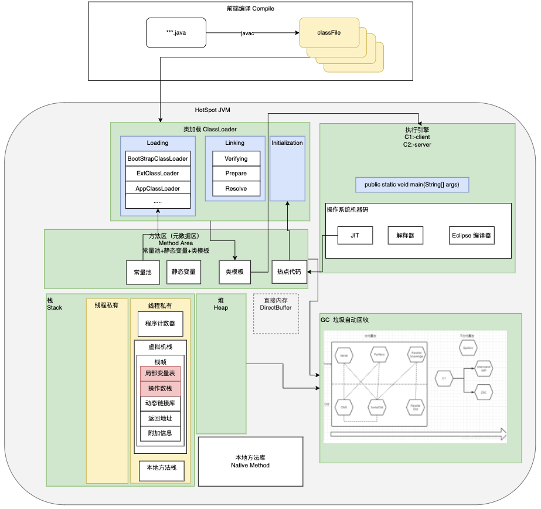
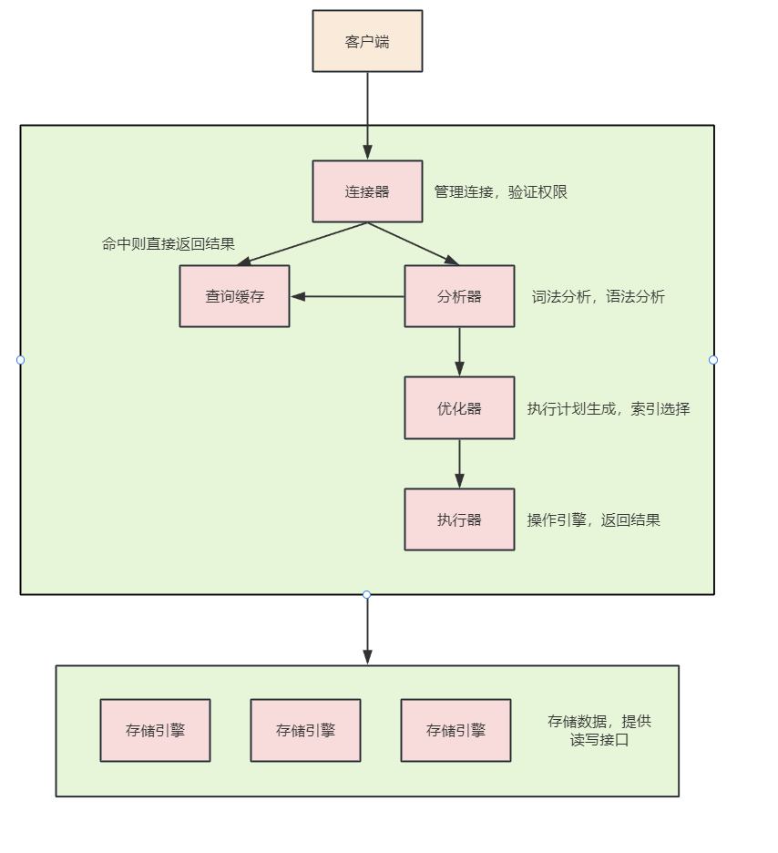
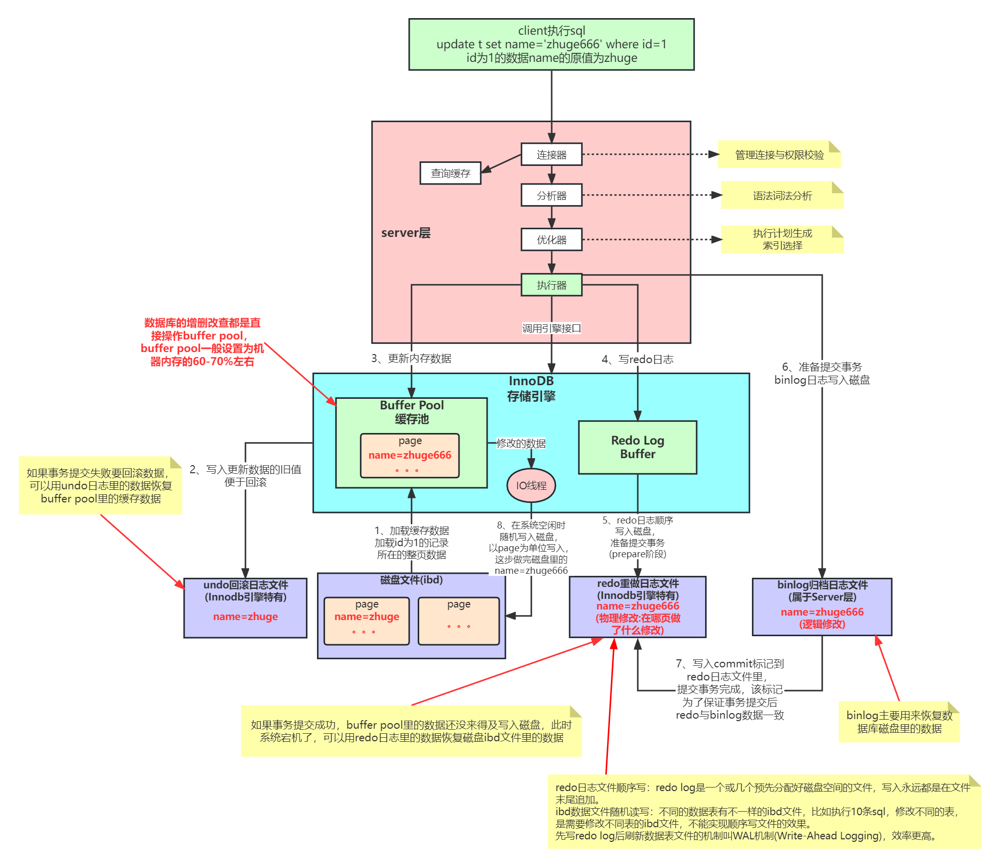
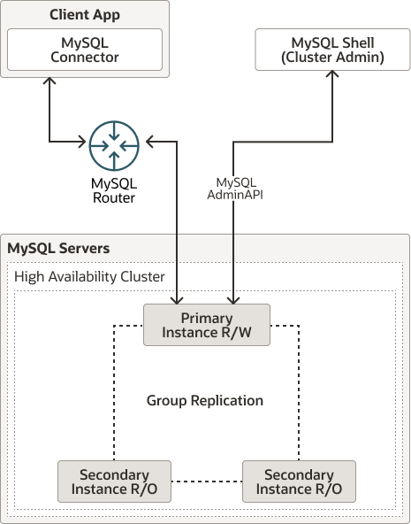
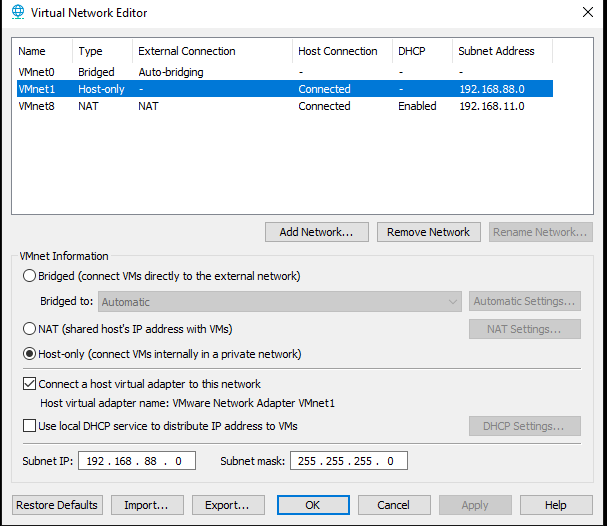
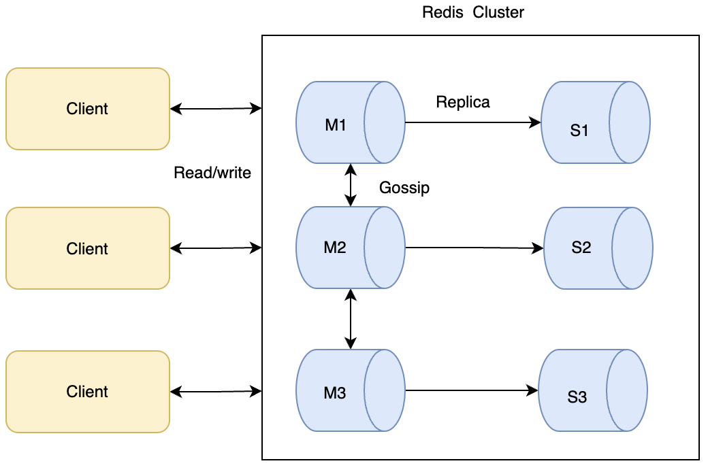
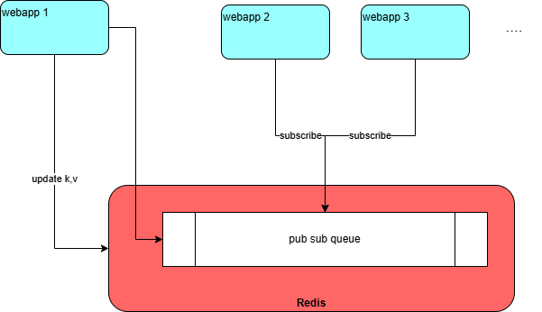
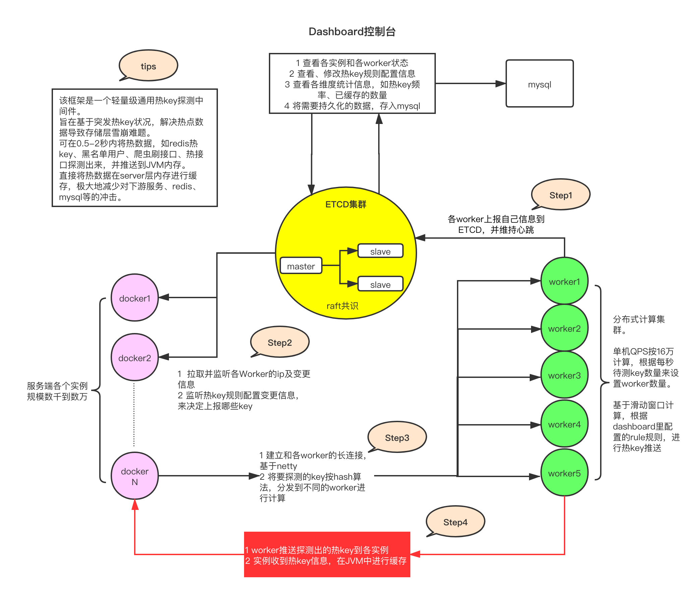
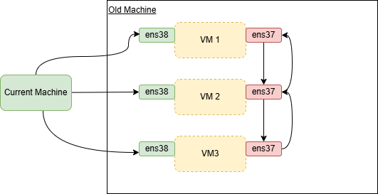
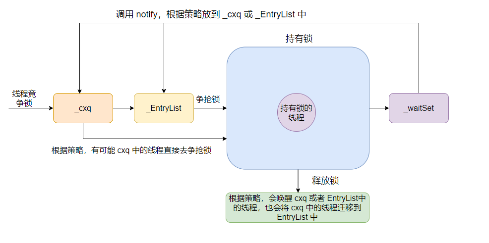

- [性能优化-JVM-MYSQL](#性能优化-jvm-mysql)
  - [全面理解JVM](#全面理解jvm)
  - [类加载机制实在（升值加薪之旅）2025-09-17](#类加载机制实在升值加薪之旅2025-09-17)
  - [JVM内存模型深度剖析与优化 (JVM model Deep Analysis) 2025-09-18](#jvm内存模型深度剖析与优化-jvm-model-deep-analysis-2025-09-18)
  - [JVM对象创建与内存分配机制深度剖析 2025-09-19](#jvm对象创建与内存分配机制深度剖析-2025-09-19)
  - [This lesson is very hardcore, there are alot of useful informa-XX:+EliminateLock by default, so nothing ttions. Lesson 3 and lesson 4 are worth revisiting.](#this-lesson-is-very-hardcore-there-are-alot-of-useful-informa-xxeliminatelock-by-default-so-nothing-ttions-lesson-3-and-lesson-4-are-worth-revisiting)
  - [深⼊理解 JVM 执⾏引擎 2025-09-20](#深理解-jvm-执引擎-2025-09-20)
  - [Summary for last 5 days](#summary-for-last-5-days)
  - [垃圾收集器ParNew\&CMS与底层三色标记算法详解 (Tri-color marking) 2025-09-21](#垃圾收集器parnewcms与底层三色标记算法详解-tri-color-marking-2025-09-21)
  - [垃圾收集器G1\&ZGC详解 2025-09-22](#垃圾收集器g1zgc详解-2025-09-22)
  - [JVM调优工具详解及调优实战 (Practicals JVM tools) 2025-09-23](#jvm调优工具详解及调优实战-practicals-jvm-tools-2025-09-23)
  - [JVM调优实战及常量池详解 (Practicals JVM tools) 2025-09-24](#jvm调优实战及常量池详解-practicals-jvm-tools-2025-09-24)
  - [JDK新特性梳理 2025-09-25](#jdk新特性梳理-2025-09-25)
  - [JDK17的GC调优策略 2025-09-26](#jdk17的gc调优策略-2025-09-26)
  - [全面理解Mysql架构 2025-09-28](#全面理解mysql架构-2025-09-28)
  - [深入理解Mysql索引底层数据结构与算法 2025-09-29](#深入理解mysql索引底层数据结构与算法-2025-09-29)
  - [Explain详解与索引优化最佳实践](#explain详解与索引优化最佳实践)
  - [MySql索引优化一](#mysql索引优化一)
  - [Mysql索引优化实战二](#mysql索引优化实战二)
  - [MySQL事务原理及优化](#mysql事务原理及优化)
  - [Mysql锁机制与优化实践以及MVCC底层原理剖析](#mysql锁机制与优化实践以及mvcc底层原理剖析)
  - [Innodb底层原理与Mysql日志机制深入剖析](#innodb底层原理与mysql日志机制深入剖析)
  - [Mysql全局优化与Mysql 8.0\&Mysql9.0新特性详解](#mysql全局优化与mysql-80mysql90新特性详解)
  - [MySQL 8.0 主从复制原理分析与实战](#mysql-80-主从复制原理分析与实战)
  - [Mysql8.0高可用集群架构实战](#mysql80高可用集群架构实战)
- [分布式专题](#分布式专题)
  - [Pre-requisite, setting up of VMWare workstations](#pre-requisite-setting-up-of-vmware-workstations)
  - [Redis核心数据结构实战+服务搭建](#redis核心数据结构实战服务搭建)
  - [深入理解Redis线程模型](#深入理解redis线程模型)
  - [Redis进阶二之Redis数据安全性分析](#redis进阶二之redis数据安全性分析)
  - [大厂生产级Redis高并发分布式锁实战](#大厂生产级redis高并发分布式锁实战)
  - [一线大厂高并发缓存架构](#一线大厂高并发缓存架构)
  - [Redis缓存设计与性能优化](#redis缓存设计与性能优化)
  - [京东热点缓存探测系统JDhotkey架构剖析](#京东热点缓存探测系统jdhotkey架构剖析)
  - [Kafka 上手](#kafka-上手)
- [并发编程](#并发编程)
  - [Concurrency and Multithreading 101](#concurrency-and-multithreading-101)
  - [Future \& CompletableFuture 实战](#future--completablefuture-实战)
  - [ThreadLocal详解](#threadlocal详解)
  - [深入理解CAS和Atomic原子类操作详解](#深入理解cas和atomic原子类操作详解)
  - [并发锁机制之深入理解synchronized](#并发锁机制之深入理解synchronized)
  - [JUC并发同步工具类在大厂中应用实战](#juc并发同步工具类在大厂中应用实战)
  - [深入理解AQS之独占锁ReentrantLock源码分析](#深入理解aqs之独占锁reentrantlock源码分析)
- [Spring源码专题](#spring源码专题)
  - [How is a bean constructed](#how-is-a-bean-constructed)
  - [AOP](#aop)
- [](#)


# 性能优化-JVM-MYSQL

## 全面理解JVM

- How is Java program executed. (tools: UltraEdit for byte code, jclasslib for analysis and understanding). Java execution has to abide Java Language Specification
  
- Class loading mechanism (sandbox protection, cache + parent + bootstrap loader)
  - bytecode, exception table, miscellanous
  - 

- Garbage Collection (tools: arthas for diagnostic)
  - Java opts, -, -X, -XX
  - default collector G1, 
  - print and analyze GC logs

- Notable interview question 
  - Where is `this` stored in JVM? 
  - Why tomcat could do hot reload for jsp, but not for jar?
  - Why do we need custom class loader? how is it implement (by overriding loadClass method in ClassLoader)
  - Why cannot child class override static method from main class (invokevirtual vs invokestatic in JLS)

## 类加载机制实在（升值加薪之旅）2025-09-17
- JDK8 classloading summary:
  - Classloading cache (in native methods)
  - Parents delegations: upward delegations, downward loading
  - domain protection (sanbox protection) : `preDefineClass` method in `ClassLoader.java`

- Linking process (the subtle native `resolveClass` method in `ClassLoader.java`)
  - Verfication: is the bytecode aligned with JLS, is there CAFEBABE? is there any children of final class, which is forbidden etc
  - Preparation: setting up memory for static fields of a class, and assign default value.
  - Resolution:
    - Purpose: Replace symbolic references in the constant pool with direct references.
    - Symbolic references are strings like "java/lang/Object" or "doSomething:()V".
    - Resolution turns these into actual pointers (to Class objects, method table entries, field offsets). Done lazily in some JVMs: the JVM spec allows resolution to happen at use time, not strictly during linking. 
- 实战
  - `OADemo2.java`: use URLCalssLoader to load jar from remote web server or file directory
  - `OADemo3.java`: Customized ClassLoader + ByteCode Obfuscation
  - `OADemo5.java`: Hot reloading of Class: create a new Classloader instance everytime you calculate salary. Performance not good, huge GC burden.
  - `OADemo6.java`: Customized ClassLoader still delegates class loading to AppClassLoader, and if there is a SalaryCaler class under the current src directory, src/SalaryCaler.java will be loaded before our custom jar from another directory. We need to break the parent delegation and prioritize loading with the current file from jar. 
  - `OADemo9.java`: Use JDK SPI and Spring Boot SPI to return services implementations for use, dynamically, without reflection.
    - Note that for **Any** Custom ClassLoader, if you call `super.loadClass()`, you will inevitably trigger the default Parents Delegations in JDK, so all services in current directory that matches your class fullname will get loaded.

## JVM内存模型深度剖析与优化 (JVM model Deep Analysis) 2025-09-18
- JVM Model: 

- Runtime Data Areas: PC, Method Area (MetaSpace), Heap, Stack, Native Method Stack
- For each method call there will be Stack Frame:
  - For each frame contains:
    - Local Variables (primitive types, object references)
    - Operand Stack (for intermediate calculations)
    - Frame Data (method return address, etc)
    - Dynamic Linking (reference to the runtime constant pool)
- JVM options:
  - Standard options, `java -h`
  - Non-standard options, `java -X`
  - Advanced options, `java -XX:+PrintFlagsFinal`
- Notable JVM applications in Spring Boot:
  - Tomcat/catalina.sh: 
  ```java
    java ‐Xms2048M ‐Xmx2048M ‐Xmn1024M ‐Xss512K ‐XX:MetaspaceSize=256M ‐XX:MaxMetaspaceSize=256M ‐jar microservice‐eureka‐server.jar
  ```
  we fix the size of `MetaspaceSize` and `MaxMetaspaceSize` to avoid dynamic expansion of metaspace, to avoid full GC pauses.

- Notable Intervew Questions: Why do we need to do STW? why can't we do GC while application is running?
  - Answer: we cannot becuase during GC, objects may be moved, if the object marked for moving is no longer needed (because app is running at the same time), we are wasting resource moving them to old generation. Also, if we are moving objects while app is running, the app may be accessing the object at the same time, leading to data inconsistency.
- Tools: jstat, jmap, jstack, jinfo, jcmd, VisualVM, VisualGC, Mission Control, et

## JVM对象创建与内存分配机制深度剖析 2025-09-19

- This lesson deepdives into JVM, and even analyzes how certain process are called in C++ code in HotSpot JVM.
- Metaspace (JDK8+), PermGen (JDK7 and below)
  - Class metadata, static variables, constants
  - Metaspace is allocated in native memory, not in heap memory
  - Default size is 21MB, can be adjusted with `-XX:MetaspaceSize` and `-XX:MaxMetaspaceSize`, it is best practice to set both to the same value to avoid dynamic expansion
  - When metaspace is full, it will trigger a full GC to reclaim space
  - Common issues: `java.lang.OutOfMemoryError: Metaspace`, can be solved by increasing metaspace size or reducing class loading/unloading
- During production, based your business load, you can actually calculate the required JVM memory size, and set the JVM options accordingly.
  - For example, if you have 300 orders/sec, that could amount to 300kb/sec in object creations, 
  - There are other things that comes with the order (coupons, stocks etc) so lets amplify by 20 , 200 * 300kb/sec,
  - if there are other order queries, we might amplify by another 10 times, 10 * 200 * 300kb/sec = 60 MB/sec
  - However those orders are short lived orders, if we do this `-Xmn2048m` so we increase the young gen to 2G, we can reduce full gc
- JVM object creations:
  - class loading
  - memory allocation
  - initialization
  - set object header
  - run init method
- Notable concepts: 
  - Pointer Compression (default in 64bit JVM, actually just left shift by 3 bits so we can reduce memory footprint), TLAB (Thread Local Allocation Buffer),
  - JVM Stack allocation, escape analysis: stack allocation, scalar replacement, lock elision (there is another hardware level lock elision which is chip dependent)
This lesson is very hardcore, there are alot of useful informa-XX:+EliminateLock by default, so nothing ttions. Lesson 3 and lesson 4 are worth revisiting. 
---
## 深⼊理解 JVM 执⾏引擎 2025-09-20
 - Just In time Compiler, Interpreter + c1 compiler + c2 compiler.
 - Hotspot code detection (Invocation counter and Back Edge Counter)
 - Compiler Optimization techniques: 
   - inline, 
   - vectorization, 
   - **Escape Analysis** -> **Scalar Replacement(-XX:+EliminateAllocation)** + **Stack Allocation**, 
   - lock elision (there is another hardware level lock elision which is chip dependent)
   - loop unrolling: fewer branch instructions, easier to spot vectorization opps (SIMD)-XX:+EliminateLock by default, so nothing t

## Summary for last 5 days
1. **Compilation (outside JVM)**
   - `javac SomeClass.java` → produces `SomeClass.class` (bytecode).

2. **JVM Startup**
   - JVM process starts.
   - Initializes core classloaders:
     - **BootstrapClassLoader**
     - **PlatformClassLoader**
     - **AppClassLoader**
   - Chooses a **GC algorithm** (e.g., G1, ZGC, Shenandoah) and spawns dedicated **GC worker threads**.

3. **Class Loading & Linking**
   - `SomeClass.class` is located and loaded by AppClassLoader.
   - Linking steps:
     - **Verification**
     - **Preparation**
     - **Resolution**
   - Initialization: run `<clinit>` (static blocks, static fields).

4. **Class Metadata Storage**
   - Class structure, constant pool, vtables, etc. stored in **Metaspace**.
   - At this point: still no objects, only metadata.

5. **Program Execution Begins**
   - `main()` is invoked.
   - Bytecode is executed by the **interpreter**.
   - On `new SomeClass()`:
     - JVM allocates memory in heap (usually Eden region).
     - Sets **object header** (mark word, klass pointer).
     - Initializes instance fields.

6. **Profiling & Hotspot Detection**
   - JVM collects runtime profiles (method invocation counts, branch frequencies, type profiles).
   - Identifies “hot” methods (frequently executed code paths).

7. **JIT Compilation**
   - Hot methods compiled into native code:
     - **C1 (client compiler):** quick, lightweight optimizations.
     - **C2 (server compiler):** deeper optimizations (inlining, escape analysis, lock elision (there is another hardware level lock elision which is chip dependent), vectorization, etc.).
   - Compiled code replaces interpreted execution.-XX:+EliminateLock by default, so nothing t

8. **Native Execution**
   - CPU executes optimized machine code directly.
   - If speculative optimizations prove wrong (e.g., unexpected type at a call site):
     - The method is **deoptimized**.
     - Falls back to interpreter.
     - May be recompiled later.

9. **Garbage Collection (Always Running in Background)**
   - GC worker threads continuously monitor allocation and heap pressure.
   - When thresholds are exceeded (e.g., Eden fills, old gen grows, metaspace expands):
     - **Stop-The-World (STW)** pauses: all app threads frozen briefly.
     - **Concurrent phases**: GC threads run alongside app threads.
   - Dead objects reclaimed, heap compacted (depending on GC algorithm).

10. **Repeat Cycle Until Shutdown**
    - Execution ↔ Profiling ↔ JIT ↔ GC cycles continue for the life of the JVM process.
    - On shutdown, JVM may run a final GC and then tear down threads and memory.
  
## 垃圾收集器ParNew&CMS与底层三色标记算法详解 (Tri-color marking) 2025-09-21
- Various collection algorithms, Garbage collectors usually employ one or more algorithms in its implementations
- Algorithms:
    - Copying collection: usually in young generation
      - From space and to Space (Survior 1 and Survivor 2)
    - Mark and Sweep
    - Mark-Sweep-Compact
    - Generatonal Collection (a trategy not a new algorithm): Copying for young gen (fast) + Mark-Sweep-Compact for old gen (handles large objects avoid fragmentations)
- Concurrent Mark Sweep Collector
  - initial Mark: STW
  - Concurrent Mark: 
  - Conccurrent Preclean
  - Remark: STW
  - Concurrent Seep
  - Concurrent Reset:
- If there are sudden heavy load on the app, CMS can degrade to PrallelOld, which is fully STW.
- Tricolor marking: 
  - Black (Node visited and all children visited  will be grey)
  - Grey (process about to visite the node but hasn't reached yet)
  - white (not visited node)
  - **Strong invariant: No black -> white edges exist**
  - **Weak invariant: Black -> white edges may exist but every such edge is recorded so the collector will re(scan) it**
  - However if not careful, there could be some white nodes being refered back to black node during concurrent Marking phase. Then if there are no procedures to protect thos white nodes, they will be garbage collected and then our applicaiton will throw Exceptions.
  - Two ways to resolve the previous problem:
    - Incremental - Update (aka insertion barrier)
      - On pointer write, if we store a refere x-> y we either Grey the target y immediately or Record the modfied slot/card so the source will be rescanned:
        ```c
        on_write(field, newRef):
        if marking_in_progress:
          if object(holder(field)) is BLACK:
            record_modified_card(holder(field))   // or shade(newRef)
        
        ```
      - Effect: prevents a black object from “silently” pointing to white—either the target becomes gray, or the card with the black source is rescanned later.
    - SATB - Snapshot-At-The-Beginning.
      - Freeze the heap graph at `initial marking`, On overwrite, log the **old** reference so anything that was reachable at the snapshot remains marked.
        ```c
        on_write(field, newRef):
        if marking_in_progress:
          oldRef = *field
          if oldRef != null:
            enqueue_SATB_buffer(oldRef)  // old ref will be marked
        *field = newRef
        ```
      - Effect: ensures objects that were reachable at the beginning can’t be lost even if the mutator drops the last reference during marking.
  - Which JVM collectors use what?
    - CMS: Incremental-update write barrier + card table; remark rescans dirty cards.
    - G1: SATB barrier; logs old refs in per-thread buffers; remark drains these.
    - Shenandoah: SATB + load barriers for concurrent evacuation.
    - ZGC: heavy use of load barriers with colored pointers; maintains reachability and remapping without long pauses (conceptually enforces the invariant on loads rather than stores).

## 垃圾收集器G1&ZGC详解 2025-09-22
- G1 GC: **initial Mark** -> **Concurrent Mark** -> **Remark** -> **Cleanup**
  - Regions based, still generational, but a lot of regions
  - Humongous regions to take care of big objects, not moving them anymore. 
  - User could customize pause goal, which is very helpful for managing GC time
  - YounGC: it is **not triggered** immediately when Eden is full, it will calculate how long it takes to collect Eden, if it is very fast, then increase the Eden regions
  - MixedGC: `-XX:InitiatingHeapOccupancyPercent` Collect all Young and part old and humongous, how many to collect depends on the `MaxGCPauseMilis` value.
  - FullGC: like SerialGC, very time consuming.
- Notable Interview Question on G1 applications
  - A kafka system, 10 thousands order per sec is normal
  - We need to increase young gen size to accomodate all short-lived, large objects, so that they do not trigger GC that often.
  - However if we have alot of short lived large objects, and we use ParNew, It will be quite lenthy STW, because Young Gen size if large now!
  - If we apply G1 to manage young gen, we can have a consistent pause goal, User will not feel a thing. App could collect garbage while handling business.
- ZGC: **TB heaps**, **10ms GC pause time**, 
  - Colored pointer: instead of storing GC information in object headers, now ZGC stores it in refernce pointer. 
  - Then it uses load barrier to update the reference pointer lazily (via ForwardTable)

## JVM调优工具详解及调优实战 (Practicals JVM tools) 2025-09-23
- **jstat**: `jstack -gc <pid> <frequency> <times>`
  - e.g. `jstack -gc 1604 2000 1000` track pid 1604, print gc info every 2 seconds, 1000 times
- **jinfo**: check the jvm opts flags for current application
  - e.g. `jinfo -flags 1604`
- Based on jstat info there are alot of informations to investigate:
  - why are YGC so frequent? what causes Eden to grow so fast?
  - Calculate how much objects are moved to Old gen.
  - Why are FGC so often, how much time are spent.
- **Optimizing Goal**: At the end of day, we **want low to no FullGC**, and henceforth **we want, after each YGC, the size of surviving objects to be less than 50% of S0/S1 regions**, so that no objects have to be moved to old gen

## JVM调优实战及常量池详解 (Practicals JVM tools) 2025-09-24
- Arthas techniques:
  - `arthas: dashboard`
  - `arthas: heapdump`
  - `thread <thread-id>` , use `thread` to see thread info.
  - use `jad` to de-compile.
  - highly dangerous: use `ongl` to modify only java objects.
- Arthas used `Java Agent`, `Instrumentations Api`, under the hood.
- Constant pool
  - Literals and Symbolic references
    - `int a = 1`, `1` is literal, `a` is symbolic reference.
  - when Constant pool is loaded into jvm, the symbols will be dynamic linked to the reference (actual object) in memory.
  - String constant pool
    - be careful of `new String("<your string literal>")`, it will create two objects.
    - like a hastable, it is located in heap.
  - Integer, Long, Character, Byte, Boolean all have `Cache`, which is equivalent of constant pool.

## JDK新特性梳理 2025-09-25
- What are some of the new features in JDK 17+?
  - Syntax Sugars: String block, Switch expression, 
  - Record class (good for DTO), record class does not support invocation by reflection, even safer,
  - Hidden Class, get class from bytes. better obfuscations
    - use ASM library to manipulate byte directly: [baeldung article](https://www.baeldung.com/java-asm)
  - Sealed Classes: choose which children is allowed
  - **Virtual Thread**: Kindof like co-routine
  - modules
  - vector api
  - G1GC is used everywhere
  - GraalVM, + Truffle Lnaguage Implementation Framework, you can imlement your own programming language.

## JDK17的GC调优策略 2025-09-26
- Look at famous open source application, (e.g. RocketMQ) to see how it is optimized.
- JDK JVM:
  - On Heap: OBjects
  - off heap: Thread Stack, Metaspace, CodeCache, ClassSpace, direct buffer + mapped buffer
- Important optimzation parameter IHOP, MaxGCPauseTime.

## 全面理解Mysql架构 2025-09-28
- Two layers: Server Layer and Storage Engine
- Server layer: Mysql-connector, Query cache, query parser, query optimizer, query executor
- Storage layer: different types of storage engine, default is innoDB.
  
- Redo log:
  - it recored the physical change to the DB server.
  - WAL technology, 
  - All updates will be written to redolog first, and then executed on disk when innoDB engine is not busy
  - Crash safe, If I some how my disk got destroyed, I can still replay my redo log to recreate my DB.
- Bin log:
  - Implemented by Mysql server (not part of storage engine)
  - it recorded the **original sql logics**
- MySQL, Two phase commits
  - Prepare phase
    - InnnoDB writes transaction changes into its redo log buffer, and marks it as prepared
    - InnoDB gurantees it can be later either commited or rollback.
    - nothing is yet written to binlog
  - Commit phase
    - Server writes the transactions binlog entry(SQL/row events) and flushes it to disk (sync_binblog=1 ensure durability)
    - Then innoDB writes the commit record into the redo log (`innodb_flush_log_at_trx_commit=1` ensure durability)
    - Only after both are persisted, the transaction is considered commited
    ```
    This way:
    - If MySQL crashes after prepare but before binlog flush, InnoDB recovery will roll back the prepared transaction.
    - If crash happens after binlog flush but before redo log commit, recovery sees a “prepared but not committed” transaction in InnoDB → it can replay commit using the binlog (binlog is authoritative).
    ```
## 深入理解Mysql索引底层数据结构与算法 2025-09-29
- How is MySQL storage engine implemented? (MYISAM, InnoDB)
  - **Binary Search Tree**: logN time, but may degrade to O(N) due to how it is built (becomes linked list for steady increasing sequence)
  - **Red Black Tree**: Red black tree solves the previous problem because it is always self-balancing, but there are no ways for us to know the height: `h` of the tree. The height `h` determines how fast we can find our data.
  - **B-Tree**: B Tree solves the previous problem by putting, not one, but multiple index + data into each tree-node. Each index is sorted in ascending order, and we can control the height of the tree very easily. At the the non-leaf node, we use Binary Search algorithm to quickly identify the index/range of index, and then retrieve data.
  - **B+ Tree**: (innodb implementation)
    - For B tree it is not very good for range query/
    - so B+ tree, we put extra index (redundant index) and place all data into leaf-node. All leaf node are connected using double pointers, so we can quickly retrieve data for range query. 
    - **Clustered index**, index are together with data in leafnode
- Composite index
  - **THE ORDER** of column in the index matters!! Because when we query, we query from the left!!
- **Notable Interview Questions**
  - "Why is it recommended for MySQL tables to have a *Int* type primary key that is also *mono increasing* ?
    ```
     An integer type is easier to compare than varchar.
     Auto increasing because it is more efficient to add data to B+ tree that way. If the index is not mono-increasing, B+ tree will have to do self-balancing, and that affects performance. 
    ```
  - "Why does our secondary index refer to primary index in its leaf nodes, instead of the actual data?"
    ```
     This is for cost concerns. It is costly to have multiple copies of the same data in SSD.
     Also if we were to have more copies of the same table, it is really hard to coordinate updates. This is the consistency concern. 
    ```
## Explain详解与索引优化最佳实践
- Important Points:
  - Type Column: system > const > eq_ref > ref > range > index > ALL, you need to try optimizing your query to `ref`
  - possible_keys vs keys column. 
  - we can use key_len to calculate what are the columns used in the index search.
  - In Extra column, if `Using Tempororary` is seen, we need to optimize it.
- Best Practices:
  - Full value matching, for **every column in the composite index**
  - **LeftMost Prefix Rule**
  - **Do not** apply functions on columns:
    ```sql
      EXPLAIN SELECT * FROM employees WHERE name = 'LiLei';
      EXPLAIN SELECT * FROM employees WHERE left(name,3) = 'LiLei';
    ```
  - Storage engine cannot use any conditions on the right of a range query
    ```sql
    EXPLAIN SELECT * FROM employees WHERE name= 'LiLei' AND age = 22 AND position ='manager';
    <!-- Cnanot use positions -->
    EXPLAIN SELECT * FROM employees WHERE name= 'LiLei' AND age > 22 AND position ='manager'; 
    ```
  - BE specific, use Covering index
  - Using `!`, or  `<>` or `not in`, `not exists` might lead to scanning `All` table. 
  - `is null` or `is not null` **might** lead to `ALL` scanning.
  - `%ABC` in `LIKE` will lead to `ALL` scanning, you should use `ABC%`


## MySql索引优化一
- Use Covering Index
  - If you specify columns in your `SELECT` statements, and the columns selected are all in your composite index, then MySQL will definitely use the composite index, and that will improve performance. If you just put `*` in `SELECT`, mysql will have to do `double lookup` which hurts performance. 
- `IN` and `OR` will only lead to index search when amount of rows are huge, if the amount of data is not alot, it might go for `ALL` type scanning.

- `LIKE` is not like `>` range operator.
  - `LIKE` will always use index, **Index Condition Pushdown** (> Mysql 5.6)
  - do prefilter in secondary index first, before checking primary clustered index for the actual data. 

- **Trace** tools for investigation
  - You have to investigate Trace if you don't know why your index is not applied to your `SELECT` query.
- `Order by` and `Group by` optimization
  - Check the `Extra` column, did we use `fileSort` (no index when ordering) or `Using index condition`
  - alway aim for `Using index` 
  - `Using index` will happen, if `order by` condition satisfy the `left prefix principle`
  
- Two Algorithms to `filesort`: Single-Read Sort vs Two-Read Sort
  - `<sort_key, additional_fields>` 
    `<sort_key, packed_additional_fields>` Single Read
  - `<sort_key, rowid>` Two-Read Sort
  - Basically the choice of which is a result of how much buffer you have set in MySQL, if buffer is large you can do Single-Read Sort.
- **Optimization techniques**
  - Code first, index later
  - Based on your sql query, build **Composite Index**
  - Do not build single index on Column that has small distinct values. 
  - Use **prefix** (e.g. `name(20)`) to build composite index, to reduce disk size usage. But this way you cannot use `order by` on the index.
  - Prioritize `where` over `order`
    - because this way we can quickly filter out rows, and that can reduce time for ordering

## Mysql索引优化实战二
- Paginated Query Optimization
  - `select * from employees limit 10000, 10;` very inefficietn. it reads 10010 rows.
  - `select * from employees where id > 90000 limit 5` is much more efficient because it uses index.
  - when `order by` is involved:
    - `select * from employees ORDER BY name limit 90000,5;` this query will not use index, becasue there are too many rows, no point using index.
    - but if you do this: `select * from employees e inner join (select id from employees order by name limit 90000,5) ed on e.id = ed.id;`
    you can force the order by and pagination to happen first, and then retrive the row with id. This way, less columns are returned when doing order by. so faster. 
- Join Opitmization
  - Nested Loop Join vs Blocked Nested Loop Join
    - make sure small table drives big table.
    - **index** the columns used after `on`

## MySQL事务原理及优化
- Transaction nomrally has the four principles: ACID
  - Read Uncommited: dirty read
  - Read Commited: Non-repeatable read, phantom Read
  - Repeatable Read: Phantom Read
  - Serailizable
- Locks and MVCC enables us to maintain ACID compliance while under heavy load.
  - Optimistic (CAS) vs Pessimistic
  - Shared lock vs X lock.
  - Intention lock.

## Mysql锁机制与优化实践以及MVCC底层原理剖析
- Read lock (Shared lock) multiple query can view the same row at the same time no problem.
- Write lock( exclusive lock) if update is not done, will block other locks:
  - `select * from T where id=1 lock in share mode`
- Intention lock: like a dog marking its terriroty. If a transaction is adding a shared / exclusive lock on the row, the transaction will also marke the table with `intention lock`. If anther transaction tries to add a table lock, it will not have to check every row. 
`IS` and `IX`
- Gap lock and Next-Kye locks, -- how mySql solves the phantom read problems
- MVCC principles
  - undo log will be created when multiple transactions modify the smae row of data. 
  - Under RR, a readview will be generated the first time `Select` is run. and **it will not change until txn is finished**
  - ReadView consist of `array of on-going transaction-ids` and `maxTransActionId`
  - During a `Select`:
    - If row `txnid` < minTrxId in array, data is visible.
    - if row `txnid` > `max_id` txn does not exist
    - if row `txnid` within `min_id` <= `max_id`
      - if `txnId` in the array: on going, not visible
      - else `txn` already committed, visible
- Summary:
  - Read View = defines what a transaction is allowed to see.
  - Undo version chain = stores the row’s history of changes.
  - Together, they let each transaction read the right version of a row, ensuring consistency under concurrency

## Innodb底层原理与Mysql日志机制深入剖析
- What happened under the hood (step 1 to 8)
  
- Redo Log: (can be number of redo log files)
  - write pos: write positions
  - check point: the place before which you can write your data freely, if at check-point, then cannot write, must dump redolog to disk first before writing (move the check point)
  -  **The write to disk strategy**
     -  `innodb_flush_log_at_trx_commit` this condition controls when should we flush redo log onto disks.
        -  if 0, never, relies on innoDB daemon thread to dump logs to disk (every 1s). Risking losing data.
        -  if 1, always write to disk every time, low performance, but safe
        -  if 2, only writes to page-cache. then relies on the aforementioned innoDB daemon thread to dump data to disk. if DB is down, data will not be lost, because whatever is in Page-Cache will be eventually synced to disk by `fsync`. But if OS is down, then we lose the data.
- BinLog
  - consists of multiple `mysql-binlog.xxxx` files, They are base64 encrypted data of past `update`, `insert`, `delete` statements on the database
  - BinLog format: Statement (risk: master slave mismatch due to functions like `UUID()`, `SYSDATE()`), ROW (Copies every row, no master slave mismatch, but low performances), MIXED(dynamically choose which format to write binlog in)
  - You can recover the DB using BinLog.  
    ```bash
      mysqlbinlog  --no-defaults --start-position=219 --stop-position=701 --database=test D:/dev/mysql-5.7.25-winx64/data/mysql-binlog.000009 | mysql -uroot -p123456 -v test
      <!-- Use command line -->
      mysqlbinlog  --no-defaults --start-datetime="2023-1-27 23:32:24" --stop-datetime="2023-1-27 23:34:23" --database=test D:/dev/mysql-5.7.25-winx64/data/mysql-binlog.000009 | mysql -uroot -p123456 -v test
    ```
    The premise of using binLog to recover DB is that you do periodic DB dump yourself.
    ```bash
      mysqldump -u root 数据库名>备份文件名;   #备份整个数据库
      mysqldump -u root 数据库名 表名字>备份文件名;  #备份整个表

      mysql -u root test < 备份文件名 #恢复整个数据库，test为数据库名称，需要自己先建一个数据库test

    ```

## Mysql全局优化与Mysql 8.0&Mysql9.0新特性详解
- New Descending order index in innodb engine
  ```sql
   explain select * from t1 order by c1,c2 desc;
   <!-- The above sql query will use index instead of filesort -->
  ```
- No more `order by` default:
  ```sql
  select count(*),c2 from t1 group by c2;   --8.0版本group by不再默认排序
  ```
- Invisible index:
  Trying to delete an index, but not sure what is the impact? set it to `invisible first`, if no other queries are impacted, we can delete it safely, else, we simply reverse the action and make it visible again.
- Function Index:
  - in MySQL 5 if we reference function in our Select statments, the query will not use index
  - Therefore in MySQL 8, we start to have function index:
  ```sql
  create index func_idx on t3((UPPER(c2)));  --创建一个大写的函数索引
  ```
- innodb storage engine skip the lock:
  ```sql
  select * from t1 where c1 = 2 for update nowait;
  select * from t1 for update skip locked;  --查询立即返回，过滤掉了第二行记录
  ```
- Extended thinking: why for many internet companies, they do not use `Foreign Key`, whereas in Banks, we use `FK` everywhere?
  ```
    In Oracle-based enterprise systems like UBS → FKs are essential for consistency and auditability.
    In MySQL-based internet systems (esp. China) → FKs are avoided for scalability, sharding, and agility.
    The difference is not “right vs wrong”, it’s a trade-off between data integrity and distributed scalability.
  ```

## MySQL 8.0 主从复制原理分析与实战
- What is Replication: Copying data from SOURCE(Master) to REPLICA(Slave)
  - Replication Algorithm relies on State machines (Snapshot + Binlog)
- Different Replication Technique:
  - Async
  - Semisynchronous Replication (feels like Kafka and Redis), SOURCE relies on ACK to decide when to finish a transactions
- Different approach to replication:
  - Using binlog, 
    - very hard to synchronize SOURCE and REPLICA if there is a problem
    - have to manually find the position, and skip errors. If the errors skipped are not trivial, we will have data mismatch.
  - Using GTID (eaiser, based on Global Transaciton ID)
    - SOURCE calculates difference in GTID between itself and REPLICA
    - then write the differences to relay log in REPLICA
  - **MySQL GROUP Replication (MGR)** (best approach)
    - based on PAXOS protocol. GROUP write (atomic and consistent), instead of SOURCE async write to REPLICA. 
    - it lacks the router to tell client which node is accessible, that is why we need *innoDB cluster*
    - Single Primary vs Multi Primray
  - Extended Thinking: *why do we need XCOM plugins for MGR? why cannot just append to binLog, and use binlog to ensure Global orders?*

    | Question                                  | Answer                                                                                              |
    |-------------------------------------------|------------------------------------------------------------------------------------------------------|
    | Why not just append to binlog?            | Because binlog has only *local ordering*, not *global* ordering.                                    |
    | Why do we need XCom?                      | To reach quorum agreement on the *next transaction order*, ensuring atomic, consistent replication. |
    | What does XCom provide that binlog can’t? | Leader election, total order broadcast, quorum-based commit, and automatic view changes.            |
    | Is XCom storing the data?                 | No — it’s deciding the *order* in which data is written locally.                                    |
  
    for Single Writer many reader, binlog is okay. But for multiprimary we are screwed because there is no global order.

## Mysql8.0高可用集群架构实战
- Inno DB cluster architecture:
  

  - Use MySQL shell to for admin work
  - Use MySQL router for client app connection.
  - If primary node is down, cluster will automatically elect a new primary
- InnoDB replicaSet: not very useful, no automatic failover, manual failover

# 分布式专题

## Pre-requisite, setting up of VMWare workstations

- VMwareWorkstations pro free for personal use
- Download Ubuntu LTS 24.04
  - allow both `Install OpenSSH server` and `allow password authentication over SSH`
- Configure three network adapters
  - NAT: for internet access
  - Host-Only: talk to other VM directly on private network, i.e. my old laptop
    - Disable DHCP
  - Bridged: for direct access via other laptops within the same network. 
  
  node 0
  
  ```yml
  network:
    version: 2
    ethernets:
      ens33:
        dhcp4: true
        dhcp4-overrides:
          route-metric: 200
      ens37:
        dhcp4: false
        addresses: [192.168.88.10/24]
        nameservers:
          addresses: [1.1.1.1, 8.8.8.8]
      ens38:
        dhcp4: false
        addresses: [192.168.10.31/24]
        routes:
          - to: 0.0.0.0/0
            via: 192.168.10.1
        nameservers:
          addresses: [192.168.10.1, 8.8.8.8]
        dhcp-identifier: mac
        dhcp4-overrides:
          route-metric: 100
  ```
  
  - After updating yml file, do `sudo netplan apply`
  - SSH status should be up
    - check  `sudo systemctl status ssh`
    - if not `sudo systemctl enable --now ssh`
  - 
- After configuring everything, create linked clones
  
## Redis核心数据结构实战+服务搭建
- How to set up redis cluster
  - redis master slave replication (kinda like mysql 1 master 2 slave)
  - sentinels (usually multiples and odd number) usually used together with one master + multiple slave topologies
  - clusters: multiple master + sharding, automatic failover without needing sentinel
  ```
    Redis replication is asynchronous, so:
    When the master (redis-1) fails,
    The replica (redis-4) might be slightly behind,
    Any write that was acknowledged by redis-1 but not yet replicated to redis-4 is lost.
    ➡️ Redis Cluster does not guarantee zero data loss during failover.
  ```
- Core Redis Datastructure:
  - String, `help @string`, `SETNX` (good for distributed lock)
  - Hash, `help @hash`
  - LIST, it is a deque, `BRPOP` can be usedas blocking queue. 
  - SET, just normal set (lucky draw, *like button*, *unlike button*)
    - `SADD like:[msg-id] [user-id]`
    - `SREM like:[msg-id] [user-id]`
    - users who likes: `SMEMBERS like:[msg-id]`
    - number of users who likes: `SCARD like:[msg-id]`
  - ZSET: ScoreBoard / Hot Search/ Trending Topic
    - `ZINCRBY hotNews:20190819 1 Capture-Capitol`
    - `ZREVRANGE hotNews:20190819 0 9 WITHSCORES`
    - `ZUNINOSTORE hotNews:20190813-20190819 7`
  - BITMAP: Bloom Filter + 签到
    - Daily punch in : `SETBIT dailycheck:1 100 1` user-1 checked-in on day 100
    - Count the numebr of dailychecks `BITCOUNT dailycheck:1`
    - Advantage: fast, performant, memory efficient
  - HyperLogLog (HLL): a probablistic datastructure for estimating cardinals of a set
    - extremly performant, use constant space (12kb) for upto 2^64 items. with an error rate of 0.81%
    - [hyperlog introduction](https://antirez.com/news/75)
  - GEO: Location servies, check the distance from real longitude and lattitude locations
  - STREAM: Redis MQ, not widely used, offers blocking queue + pub/sub
  - SpringBoot + rdis:
    - Becareful of your serializers, your serializer may transform your key and value into something else.
    - Define your own serializer in `RedisTemplate` if necessary.

## 深入理解Redis线程模型
- Intro
  - Redis at 2024: not just a cache but a DB ecosystem.
  - Mostly single threaded but there are other threaded operations such as UNLINK, slow IO accesses... refer to redis.conf (~/redis/redis.conf)
  - Highly performant becuase it is using epoll for io-multiplexing, so that one thread can respond to many socket connection request. 
- Redis Transaction
  - Not fully Atomic perse, MULTI is more like  group transactions, not atomic transactions like mysql. 
  - if one op fails, the others **still gets executed!!** DANGEROUS.
  - so how do we ensure atomicity? using watch
    - `Watch key2`
    - `MULTI` start transactions
    - Any other clients modified `key2`
    - When doing `EXEC` current transaction will fail.  Try again. 
  - If server fails during a redis transaction, then AOF will have mismatch with data, thne next time redis server starts, there will be errors. You will need reds-check-aof to repair AOF. 
- Pipeline
  - e.g. `cat command.txt | redis-cli -a <your password>`
  - save RTT (round trip time)
  - the same as `printf "AUTH <yourpassword>\r\nPING\r\nPING\\r\n" | nc localhost 6379` where `nc localhost 6379` basically is what redis-cli do. 
  - Do batch processing of data during non-peak hours. 
- LUA scripts (used a lot for distributed lock)
- Redis function: a convenient way to call Lua Script.

## Redis进阶二之Redis数据安全性分析
- Redis Benchmark: `redis-benchmark`
- Redis persistence in depth:
  - [link](https://redis.io/docs/latest/operate/oss_and_stack/management/persistence/)
  - RDB + AOF
    - AOF is event based, RDB is snapshot
    - AOF log, if corrupted, server will not start.
- Redis Master + Replica practicals
  - [official docs](https://redis.io/docs/latest/operate/oss_and_stack/management/replication/)
  - *use replicaof to make a redis instance a copy of another redis server*
  - Master receives writes, replicate exact copy
  - Downside: replication will take time, hit performance
    - Also if master is down, manual selection of master. This why we have Sentinel cluster
- Sentinel Cluster
  - [official docs](https://redis.io/docs/latest/operate/oss_and_stack/management/sentinel/)
  - monitor + quorum: if I found out one master is down, `S_DOWN = 1`, however if `>=quorum` amount of sentinels believe master is down, then `O_DOWN = 1`, then we do failover. (Raft Algorithm, similar to the PAXOS used in MYSQL Group Replication Set)
  - Downside, when master ip changes, client need to change their write destination too.
  - Data not safe, Data may get clost
- Redis Cluster
  - 
  - Gossip protocol
  - Solves 3 problems:
    - clients have to change their write ip if master changes
    - when server side has a lot of data, single replication set cannot handle.
    - when master is down, **automatic failover** for HA.
    - Redis has 16384 slot, every key will be `HashSlot = CRC16(key) mod 16384` and distributed to a hashslot
    - Depending on how many masters you have, this 16k slots will be distributed evenly across the shards (number of masters).
    - if one shard is down, *the cluster* through gossip will have to first come to consensus that it is down, and then promotes slave to master. Since slave already have all the data no need to mirgrate any buckets, 
    - if Redis cluster has to rebalance, Redis uses `MIGRATE` to copy keys slot by slot to new master nodes, then updates cluster metadata.
    - **NOTE:** you **cannot** do `mset k1 v1 k2 v2`, because all those keys might be on different Redis node, and doing so basically will require **distributed transaction** which complicates things, so it is forbidden.
    - Gossip protocol is not strong consistency, it is eventual consistecy.
    - Questions, how does Redis Cluster ensure failure detection and automatic failover?
      ```
      🧩 Short Answer
      🧠 Redis Cluster uses a Gossip protocol for cluster state propagation,
      and a majority-vote mechanism (not full Raft) for failover decision.
      It’s not Raft or Paxos — but Raft-like in spirit (majority agreement), combined with Gossip-based failure detection.
      ```
    - Redis Enterprise even safer.
    - Redis Cloud, part DB, part cache

## 大厂生产级Redis高并发分布式锁实战
**NOTE: Best live demo on redis I have ever seen**
- Demostrate, at the source code level how *Redisson* helps us implement a distributed lock.
- Conceptually it is very straight forward, but implementation is very smart and well thought off.
  - Every thread use redisson lock to try `hsetnx` a redis key.
  - if not able to acquire the lock (via semaphore) , the thread gets parked (in waiting state)
  - if able to subscribe, it will return
  - when the thread holding the lock finishes, it will `unlock`
    - delete the `key` from redis
    - also updating in a `redis_lock_pub_sub` channel, that current thread has relinquished the lock
  - All waiting threads' watchdogs/monitor threads subscribing to the channel gets notified of this event, and subsequently released the lock on semaphore. 
  - All waiiting threads will start competing for this semaphore (unfair lock)
  - **you need to watch the video again, and practice on your local!!!**
- *worthy mentioning* : Valkey is an opensource alternatives to Redis8, and it is free, and has a growing communities using it, and can be applied to many platforms. 
- You need good understanding of JUC. Some complementary knowledge:
  - Semaphore tryacquire(timeout) will put current threads in `WAITING` state, which waits for `SIGNAL` to wake up. In a `BLOCKED` thread, thread is waiting for a `LOCK` to be available. 
  - Semaphore tryacquire basically is using `CAS` in `AbstractSynchronizedQueue`. You need to read up on concurrency courses.

## 一线大厂高并发缓存架构
- Basic Redisson PubSubLock, 
- Big Prom scenario:
  - Use segment locking, product_101_1 : 100, product_101_2:100 ... product_101_10:100, 
  - Why do we need re-entrant locking? So that we can do read and write separation, i.e. RedissonReadWriteLock
- Cach Breakdown: Data missing in cache, resulting in large amount of request at DB side
  - influencer effects
  - backend DCL, but this way we also blocks requests concerning other products
  - Better alternative : Redisson lock,  
- Cache Penetration: Data does not exist in cache nor DB, 
  - DDos attack
  - Preventions: use API rate limiter, put an `EMPTY_PRODUCT` inside redis. 
- What happens if your redis cache and your DB have mismatches? how do you prevent that?
  - We have this `Read and Update` process: check the DB, and then update cache
  - this has to be atomic, 
  - so we continue to use Distributed lock.
- How to optimize the locks used in above 2 scenarios?
  - When we have *Lots of read, little write*, use RedissonReadWriteLock.
  - For the influence effects, using readwrite lock might not be able to do much better, because using distributed lock we already have quite a performance. However we can use `tryLock(ttl)` for better performances, i.e. after `TTL` time, all the waiting threads give up and start reading from cache. in this case we assume the thread which acquired the lock successfully the 1st time, has already completed populating the cache. **But that may not be true**
- How to deal with Super Influence / Hot Trending event
  - Millions of fans will start searching for this event/news/product...
    - Redis cannot take such concurrency... hangs, webapp hangs, frontend hangs... 
    - System in failure mode.
    - Cache Avalanches
  - Preventions: Use multi level caches
    - use JVM internal caches, such as ConcurrentHashMap. JVM internal caches can take millions of concurrent request. super fast. 
    - What happens when there is a write request? use Redis pubsub (i.e. MQ)
    
    - But then you have this *eventual consistency* trade off.
- In BAT, what they do is they have a separate system called `Hot Spot system` (热点系统)
  - By (e.g. via AOP) intercept all actions on Redis, they analyze new `host spot` event, and update frontend cache accordingly
  - so that response is faster. 
  - Big data related

## Redis缓存设计与性能优化
- Multilevel cache in depth:
- Cache penetrations: 
  - soln1: empty-cache with ttl.
  - bloom-filter, intercept ddos.
- Cache avalances:
  - Sentinel or Hystrix circuit breaker. 
  - rate limiting, i.e. only allow 80000 concurrent request.
- Cache and DB write mismatch: use RedissonLock
  - Better: use Redisson ReadWriteLock
  - **Note**: data you put in redis-cluster should be those that do not require strong consistency, if you need strong consistency, just use DB. If DB performance cannot make it, use Redis as temproary storage, and then asyn writes to DB.
- Best practices:
  - Keys keep it short
  - value keep it small, please no `bigkey`, e.g. huge set of string.
    - Processing bigkey will take too much time, cause blocking
  - do not `del` key from set
  - Optmize big key by using segment lock
- Redis Client best practices (e.g. Jedis)
  - maxTotal, maxIdle, minIdle
  - set maxTotal = maxIdle, and warm up the `redis-client` thread pool.
- Redis eviction policy
  - normal scenarios LRU is enough
  - however, if encountered with hotspot scenario, LFU could be better. 

## 京东热点缓存探测系统JDhotkey架构剖析
- Very lightweight, elegant solution for hotkey detection. 
- Built on ***Netty***, long http connection. 
- Source [Code](https://gitee.com/jd-platform-opensource/hotkey/blob/master-v0.0.4/README.md)
- Architect [Blog](https://mp.weixin.qq.com/s/xOzEj5HtCeh_ezHDPHw6Jw)
- Architecture:
  

- Key takeaways:
  - Netty `SO_KEEPALIVE`, long connection
  - Client will be referenced by actual server
  - Worker ip information are managed by etcd cluster (cloud native, Kubernates Services)

## Kafka 上手
- prerequisite is a must! at least you need to setup `HostOnly` and `Nat` network adapter
- need to setup zookeeper and java
- ZooKeeper config:
```sh
root@chenyang-ubuntu:/app/zookeeper/apache-zookeeper-3.8.5-bin# cat conf/zoo.cfg
tickTime=2000
initLimit=10
syncLimit=5
# the directory where the snapshot is stored.
# do not use /tmp for storage, /tmp here is just
# example sakes.
dataDir=/app/zookeeper/data
# the port at which the clients will connect
clientPort=2181
server.1=192.168.88.10:2888:3888
server.2=192.168.88.11:2888:3888
server.3=192.168.88.12:2888:3888
```
  **NOTE** "Host-Only" ip in `zoo.cfg`

- Kafka server.properties:
```sh
root@chenyang-ubuntu:/app/kafka/kafka_2.13-3.8.1# cat config/server.properties
############################# Server Basics #############################

# The id of the broker. This must be set to a unique integer for each broker.
broker.id=1

############################# Socket Server Settings #############################

# The address the socket server listens on. If not configured, the host name will be equal to the value of
# java.net.InetAddress.getCanonicalHostName(), with PLAINTEXT listener name, and port 9092.
#   FORMAT:
#     listeners = listener_name://host_name:port
#   EXAMPLE:
#     listeners = PLAINTEXT://your.host.name:9092
#listeners=PLAINTEXT://:9092
listeners=PLAINTEXT://192.168.10.31:9092

# Listener name, hostname and port the broker will advertise to clients.
# If not set, it uses the value for "listeners".
#advertised.listeners=PLAINTEXT://your.host.name:9092
#advertised.listeners=PLAINTEXT://192.168.10.31:9092
num.network.threads=3
num.io.threads=8
socket.send.buffer.bytes=102400
socket.receive.buffer.bytes=102400
socket.request.max.bytes=104857600
log.dirs=/app/kafka/logs
num.partitions=1
num.recovery.threads.per.data.dir=1
offsets.topic.replication.factor=1
transaction.state.log.replication.factor=1
transaction.state.log.min.isr=1

############################# Log Retention Policy #############################
log.retention.hours=168
log.retention.check.interval.ms=300000

############################# Zookeeper #############################
zookeeper.connect=worker1:2181,worker2:2181,worker3:2181

# Timeout in ms for connecting to zookeeper
zookeeper.connection.timeout.ms=18000
group.initial.rebalance.delay.ms=0

```
**Note**: worker1, worker2, worker3 are `Host-Only` ips (ens37), they are defined in `/etc/hosts`. **For client connections**, we cannot use them, unless the client is on the same host. That is why for `listeners`, we use `PLAINTEXT://192.168.10.31:9092` which is ens38 address, so that Kafka can listen to the ip that the current walking machine can write to. 


# 并发编程

## Concurrency and Multithreading 101

- Context Switching:
  - Save (push) current process’s register values into its PCB (Process Control Block).
    - Program counter, stack pointer, general registers, etc.
  - Load (pop) the next process’s registers from its PCB into the CPU.
  - CPU resumes execution exactly from where that process left off.
  - So during context switching, the OS essentially swaps out the register state to simulate as if each process “owns” the CPU exclusively.

- Java is Born with concurrency, you can use `ThreadMXBean.dumpAllThreads(false, false)` to see all Threads
- Two ways to create threads: `Thread` & `Runnable`
- Thread states
  CPU perspective
  ```
    ┌────────────┐
    │    New     │
    └──────┬─────┘
           │ admitted
           ▼
    ┌────────────┐
    │   Ready    │◄──────────┐
    └──────┬─────┘           │
           │ dispatched      │
           ▼                 │
    ┌────────────┐     I/O wait / sleep
    │  Running   │───────────────►┌────────────┐
    └──────┬─────┘                │  Blocked   │
           │ time slice over      └──────┬─────┘
           ▼                             │ event complete
    ┌────────────┐                      │
    │ Terminated │◄─────────────────────┘
    └────────────┘

  ```

  Java perspectives
  ```
   ┌────────────┐
   │    NEW     │
   └─────┬──────┘
         │ start()
         ▼
   ┌────────────┐
   │  RUNNABLE  │◄───────────-─┐
   └─────┬──────┘              │
         │ enters synchronized │
         ▼                     │
   ┌────────────┐              │
   │  BLOCKED   │              │
   └─────┬──────┘              │
         │ gets lock           │
         ▼                     │
   ┌────────────┐              │
   │  RUNNABLE  │──────────────┘
   └─────┬──────┘
         │ sleep(), wait(), join()
         ▼
   ┌───────────────┐
   │WAITING /      │
   │TIMED_WAITING  │
   └─────┬─────────┘
         │ notify(), timeout, interrupt
         ▼
   ┌────────────┐
   │  RUNNABLE  │
   └─────┬──────┘
         │ run() finished
         ▼
   ┌────────────┐
   │TERMINATED  │
   └────────────┘

  ```

- `sleep` vs `yield`
  - `sleep` : `RUNNABLE` -> `TIMED_WAITING`
  - `yeild`: `RUNNABLE(OS_running)` -> `RUNNABLE(OS_Ready)`, no context swithcing.
  - Both mechanism requires no locks to release control of current cpu.

- Thread Priority
- `join()`: Blocked, waiting for all threads to finish

- Thread stoping mechanism: let it run naturally or interrupt, and catch interruption, no `stop()`
- Interrupting `sleep` `wait` `join`:
  - all the above methods will put the caller thread in `BLOCKED` state, 
  - interrrupting `BLOCKED` state will remove the interrtupted state. 
- Cooperative Thread Scheduling vs Preemptive Thread Scheduling
  - Java using preemptive model
- Java Thread model:
  - One Java thread == One os thread (Kernel Level Thread)
  - thread scheduling is totally up to OS scheduler
  - However after 21, there is Virtual Thread (which is User mode thread)
- Interthread Communication
  - Java `PipedOutputStream` (byte), `PipedInputStream` (byte), `PipedReader`(char), `PipedWriter`(char), replaced by `BlockingQueue`. Early java way to stream data between thread, block one thread until the other side consumes.
  - volatile (lightest weight communication meachanism)
    - Happens Before
    - MESI protocol (hard ware level)
    - load barrier and store barrier: if you want to read, you have to fetch from main memory; if you want to write, you force all cached writes to main memory.  
    - However this in reality:
      - might result in false sharing: 2 hot variables on different cores but within the same 64 bytes line -> every write causes invalidations and ping-pong (S -> I, E to M churn)
        - Prefer counters like LongAdder
      - Contention hot-spot: many cores writing the same line (constant invalidations, the line bounces between cores) 
      - **Note: why volatile and atomicLong are vulnerable**:
  
      ```java
            public class Counter {
                  private final AtomicLong count = new AtomicLong(0);

                  public void inc() {
                        count.incrementAndGet();
                  }
            }
      ```
      
    - Solution is LongAdder: using striped internal design, ecah thread will be assigned a bin (via hashing), and they only update that bin/cell. checkout `LongAdder`, `LongAccumulator` and `Striped64`


## Future & CompletableFuture 实战

- Future is API, implemtation is FutureTask.
- But Future is limited, it cannot:
  - Run multiple task in paralle.
  - Run multiple tasks in chains 
  - Combine multiple tasks
  - Handle Exceptions
  That is why we have **CompletableFuture**, it provides some sort of planning mechanism
- Completable Future APIs:
  

## ThreadLocal详解

- Design principle: apply Immutablity to concurrency
- Used for internal variables for each thread.
- ThreadLocal vs Synchronized: Extra space for latency
- ThreadLocal used in Spring (DB connections, so that we don't have to pass connection information whenever we call DAO)
- ThreadLocal Design
  - Each Thread owns a ThreadlocalMap,
  - A ThreadLocalMap is `Map<WeakReference<ThreadLocal>, value>`
  - We use `WeakReference` here because in our **Thread logic**, we definitely have a strong reference to the same `ThreadLocal` object.
  - ThreadLocalMap is not a java 8 HashMap, it is a java 7 HashMap, It is using generic `Array` + `LinkedList` structure.
- Under what circumstances would ThreadLocal cause memory leak?
  - When we lose the strong reference in our code, we will **not likely** have any memory leak, because `ThreadLocal.expungStaleEntries` method
  - When we still has access to the strong reference, and **thread is reused**, then we have a problem.
  
  ```java
    static final ThreadLocal<byte[]> TL = new ThreadLocal<>();

    ExecutorService pool = Executors.newFixedThreadPool(4);

    for (int i = 0; i < 1_000_000; i++) {
      pool.submit(() -> {
        // Simulate request-scoped big object graph
        TL.set(new byte[2 * 1024 * 1024]); // 2 MB
        try {
          // ... do work ...
        } finally {
          // BUG: forgot TL.remove();
        }
      });
    }
  ```

  - Food for thought today: why Java requires child class to call `super()`, when parent does not have a default constructor(e.g. it only has parameterized constructors)
  
  ```plain
    In Java, “object construction” means building real memory structure from top to bottom.
    Leaving anything half initialized will result in memoy error that happens often in C++. 
    So Java Designers forbid it explicitly from compile time to runtime. 
    In JS/TS, it just means wiring prototype links — no real “super memory” to initialize.
  ```

## 深入理解CAS和Atomic原子类操作详解
- Compare and Swap General
  - Read + Modify + Write operations
  - Supported by `Unsafe` (prior java 9) and `VarHandle` ( > java 9)
  - Hardware level primitive that implements optimistic locking
- Downside:
  - CAS often works with while, if you cannot set value, while loop will increase CPU contention
  - only can gurantee **one** atomic operation
  - fails when there is **ABA** (vers.) problem, **ABA** is version of an object.
- Resolutions:
  - versioning with `AtomicStampedReference`
- High Performance Atomic Types
  - AtomicInteger
  - `AtomicReference`: 
    - Treiber Stack (lock free thread safe threads)
    - Storing immutable state snapshots
    - implment CAS on complex objects
  - `AtomicReferenceFieldUpadter<T, R>`
    - A reflection-based helper that lets you perform atomic CAS on a field inside an existing object, without wrapping it in an AtomicReference.
    - Why not just use `AtomicReference`
      - Because memory footprint and false sharing.
      - Every AtomicReference is a full-fledged object → extra heap allocation and pointer indirection.
      - But with AtomicReferenceFieldUpdater, you get zero wrapper objects — the field stays inline inside Foo.
        So frameworks like java.util.concurrent use it for millions of small nodes without overhead.
      - AtomicReference, each reference lives in its own separate object - random heap placement -> unpredicatable memory proximity.
  - `LongAdder`/ `DoubleAdder`
    - Uses `Cell[] cells` to manage hot contention (many thread writing on the same line) due to CAS
    - Cells are created only when needed as it is large.
    - Cells are resized twice if there are conten
    - Each Cell is a `Striped64` impl, annotated with `@Contended`
    - Hotspot JVM sees this annotation and automatically padd with bytes before and after the value so that it doesn't share a cache line with the next Cell object. This is done during **Java Object Layout Time**.
    - The padding is not visible in Java fields or reflection, but it is visible to the memory allocator and GC. (Don't exist in byte code), you can observe it with `JOL`.
    - in `Striped64.longAccumulate` there is constant checking for stale value `if (cells == cs)` to prevent race condition.
- **Extra thought**: what is the difference between `parkNanos(long nanos)` and `Thread.sleep(long milis)`
  - park is like the mini semaphore that each thread owns. when you park, you set bit to 1, and thread goes to waiting. If you set to 0, thread becomes runnable. After `nanos` time, thread becomes runnable
  - For `Thread.sleep` nothing wakes it up except interrupts. 
  - Both block the current thread and make it ineligible for CPU scheduling.
    - But: sleep() = dumb timer delay.
    - parkNanos() = intelligent wait with extra unpark + interrupt control.

## 并发锁机制之深入理解synchronized
- MESA-style Monitor in java: (`WaitSet`, `EntryList` + `cxq`, `owner`)
  ```php
  Thread arrives:
  if (owner == null && CAS(owner, null, me)) return; // fast path
  else {
    push me onto _cxq;    // single CAS, no owner interaction
    park();
  }

  Owner unlocks:
  if (_EntryList empty) drain some/all of _cxq -> _EntryList (possibly reversing)
    pick head from _EntryList as _succ
    unpark(_succ)

  notify(obj):
    m = obj.monitor
    if (m.owner != me) throw IllegalMonitorStateException
    t = dequeue_one(m._WaitSet)
    if (t != null) {
      enqueue_front(t, m._EntryList)   // make it a candidate successor
      // (HotSpot may also mark it so the unlock path will prefer it)
    }

  notifyAll(obj):
    m = obj.monitor
    if (m.owner != me) throw IllegalMonitorStateException
    while (!empty(m._WaitSet)) {
      t = dequeue_one(m._WaitSet)
      enqueue_front(t, m._EntryList) // HOTSPOT source code(OpenJDK’s ObjectMonitor.cpp), but in JVM we don't gurantee that the most recent waiting thread gets picked
    }
  ```
  - Use C++ ObjectMonitor, wrapped with OS platform monitor so as to use `mutex`:
  ```c++
    class ObjectMonitor {
    public:
        void*      _object;      // the associated Java object
        Thread*    _owner;       // owning JavaThread
        ObjectWaiter* _EntryList; // contenders waiting for lock
        ObjectWaiter* _WaitSet;   // wait() callers
        os::PlatformMonitor _lock; // OS-level condition/mutex primitive
        ...
    };
  ```
  the last line wraps the underlying platform mutex.
  - current thread goes into `WaitSet`, when, as the owner of the monitor, the thread calls `obj.wait(...)`
  - if you are not the owner, you go `IllegalMonitorStateException`
  - cxq serves as a buffer zone, do one cas and goes to treiber stack, so that the monitor does not have to server **Thundering Herd**
  - 
  - Visulization of transition:
  ```
    Thread A: enters synchronized(obj)
      ↓  CAS mark word → thin lock → success

    Thread B: enters synchronized(obj)
      ↓  CAS fails (mark word points into A’s stack)
      ↓  Inflate to ObjectMonitor
            obj.mark = ptr(ObjectMonitor) | 10
            ObjectMonitor._owner = A
      ↓  Add B to EntryList
      ↓  park() → futex_wait()  ← OS mutex comes into play

    Thread A: exits synchronized(obj)
      ↓  If EntryList not empty → unpark(B)
      ↓  B wakes via futex_wake()
      ↓  B acquires monitor → continues
  ```

- Optimization techniques for `Synchronized` (intrinsic lock, as opposed to normal lock like Reentrant lock) in HotSpot
  - Lock Coarsening (Reduce number of ops to Lock and Unlock)
  - Lock Elimination / Elision (there is another hardware level lock elision which is chip dependent)
    - Done via Escape Analysis
    - `-XX:+EliminateLock` by default, so nothing to adjust here. 
  - CAS optimization, when thread contending for monitor, it uses CAS, so that it does not get suspended to avoid context switching. The number of times for a thread to spin during CAS, is **adaptive**
  - **Lightweight locking** and **Biased Locking** (before JDK 15)
    - We need lightweight locking because very often there is only one thread at a time accessing synchronized block. It is not worth it to use heavy weight locking with one thread. 

- How does Synchronized locks gets upgraded? **By contention**
  - biased --> light --> heavy
  - First of all where does the object store lock information (since we are doing `synchronized(object){}` all the time)
    - in Object Header --> Mark Word (`markOop.hpp`), 
      - `101` biased lock
      - `01` no lock
      - `10` heavy lock
      - `00` light lock
    - We can use JOL tool to print `ClassLayout`
    - Light lock stores MarkWord in `Thread Stack` --> `LockRecord.dhw`, then during multi-threading, try to CAS `LockRecord.dhw` back to Object header, if `dhw` is null, that means another thread has the light lock so current thread must return. If CAS fails, then contention, therefore upgrade to Heavy Lock.
  - Heavy lock can become no lock, but then it will become light lock, it will never be biased lock ever.
  
- Biased locking (deprecated after JDK 15) in depth
  - the problem is not only are synchronized blocks accessed one at a time most of the time, they are also accessed **by the same thread**. So to eliminate the unnecessary CAS (lightweight lock) in this scenario, we do Biased locking (a bit over engineering)
  - Only active after Hotspot starts for 4s. 
  - **Qn**: if we are calling `obj.hashCode()`, do we still get a biased locking by default?
    - biased lock will be revoked because hashcode will take up space for biased_locking_bit in MarkWord.
    - light lock keeps lock record in thread stack
    - heavy lock keeps it in Monitor.hpp
  - If you do `obj.notify` biased --> light
  - if you do `obj.wait`   biased --> heavy
  - Bulk Rebias and Bulk Revoke

## JUC并发同步工具类在大厂中应用实战

- What is difference between `Synchronized` and `Lock` interface:
  - Intrinsic lock (monitor lock) vs Explicit Lock (JUC, deep down used AQS and CAS)
- `Reentrantlock`: like `synchronized`, support re-entering.
  - similar to a ticket window selling ticket to a queue of buyers
  - Under the hood: linkedlist, with the head (which CAS AQS state successfully) being the owner of the lock. Next owner will be assigned to `head.next` (if fair lock), It can also be any newcomers (unfair lock) who successfully CAS-ed the AQS state.
  - `Condition`: more powerful, more flexible `wait()` and `notify()`
    - Use `Condition` to implement Producer Consumer pattern.
- `Semaphore`: allow multiple thread to access shared resources
  - internal counter
  - used for rate limiting or access to resource pool.
  - **NOTE: use release with caution!! ANY THREAD can release a semaphore**, it doesn't have to be the owner! 
- `CountDownLatch`: wait for everyone in the team to get on the bus, before starting the bus.
  - counter like `Semaphore`
  - but the counter is one time only. There is no `release` to add it back
  - That is why we have `CyclicBarrier`
- `CyclicBarrier`
  - can be reused
  - feels like a tour bus, every get on the bus -> go to a scene -> every get off -> park the bus
  - uses barrier point instead of counter like `CountDownLatch`, wait for all threads to reach barrier point, instead of counter becoming 0.
- `Exchanger`
  - For 2 threads to literally exchange data.
  - if one thread reaches `exchange()` first, it will wait for other thread.
  - use case inlcluding payment scenario. 
- `Phaser`
  - More flexible form of multi-threads coordinations
  - like a combination of `CountDownLatch` and `CyclicBarrier`
  - it can support **Dynamic Membership per phase**, very important, very powerful, `CyclicBarrier` cannot do that.
  - One `Phaser` object handles all rounds, with `CyclicBarrier` and `CountDownLatch` you will need multiple barriers. 
  - Graceful early exit with `arriveAndDeregister`
  - Global phase hooks, `onAdvance` gives a phase-wide callback to run houskeeping exactly when the last party arrives (e.g. sealing buffers, toggling read-only views, switching indices)
  - So powerful, yet easily replaced by `CompletableFuture.allOf(tasks.toArray(CompletableFuture[]::new)).join();`
  
- Supplementary, how to handle `if` during multithread scenario
  - **Guarded Suspension Pattern**: "Please wait for me to be ready"
    - this is actually how `join` and `future` is implemented
    - Relies on Java wait notify mechanism:
      - `synchronized` and `wait` + `notify` + `notifyAll`
      - ReentrantLock + Condition (await/signal/signalAll)
      - cas + park/unpark
  ```java
    public class GuardedObject<T> {
      private T obj;

      public T get() {
        synchronized(this) {
          while(obj == null) {
            try{
              this.wait();
            } catch (InterruptedException e) {
              e.printStackTrace();
            }
          }
          return obj;
        }
      }

      public void complete(T obj) {
        synchronized(this) {
          this.obj = obj;
          this.notifyAll();
        }
      }
    }
  ```
  - **Balking Pattern**: "Okay, if you don't need then forget it"
    - used in `synchronzied` lock inflation, only one thread to obtain the monitor object
    - DCL singleton instances
    ```java
      public class SingletonCalss {

        private static volatile SingeltonClass instance;

        public static SingletonClass getInstance() {
          if (instance == null) {
            synchronized(this) {
              if (instance == null) {
                init()
              }
            }
          }
        }
      }

    ```
    - Services initializations

## 深入理解AQS之独占锁ReentrantLock源码分析

- AbstractQueuedSynchronizer
  - AQS Condition is a modernized, explicit, and flexible version of Java’s intrinsic wait/notify model — same principles, better engineering. Difference is that AQS could have multiple condition queue, intrinsic lock only have one condition queue. 
  - `volatile int state`: `getState`, `setState`, `compareAndSetState`
  - Exclusive (ReentrantLock) vs Shared (Semaphore, CountDownLatch)
  - Sync Queue (CLH Queue): Deque, hold thread which failed to acquire lock
  - Condition queue: when thread `await()`, it will release lock, and will be added to Condition Queue, when others invoke `signal()`, it will put one node from condition queueu into Sync Queue, waiting to acquire lock again. 
- Re-entrant lock implemented using CAS + AQS. 
  - `Sync` vs `NonfairSync` (`NonfairSync` has 2 extra CAS tries in 1.8, 1 extra CAS tries in jdk 25)
  

---
# Spring源码专题
## How is a bean constructed
- scan -> BeanDefinitionMap
- instantiate using reflection, using no-args constructors
- initialization (via PostConstruct)
- preDestroy (run destroy algorithms)

## AOP 
- JDKproxy : via interface/implements
- CGLib: via extends/inheritence


#