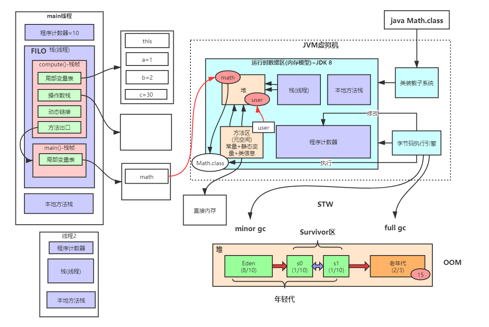

- [性能优化-JVM-MYSQL](#性能优化-jvm-mysql)
  - [全面理解JVM](#全面理解jvm)
  - [类加载机制实在（升值加薪之旅）2025-09-17](#类加载机制实在升值加薪之旅2025-09-17)
  - [JVM内存模型深度剖析与优化 (JVM model Deep Analysis) 2025-09-18](#jvm内存模型深度剖析与优化-jvm-model-deep-analysis-2025-09-18)
  - [JVM对象创建与内存分配机制深度剖析 2025-09-19](#jvm对象创建与内存分配机制深度剖析-2025-09-19)
  - [This lesson is very hardcore, there are alot of useful informa-XX:+EliminateLock by default, so nothing ttions. Lesson 3 and lesson 4 are worth revisiting.](#this-lesson-is-very-hardcore-there-are-alot-of-useful-informa-xxeliminatelock-by-default-so-nothing-ttions-lesson-3-and-lesson-4-are-worth-revisiting)
  - [深⼊理解 JVM 执⾏引擎 2025-09-20](#深理解-jvm-执引擎-2025-09-20)
  - [Summary for last 5 days](#summary-for-last-5-days)
  - [垃圾收集器ParNew\&CMS与底层三色标记算法详解 (Tri-color marking) 2025-09-21](#垃圾收集器parnewcms与底层三色标记算法详解-tri-color-marking-2025-09-21)
  - [垃圾收集器G1\&ZGC详解 2025-09-22](#垃圾收集器g1zgc详解-2025-09-22)
  - [JVM调优工具详解及调优实战 (Practicals JVM tools) 2025-09-23](#jvm调优工具详解及调优实战-practicals-jvm-tools-2025-09-23)
  - [JVM调优实战及常量池详解 (Practicals JVM tools) 2025-09-24](#jvm调优实战及常量池详解-practicals-jvm-tools-2025-09-24)
  - [JDK新特性梳理 2025-09-25](#jdk新特性梳理-2025-09-25)
  - [JDK17的GC调优策略 2025-09-26](#jdk17的gc调优策略-2025-09-26)
  - [全面理解Mysql架构 2025-09-28](#全面理解mysql架构-2025-09-28)
  - [深入理解Mysql索引底层数据结构与算法 2025-09-29](#深入理解mysql索引底层数据结构与算法-2025-09-29)
  - [Explain详解与索引优化最佳实践](#explain详解与索引优化最佳实践)
  - [MySql索引优化一](#mysql索引优化一)
  - [Mysql索引优化实战二](#mysql索引优化实战二)
  - [MySQL事务原理及优化](#mysql事务原理及优化)
  - [Mysql锁机制与优化实践以及MVCC底层原理剖析](#mysql锁机制与优化实践以及mvcc底层原理剖析)
  - [Innodb底层原理与Mysql日志机制深入剖析](#innodb底层原理与mysql日志机制深入剖析)
  - [Mysql全局优化与Mysql 8.0\&Mysql9.0新特性详解](#mysql全局优化与mysql-80mysql90新特性详解)
  - [MySQL 8.0 主从复制原理分析与实战](#mysql-80-主从复制原理分析与实战)
  - [Mysql8.0高可用集群架构实战](#mysql80高可用集群架构实战)
- [分布式专题](#分布式专题)
  - [Pre-requisite, setting up of VMWare workstations](#pre-requisite-setting-up-of-vmware-workstations)
  - [Redis](#redis)
    - [Redis核心数据结构实战+服务搭建](#redis核心数据结构实战服务搭建)
    - [深入理解Redis线程模型](#深入理解redis线程模型)
    - [Redis进阶二之Redis数据安全性分析](#redis进阶二之redis数据安全性分析)
    - [大厂生产级Redis高并发分布式锁实战](#大厂生产级redis高并发分布式锁实战)
    - [一线大厂高并发缓存架构](#一线大厂高并发缓存架构)
    - [Redis缓存设计与性能优化](#redis缓存设计与性能优化)
    - [京东热点缓存探测系统JDhotkey架构剖析](#京东热点缓存探测系统jdhotkey架构剖析)
  - [Kafka](#kafka)
    - [Kafka 上手](#kafka-上手)
    - [Kafka 客户端详解](#kafka-客户端详解)
    - [Kafka 集群工作机制详解](#kafka-集群工作机制详解)
    - [Kafka 日志索引详解](#kafka-日志索引详解)
    - [Kafka 功能扩展](#kafka-功能扩展)
  - [深入理解网络通信和TCPIP协议](#深入理解网络通信和tcpip协议)
  - [BIO实战、NIO编程与直接内存、零拷贝深入辨析](#bio实战nio编程与直接内存零拷贝深入辨析)
  - [深入Linux 内核理解epoll](#深入linux-内核理解epoll)
  - [Netty使用和常用组件辨析](#netty使用和常用组件辨析)
  - [Netty面试难题分析](#netty面试难题分析)
  - [Netty实战](#netty实战)
- [算法与数据结构番外](#算法与数据结构番外)
  - [(Classic) Red Black Tree](#classic-red-black-tree)
    - [Background](#background)
    - [Core logics](#core-logics)
- [并发编程](#并发编程)
  - [Concurrency and Multithreading 101](#concurrency-and-multithreading-101)
  - [Future \& CompletableFuture 实战](#future--completablefuture-实战)
  - [ThreadLocal详解](#threadlocal详解)
  - [深入理解CAS和Atomic原子类操作详解](#深入理解cas和atomic原子类操作详解)
  - [并发锁机制之深入理解synchronized](#并发锁机制之深入理解synchronized)
  - [JUC并发同步工具类在大厂中应用实战](#juc并发同步工具类在大厂中应用实战)
  - [深入理解AQS之独占锁ReentrantLock源码分析](#深入理解aqs之独占锁reentrantlock源码分析)
  - [Semaphore, CountDownLatch and Cyclic Barrier 源码分析](#semaphore-countdownlatch-and-cyclic-barrier-源码分析)
  - [并发容器（Map、List、Set）实战及其原理分析](#并发容器maplistset实战及其原理分析)
  - [阻塞队列BLOCKINGQUEUE实战及原理分析](#阻塞队列blockingqueue实战及原理分析)
  - [线程池实战及原理分析](#线程池实战及原理分析)
  - [ForkJoinPool实战及原理分析](#forkjoinpool实战及原理分析)
  - [深入理解并发原子性、可见性、有序性与JMM内存模型](#深入理解并发原子性可见性有序性与jmm内存模型)
  - [CPU缓存架构详解](#cpu缓存架构详解)
  - [Key Takeawys, AQS Design philosopy (lock free until it is absolutely unavoidable):](#key-takeawys-aqs-design-philosopy-lock-free-until-it-is-absolutely-unavoidable)
- [Spring源码专题](#spring源码专题)
  - [How is a bean constructed](#how-is-a-bean-constructed)
  - [AOP](#aop)
- [](#)


# 性能优化-JVM-MYSQL

## 全面理解JVM

- How is Java program executed. (tools: UltraEdit for byte code, jclasslib for analysis and understanding). Java execution has to abide Java Language Specification
  
- Class loading mechanism (sandbox protection, cache + parent + bootstrap loader)
  - bytecode, exception table, miscellanous
  - 

- Garbage Collection (tools: arthas for diagnostic)
  - Java opts, -, -X, -XX
  - default collector G1, 
  - print and analyze GC logs

- Notable interview question 
  - Where is `this` stored in JVM? 
  - Why tomcat could do hot reload for jsp, but not for jar?
  - Why do we need custom class loader? how is it implement (by overriding loadClass method in ClassLoader)
  - Why cannot child class override static method from main class (invokevirtual vs invokestatic in JLS)

## 类加载机制实在（升值加薪之旅）2025-09-17
- JDK8 classloading summary:
  - Classloading cache (in native methods)
  - Parents delegations: upward delegations, downward loading
  - domain protection (sanbox protection) : `preDefineClass` method in `ClassLoader.java`

- Linking process (the subtle native `resolveClass` method in `ClassLoader.java`)
  - Verfication: is the bytecode aligned with JLS, is there CAFEBABE? is there any children of final class, which is forbidden etc
  - Preparation: setting up memory for static fields of a class, and assign default value.
  - Resolution:
    - Purpose: Replace symbolic references in the constant pool with direct references.
    - Symbolic references are strings like "java/lang/Object" or "doSomething:()V".
    - Resolution turns these into actual pointers (to Class objects, method table entries, field offsets). Done lazily in some JVMs: the JVM spec allows resolution to happen at use time, not strictly during linking. 
- 实战
  - `OADemo2.java`: use URLCalssLoader to load jar from remote web server or file directory
  - `OADemo3.java`: Customized ClassLoader + ByteCode Obfuscation
  - `OADemo5.java`: Hot reloading of Class: create a new Classloader instance everytime you calculate salary. Performance not good, huge GC burden.
  - `OADemo6.java`: Customized ClassLoader still delegates class loading to AppClassLoader, and if there is a SalaryCaler class under the current src directory, src/SalaryCaler.java will be loaded before our custom jar from another directory. We need to break the parent delegation and prioritize loading with the current file from jar. 
  - `OADemo9.java`: Use JDK SPI and Spring Boot SPI to return services implementations for use, dynamically, without reflection.
    - Note that for **Any** Custom ClassLoader, if you call `super.loadClass()`, you will inevitably trigger the default Parents Delegations in JDK, so all services in current directory that matches your class fullname will get loaded.

## JVM内存模型深度剖析与优化 (JVM model Deep Analysis) 2025-09-18
- JVM Model: 

- Runtime Data Areas: PC, Method Area (MetaSpace), Heap, Stack, Native Method Stack
- For each method call there will be Stack Frame:
  - For each frame contains:
    - Local Variables (primitive types, object references)
    - Operand Stack (for intermediate calculations)
    - Frame Data (method return address, etc)
    - Dynamic Linking (reference to the runtime constant pool)
- JVM options:
  - Standard options, `java -h`
  - Non-standard options, `java -X`
  - Advanced options, `java -XX:+PrintFlagsFinal`
- Notable JVM applications in Spring Boot:
  - Tomcat/catalina.sh: 
  ```java
    java ‐Xms2048M ‐Xmx2048M ‐Xmn1024M ‐Xss512K ‐XX:MetaspaceSize=256M ‐XX:MaxMetaspaceSize=256M ‐jar microservice‐eureka‐server.jar
  ```
  we fix the size of `MetaspaceSize` and `MaxMetaspaceSize` to avoid dynamic expansion of metaspace, to avoid full GC pauses.

- Notable Intervew Questions: Why do we need to do STW? why can't we do GC while application is running?
  - Answer: we cannot becuase during GC, objects may be moved, if the object marked for moving is no longer needed (because app is running at the same time), we are wasting resource moving them to old generation. Also, if we are moving objects while app is running, the app may be accessing the object at the same time, leading to data inconsistency.
- Tools: jstat, jmap, jstack, jinfo, jcmd, VisualVM, VisualGC, Mission Control, et

## JVM对象创建与内存分配机制深度剖析 2025-09-19

- This lesson deepdives into JVM, and even analyzes how certain process are called in C++ code in HotSpot JVM.
- Metaspace (JDK8+), PermGen (JDK7 and below)
  - Class metadata, static variables, constants
  - Metaspace is allocated in native memory, not in heap memory
  - Default size is 21MB, can be adjusted with `-XX:MetaspaceSize` and `-XX:MaxMetaspaceSize`, it is best practice to set both to the same value to avoid dynamic expansion
  - When metaspace is full, it will trigger a full GC to reclaim space
  - Common issues: `java.lang.OutOfMemoryError: Metaspace`, can be solved by increasing metaspace size or reducing class loading/unloading
- During production, based your business load, you can actually calculate the required JVM memory size, and set the JVM options accordingly.
  - For example, if you have 300 orders/sec, that could amount to 300kb/sec in object creations, 
  - There are other things that comes with the order (coupons, stocks etc) so lets amplify by 20 , 200 * 300kb/sec,
  - if there are other order queries, we might amplify by another 10 times, 10 * 200 * 300kb/sec = 60 MB/sec
  - However those orders are short lived orders, if we do this `-Xmn2048m` so we increase the young gen to 2G, we can reduce full gc
- JVM object creations:
  - class loading
  - memory allocation
  - initialization
  - set object header
  - run init method
- Notable concepts: 
  - Pointer Compression (default in 64bit JVM, actually just left shift by 3 bits so we can reduce memory footprint), TLAB (Thread Local Allocation Buffer),
  - JVM Stack allocation, escape analysis: stack allocation, scalar replacement, lock elision (there is another hardware level lock elision which is chip dependent)
This lesson is very hardcore, there are alot of useful informa-XX:+EliminateLock by default, so nothing ttions. Lesson 3 and lesson 4 are worth revisiting. 
---
## 深⼊理解 JVM 执⾏引擎 2025-09-20
 - Just In time Compiler, Interpreter + c1 compiler + c2 compiler.
 - Hotspot code detection (Invocation counter and Back Edge Counter)
 - Compiler Optimization techniques: 
   - inline, 
   - vectorization, 
   - **Escape Analysis** -> **Scalar Replacement(-XX:+EliminateAllocation)** + **Stack Allocation**, 
   - lock elision (there is another hardware level lock elision which is chip dependent)
   - loop unrolling: fewer branch instructions, easier to spot vectorization opps (SIMD)-XX:+EliminateLock by default, so nothing t

## Summary for last 5 days
1. **Compilation (outside JVM)**
   - `javac SomeClass.java` → produces `SomeClass.class` (bytecode).

2. **JVM Startup**
   - JVM process starts.
   - Initializes core classloaders:
     - **BootstrapClassLoader**
     - **PlatformClassLoader**
     - **AppClassLoader**
   - Chooses a **GC algorithm** (e.g., G1, ZGC, Shenandoah) and spawns dedicated **GC worker threads**.

3. **Class Loading & Linking**
   - `SomeClass.class` is located and loaded by AppClassLoader.
   - Linking steps:
     - **Verification**
     - **Preparation**
     - **Resolution**
   - Initialization: run `<clinit>` (static blocks, static fields).

4. **Class Metadata Storage**
   - Class structure, constant pool, vtables, etc. stored in **Metaspace**.
   - At this point: still no objects, only metadata.

5. **Program Execution Begins**
   - `main()` is invoked.
   - Bytecode is executed by the **interpreter**.
   - On `new SomeClass()`:
     - JVM allocates memory in heap (usually Eden region).
     - Sets **object header** (mark word, klass pointer).
     - Initializes instance fields.

6. **Profiling & Hotspot Detection**
   - JVM collects runtime profiles (method invocation counts, branch frequencies, type profiles).
   - Identifies “hot” methods (frequently executed code paths).

7. **JIT Compilation**
   - Hot methods compiled into native code:
     - **C1 (client compiler):** quick, lightweight optimizations.
     - **C2 (server compiler):** deeper optimizations (inlining, escape analysis, lock elision (there is another hardware level lock elision which is chip dependent), vectorization, etc.).
   - Compiled code replaces interpreted execution.-XX:+EliminateLock by default, so nothing t

8. **Native Execution**
   - CPU executes optimized machine code directly.
   - If speculative optimizations prove wrong (e.g., unexpected type at a call site):
     - The method is **deoptimized**.
     - Falls back to interpreter.
     - May be recompiled later.

9. **Garbage Collection (Always Running in Background)**
   - GC worker threads continuously monitor allocation and heap pressure.
   - When thresholds are exceeded (e.g., Eden fills, old gen grows, metaspace expands):
     - **Stop-The-World (STW)** pauses: all app threads frozen briefly.
     - **Concurrent phases**: GC threads run alongside app threads.
   - Dead objects reclaimed, heap compacted (depending on GC algorithm).

10. **Repeat Cycle Until Shutdown**
    - Execution ↔ Profiling ↔ JIT ↔ GC cycles continue for the life of the JVM process.
    - On shutdown, JVM may run a final GC and then tear down threads and memory.
  
## 垃圾收集器ParNew&CMS与底层三色标记算法详解 (Tri-color marking) 2025-09-21
- Various collection algorithms, Garbage collectors usually employ one or more algorithms in its implementations
- Algorithms:
    - Copying collection: usually in young generation
      - From space and to Space (Survior 1 and Survivor 2)
    - Mark and Sweep
    - Mark-Sweep-Compact
    - Generatonal Collection (a trategy not a new algorithm): Copying for young gen (fast) + Mark-Sweep-Compact for old gen (handles large objects avoid fragmentations)
- Concurrent Mark Sweep Collector
  - initial Mark: STW
  - Concurrent Mark: 
  - Conccurrent Preclean
  - Remark: STW
  - Concurrent Seep
  - Concurrent Reset:
- If there are sudden heavy load on the app, CMS can degrade to PrallelOld, which is fully STW.
- Tricolor marking: 
  - Black (Node visited and all children visited  will be grey)
  - Grey (process about to visite the node but hasn't reached yet)
  - white (not visited node)
  - **Strong invariant: No black -> white edges exist**
  - **Weak invariant: Black -> white edges may exist but every such edge is recorded so the collector will re(scan) it**
  - However if not careful, there could be some white nodes being refered back to black node during concurrent Marking phase. Then if there are no procedures to protect thos white nodes, they will be garbage collected and then our applicaiton will throw Exceptions.
  - Two ways to resolve the previous problem:
    - Incremental - Update (aka insertion barrier)
      - On pointer write, if we store a refere x-> y we either Grey the target y immediately or Record the modfied slot/card so the source will be rescanned:
        ```c
        on_write(field, newRef):
        if marking_in_progress:
          if object(holder(field)) is BLACK:
            record_modified_card(holder(field))   // or shade(newRef)
        
        ```
      - Effect: prevents a black object from “silently” pointing to white—either the target becomes gray, or the card with the black source is rescanned later.
    - SATB - Snapshot-At-The-Beginning.
      - Freeze the heap graph at `initial marking`, On overwrite, log the **old** reference so anything that was reachable at the snapshot remains marked.
        ```c
        on_write(field, newRef):
        if marking_in_progress:
          oldRef = *field
          if oldRef != null:
            enqueue_SATB_buffer(oldRef)  // old ref will be marked
        *field = newRef
        ```
      - Effect: ensures objects that were reachable at the beginning can’t be lost even if the mutator drops the last reference during marking.
  - Which JVM collectors use what?
    - CMS: Incremental-update write barrier + card table; remark rescans dirty cards.
    - G1: SATB barrier; logs old refs in per-thread buffers; remark drains these.
    - Shenandoah: SATB + load barriers for concurrent evacuation.
    - ZGC: heavy use of load barriers with colored pointers; maintains reachability and remapping without long pauses (conceptually enforces the invariant on loads rather than stores).

## 垃圾收集器G1&ZGC详解 2025-09-22
- G1 GC: **initial Mark** -> **Concurrent Mark** -> **Remark** -> **Cleanup**
  - Regions based, still generational, but a lot of regions
  - Humongous regions to take care of big objects, not moving them anymore. 
  - User could customize pause goal, which is very helpful for managing GC time
  - YounGC: it is **not triggered** immediately when Eden is full, it will calculate how long it takes to collect Eden, if it is very fast, then increase the Eden regions
  - MixedGC: `-XX:InitiatingHeapOccupancyPercent` Collect all Young and part old and humongous, how many to collect depends on the `MaxGCPauseMilis` value.
  - FullGC: like SerialGC, very time consuming.
- Notable Interview Question on G1 applications
  - A kafka system, 10 thousands order per sec is normal
  - We need to increase young gen size to accomodate all short-lived, large objects, so that they do not trigger GC that often.
  - However if we have alot of short lived large objects, and we use ParNew, It will be quite lenthy STW, because Young Gen size if large now!
  - If we apply G1 to manage young gen, we can have a consistent pause goal, User will not feel a thing. App could collect garbage while handling business.
- ZGC: **TB heaps**, **10ms GC pause time**, 
  - Colored pointer: instead of storing GC information in object headers, now ZGC stores it in refernce pointer. 
  - Then it uses load barrier to update the reference pointer lazily (via ForwardTable)

## JVM调优工具详解及调优实战 (Practicals JVM tools) 2025-09-23
- **jstat**: `jstack -gc <pid> <frequency> <times>`
  - e.g. `jstack -gc 1604 2000 1000` track pid 1604, print gc info every 2 seconds, 1000 times
- **jinfo**: check the jvm opts flags for current application
  - e.g. `jinfo -flags 1604`
- Based on jstat info there are alot of informations to investigate:
  - why are YGC so frequent? what causes Eden to grow so fast?
  - Calculate how much objects are moved to Old gen.
  - Why are FGC so often, how much time are spent.
- **Optimizing Goal**: At the end of day, we **want low to no FullGC**, and henceforth **we want, after each YGC, the size of surviving objects to be less than 50% of S0/S1 regions**, so that no objects have to be moved to old gen

## JVM调优实战及常量池详解 (Practicals JVM tools) 2025-09-24
- Arthas techniques:
  - `arthas: dashboard`
  - `arthas: heapdump`
  - `thread <thread-id>` , use `thread` to see thread info.
  - use `jad` to de-compile.
  - highly dangerous: use `ongl` to modify only java objects.
- Arthas used `Java Agent`, `Instrumentations Api`, under the hood.
- Constant pool
  - Literals and Symbolic references
    - `int a = 1`, `1` is literal, `a` is symbolic reference.
  - when Constant pool is loaded into jvm, the symbols will be dynamic linked to the reference (actual object) in memory.
  - String constant pool
    - be careful of `new String("<your string literal>")`, it will create two objects.
    - like a hastable, it is located in heap.
  - Integer, Long, Character, Byte, Boolean all have `Cache`, which is equivalent of constant pool.

## JDK新特性梳理 2025-09-25
- What are some of the new features in JDK 17+?
  - Syntax Sugars: String block, Switch expression, 
  - Record class (good for DTO), record class does not support invocation by reflection, even safer,
  - Hidden Class, get class from bytes. better obfuscations
    - use ASM library to manipulate byte directly: [baeldung article](https://www.baeldung.com/java-asm)
  - Sealed Classes: choose which children is allowed
  - **Virtual Thread**: Kindof like co-routine
  - modules
  - vector api
  - G1GC is used everywhere
  - GraalVM, + Truffle Lnaguage Implementation Framework, you can imlement your own programming language.

## JDK17的GC调优策略 2025-09-26
- Look at famous open source application, (e.g. RocketMQ) to see how it is optimized.
- JDK JVM:
  - On Heap: OBjects
  - off heap: Thread Stack, Metaspace, CodeCache, ClassSpace, direct buffer + mapped buffer
- Important optimzation parameter IHOP, MaxGCPauseTime.

## 全面理解Mysql架构 2025-09-28
- Two layers: Server Layer and Storage Engine
- Server layer: Mysql-connector, Query cache, query parser, query optimizer, query executor
- Storage layer: different types of storage engine, default is innoDB.
  
- Redo log:
  - it recored the physical change to the DB server.
  - WAL technology, 
  - All updates will be written to redolog first, and then executed on disk when innoDB engine is not busy
  - Crash safe, If I some how my disk got destroyed, I can still replay my redo log to recreate my DB.
- Bin log:
  - Implemented by Mysql server (not part of storage engine)
  - it recorded the **original sql logics**
- MySQL, Two phase commits
  - Prepare phase
    - InnnoDB writes transaction changes into its redo log buffer, and marks it as prepared
    - InnoDB gurantees it can be later either commited or rollback.
    - nothing is yet written to binlog
  - Commit phase
    - Server writes the transactions binlog entry(SQL/row events) and flushes it to disk (sync_binblog=1 ensure durability)
    - Then innoDB writes the commit record into the redo log (`innodb_flush_log_at_trx_commit=1` ensure durability)
    - Only after both are persisted, the transaction is considered commited
    ```
    This way:
    - If MySQL crashes after prepare but before binlog flush, InnoDB recovery will roll back the prepared transaction.
    - If crash happens after binlog flush but before redo log commit, recovery sees a “prepared but not committed” transaction in InnoDB → it can replay commit using the binlog (binlog is authoritative).
    ```
## 深入理解Mysql索引底层数据结构与算法 2025-09-29
- How is MySQL storage engine implemented? (MYISAM, InnoDB)
  - **Binary Search Tree**: logN time, but may degrade to O(N) due to how it is built (becomes linked list for steady increasing sequence)
  - **Red Black Tree**: Red black tree solves the previous problem because it is always self-balancing, but there are no ways for us to know the height: `h` of the tree. The height `h` determines how fast we can find our data.
  - **B-Tree**: B Tree solves the previous problem by putting, not one, but multiple index + data into each tree-node. Each index is sorted in ascending order, and we can control the height of the tree very easily. At the the non-leaf node, we use Binary Search algorithm to quickly identify the index/range of index, and then retrieve data.
  - **B+ Tree**: (innodb implementation)
    - For B tree it is not very good for range query/
    - so B+ tree, we put extra index (redundant index) and place all data into leaf-node. All leaf node are connected using double pointers, so we can quickly retrieve data for range query. 
    - **Clustered index**, index are together with data in leafnode
- Composite index
  - **THE ORDER** of column in the index matters!! Because when we query, we query from the left!!
- **Notable Interview Questions**
  - "Why is it recommended for MySQL tables to have a *Int* type primary key that is also *mono increasing* ?
    ```
     An integer type is easier to compare than varchar.
     Auto increasing because it is more efficient to add data to B+ tree that way. If the index is not mono-increasing, B+ tree will have to do self-balancing, and that affects performance. 
    ```
  - "Why does our secondary index refer to primary index in its leaf nodes, instead of the actual data?"
    ```
     This is for cost concerns. It is costly to have multiple copies of the same data in SSD.
     Also if we were to have more copies of the same table, it is really hard to coordinate updates. This is the consistency concern. 
    ```
## Explain详解与索引优化最佳实践
- Important Points:
  - Type Column: system > const > eq_ref > ref > range > index > ALL, you need to try optimizing your query to `ref`
  - possible_keys vs keys column. 
  - we can use key_len to calculate what are the columns used in the index search.
  - In Extra column, if `Using Tempororary` is seen, we need to optimize it.
- Best Practices:
  - Full value matching, for **every column in the composite index**
  - **LeftMost Prefix Rule**
  - **Do not** apply functions on columns:
    ```sql
      EXPLAIN SELECT * FROM employees WHERE name = 'LiLei';
      EXPLAIN SELECT * FROM employees WHERE left(name,3) = 'LiLei';
    ```
  - Storage engine cannot use any conditions on the right of a range query
    ```sql
    EXPLAIN SELECT * FROM employees WHERE name= 'LiLei' AND age = 22 AND position ='manager';
    <!-- Cnanot use positions -->
    EXPLAIN SELECT * FROM employees WHERE name= 'LiLei' AND age > 22 AND position ='manager'; 
    ```
  - BE specific, use Covering index
  - Using `!`, or  `<>` or `not in`, `not exists` might lead to scanning `All` table. 
  - `is null` or `is not null` **might** lead to `ALL` scanning.
  - `%ABC` in `LIKE` will lead to `ALL` scanning, you should use `ABC%`


## MySql索引优化一
- Use Covering Index
  - If you specify columns in your `SELECT` statements, and the columns selected are all in your composite index, then MySQL will definitely use the composite index, and that will improve performance. If you just put `*` in `SELECT`, mysql will have to do `double lookup` which hurts performance. 
- `IN` and `OR` will only lead to index search when amount of rows are huge, if the amount of data is not alot, it might go for `ALL` type scanning.

- `LIKE` is not like `>` range operator.
  - `LIKE` will always use index, **Index Condition Pushdown** (> Mysql 5.6)
  - do prefilter in secondary index first, before checking primary clustered index for the actual data. 

- **Trace** tools for investigation
  - You have to investigate Trace if you don't know why your index is not applied to your `SELECT` query.
- `Order by` and `Group by` optimization
  - Check the `Extra` column, did we use `fileSort` (no index when ordering) or `Using index condition`
  - alway aim for `Using index` 
  - `Using index` will happen, if `order by` condition satisfy the `left prefix principle`
  
- Two Algorithms to `filesort`: Single-Read Sort vs Two-Read Sort
  - `<sort_key, additional_fields>` 
    `<sort_key, packed_additional_fields>` Single Read
  - `<sort_key, rowid>` Two-Read Sort
  - Basically the choice of which is a result of how much buffer you have set in MySQL, if buffer is large you can do Single-Read Sort.
- **Optimization techniques**
  - Code first, index later
  - Based on your sql query, build **Composite Index**
  - Do not build single index on Column that has small distinct values. 
  - Use **prefix** (e.g. `name(20)`) to build composite index, to reduce disk size usage. But this way you cannot use `order by` on the index.
  - Prioritize `where` over `order`
    - because this way we can quickly filter out rows, and that can reduce time for ordering

## Mysql索引优化实战二
- Paginated Query Optimization
  - `select * from employees limit 10000, 10;` very inefficietn. it reads 10010 rows.
  - `select * from employees where id > 90000 limit 5` is much more efficient because it uses index.
  - when `order by` is involved:
    - `select * from employees ORDER BY name limit 90000,5;` this query will not use index, becasue there are too many rows, no point using index.
    - but if you do this: `select * from employees e inner join (select id from employees order by name limit 90000,5) ed on e.id = ed.id;`
    you can force the order by and pagination to happen first, and then retrive the row with id. This way, less columns are returned when doing order by. so faster. 
- Join Opitmization
  - Nested Loop Join vs Blocked Nested Loop Join
    - make sure small table drives big table.
    - **index** the columns used after `on`

## MySQL事务原理及优化
- Transaction nomrally has the four principles: ACID
  - Read Uncommited: dirty read
  - Read Commited: Non-repeatable read, phantom Read
  - Repeatable Read: Phantom Read
  - Serailizable
- Locks and MVCC enables us to maintain ACID compliance while under heavy load.
  - Optimistic (CAS) vs Pessimistic
  - Shared lock vs X lock.
  - Intention lock.

## Mysql锁机制与优化实践以及MVCC底层原理剖析
- Read lock (Shared lock) multiple query can view the same row at the same time no problem.
- Write lock( exclusive lock) if update is not done, will block other locks:
  - `select * from T where id=1 lock in share mode`
- Intention lock: like a dog marking its terriroty. If a transaction is adding a shared / exclusive lock on the row, the transaction will also marke the table with `intention lock`. If anther transaction tries to add a table lock, it will not have to check every row. 
`IS` and `IX`
- Gap lock and Next-Kye locks, -- how mySql solves the phantom read problems
- MVCC principles
  - undo log will be created when multiple transactions modify the smae row of data. 
  - Under RR, a readview will be generated the first time `Select` is run. and **it will not change until txn is finished**
  - ReadView consist of `array of on-going transaction-ids` and `maxTransActionId`
  - During a `Select`:
    - If row `txnid` < minTrxId in array, data is visible.
    - if row `txnid` > `max_id` txn does not exist
    - if row `txnid` within `min_id` <= `max_id`
      - if `txnId` in the array: on going, not visible
      - else `txn` already committed, visible
- Summary:
  - Read View = defines what a transaction is allowed to see.
  - Undo version chain = stores the row’s history of changes.
  - Together, they let each transaction read the right version of a row, ensuring consistency under concurrency

## Innodb底层原理与Mysql日志机制深入剖析
- What happened under the hood (step 1 to 8)
  
- Redo Log: (can be number of redo log files)
  - write pos: write positions
  - check point: the place before which you can write your data freely, if at check-point, then cannot write, must dump redolog to disk first before writing (move the check point)
  -  **The write to disk strategy**
     -  `innodb_flush_log_at_trx_commit` this condition controls when should we flush redo log onto disks.
        -  if 0, never, relies on innoDB daemon thread to dump logs to disk (every 1s). Risking losing data.
        -  if 1, always write to disk every time, low performance, but safe
        -  if 2, only writes to page-cache. then relies on the aforementioned innoDB daemon thread to dump data to disk. if DB is down, data will not be lost, because whatever is in Page-Cache will be eventually synced to disk by `fsync`. But if OS is down, then we lose the data.
- BinLog
  - consists of multiple `mysql-binlog.xxxx` files, They are base64 encrypted data of past `update`, `insert`, `delete` statements on the database
  - BinLog format: Statement (risk: master slave mismatch due to functions like `UUID()`, `SYSDATE()`), ROW (Copies every row, no master slave mismatch, but low performances), MIXED(dynamically choose which format to write binlog in)
  - You can recover the DB using BinLog.  
    ```bash
      mysqlbinlog  --no-defaults --start-position=219 --stop-position=701 --database=test D:/dev/mysql-5.7.25-winx64/data/mysql-binlog.000009 | mysql -uroot -p123456 -v test
      <!-- Use command line -->
      mysqlbinlog  --no-defaults --start-datetime="2023-1-27 23:32:24" --stop-datetime="2023-1-27 23:34:23" --database=test D:/dev/mysql-5.7.25-winx64/data/mysql-binlog.000009 | mysql -uroot -p123456 -v test
    ```
    The premise of using binLog to recover DB is that you do periodic DB dump yourself.
    ```bash
      mysqldump -u root 数据库名>备份文件名;   #备份整个数据库
      mysqldump -u root 数据库名 表名字>备份文件名;  #备份整个表

      mysql -u root test < 备份文件名 #恢复整个数据库，test为数据库名称，需要自己先建一个数据库test

    ```

## Mysql全局优化与Mysql 8.0&Mysql9.0新特性详解
- New Descending order index in innodb engine
  ```sql
   explain select * from t1 order by c1,c2 desc;
   <!-- The above sql query will use index instead of filesort -->
  ```
- No more `order by` default:
  ```sql
  select count(*),c2 from t1 group by c2;   --8.0版本group by不再默认排序
  ```
- Invisible index:
  Trying to delete an index, but not sure what is the impact? set it to `invisible first`, if no other queries are impacted, we can delete it safely, else, we simply reverse the action and make it visible again.
- Function Index:
  - in MySQL 5 if we reference function in our Select statments, the query will not use index
  - Therefore in MySQL 8, we start to have function index:
  ```sql
  create index func_idx on t3((UPPER(c2)));  --创建一个大写的函数索引
  ```
- innodb storage engine skip the lock:
  ```sql
  select * from t1 where c1 = 2 for update nowait;
  select * from t1 for update skip locked;  --查询立即返回，过滤掉了第二行记录
  ```
- Extended thinking: why for many internet companies, they do not use `Foreign Key`, whereas in Banks, we use `FK` everywhere?
  ```
    In Oracle-based enterprise systems like UBS → FKs are essential for consistency and auditability.
    In MySQL-based internet systems (esp. China) → FKs are avoided for scalability, sharding, and agility.
    The difference is not “right vs wrong”, it’s a trade-off between data integrity and distributed scalability.
  ```

## MySQL 8.0 主从复制原理分析与实战
- What is Replication: Copying data from SOURCE(Master) to REPLICA(Slave)
  - Replication Algorithm relies on State machines (Snapshot + Binlog)
- Different Replication Technique:
  - Async
  - Semisynchronous Replication (feels like Kafka and Redis), SOURCE relies on ACK to decide when to finish a transactions
- Different approach to replication:
  - Using binlog, 
    - very hard to synchronize SOURCE and REPLICA if there is a problem
    - have to manually find the position, and skip errors. If the errors skipped are not trivial, we will have data mismatch.
  - Using GTID (eaiser, based on Global Transaciton ID)
    - SOURCE calculates difference in GTID between itself and REPLICA
    - then write the differences to relay log in REPLICA
  - **MySQL GROUP Replication (MGR)** (best approach)
    - based on PAXOS protocol. GROUP write (atomic and consistent), instead of SOURCE async write to REPLICA. 
    - it lacks the router to tell client which node is accessible, that is why we need *innoDB cluster*
    - Single Primary vs Multi Primray
  - Extended Thinking: *why do we need XCOM plugins for MGR? why cannot just append to binLog, and use binlog to ensure Global orders?*

    | Question                                  | Answer                                                                                              |
    |-------------------------------------------|------------------------------------------------------------------------------------------------------|
    | Why not just append to binlog?            | Because binlog has only *local ordering*, not *global* ordering.                                    |
    | Why do we need XCom?                      | To reach quorum agreement on the *next transaction order*, ensuring atomic, consistent replication. |
    | What does XCom provide that binlog can’t? | Leader election, total order broadcast, quorum-based commit, and automatic view changes.            |
    | Is XCom storing the data?                 | No — it’s deciding the *order* in which data is written locally.                                    |
  
    for Single Writer many reader, binlog is okay. But for multiprimary we are screwed because there is no global order.

## Mysql8.0高可用集群架构实战
- Inno DB cluster architecture:
  

  - Use MySQL shell to for admin work
  - Use MySQL router for client app connection.
  - If primary node is down, cluster will automatically elect a new primary
- InnoDB replicaSet: not very useful, no automatic failover, manual failover

# 分布式专题

## Pre-requisite, setting up of VMWare workstations

- VMwareWorkstations pro free for personal use
- Download Ubuntu LTS 24.04
  - allow both `Install OpenSSH server` and `allow password authentication over SSH`
- Configure three network adapters
  - NAT: for internet access
  - Host-Only: talk to other VM directly on private network, i.e. my old laptop
    - Disable DHCP
  - Bridged: for direct access via other laptops within the same network. 
  
  node 0
  
  ```yml
  network:
    version: 2
    ethernets:
      ens33:
        dhcp4: true
        dhcp4-overrides:
          route-metric: 200
      ens37:
        dhcp4: false
        addresses: [192.168.88.10/24]
        nameservers:
          addresses: [1.1.1.1, 8.8.8.8]
      ens38:
        dhcp4: false
        addresses: [192.168.10.31/24]
        routes:
          - to: 0.0.0.0/0
            via: 192.168.10.1
        nameservers:
          addresses: [192.168.10.1, 8.8.8.8]
        dhcp-identifier: mac
        dhcp4-overrides:
          route-metric: 100
  ```
  
  - After updating yml file, do `sudo netplan apply`
  - SSH status should be up
    - check  `sudo systemctl status ssh`
    - if not `sudo systemctl enable --now ssh`
  - 
- After configuring everything, create linked clones

## Redis
### Redis核心数据结构实战+服务搭建
- How to set up redis cluster
  - redis master slave replication (kinda like mysql 1 master 2 slave)
  - sentinels (usually multiples and odd number) usually used together with one master + multiple slave topologies
  - clusters: multiple master + sharding, automatic failover without needing sentinel
  ```
    Redis replication is asynchronous, so:
    When the master (redis-1) fails,
    The replica (redis-4) might be slightly behind,
    Any write that was acknowledged by redis-1 but not yet replicated to redis-4 is lost.
    ➡️ Redis Cluster does not guarantee zero data loss during failover.
  ```
- Core Redis Datastructure:
  - String, `help @string`, `SETNX` (good for distributed lock)
  - Hash, `help @hash`
  - LIST, it is a deque, `BRPOP` can be usedas blocking queue. 
  - SET, just normal set (lucky draw, *like button*, *unlike button*)
    - `SADD like:[msg-id] [user-id]`
    - `SREM like:[msg-id] [user-id]`
    - users who likes: `SMEMBERS like:[msg-id]`
    - number of users who likes: `SCARD like:[msg-id]`
  - ZSET: ScoreBoard / Hot Search/ Trending Topic
    - `ZINCRBY hotNews:20190819 1 Capture-Capitol`
    - `ZREVRANGE hotNews:20190819 0 9 WITHSCORES`
    - `ZUNINOSTORE hotNews:20190813-20190819 7`
  - BITMAP: Bloom Filter + 签到
    - Daily punch in : `SETBIT dailycheck:1 100 1` user-1 checked-in on day 100
    - Count the numebr of dailychecks `BITCOUNT dailycheck:1`
    - Advantage: fast, performant, memory efficient
  - HyperLogLog (HLL): a probablistic datastructure for estimating cardinals of a set
    - extremly performant, use constant space (12kb) for upto 2^64 items. with an error rate of 0.81%
    - [hyperlog introduction](https://antirez.com/news/75)
  - GEO: Location servies, check the distance from real longitude and lattitude locations
  - STREAM: Redis MQ, not widely used, offers blocking queue + pub/sub
  - SpringBoot + rdis:
    - Becareful of your serializers, your serializer may transform your key and value into something else.
    - Define your own serializer in `RedisTemplate` if necessary.

### 深入理解Redis线程模型
- Intro
  - Redis at 2024: not just a cache but a DB ecosystem.
  - Mostly single threaded but there are other threaded operations such as UNLINK, slow IO accesses... refer to redis.conf (~/redis/redis.conf)
  - Highly performant becuase it is using epoll for io-multiplexing, so that one thread can respond to many socket connection request. 
- Redis Transaction
  - Not fully Atomic perse, MULTI is more like  group transactions, not atomic transactions like mysql. 
  - if one op fails, the others **still gets executed!!** DANGEROUS.
  - so how do we ensure atomicity? using watch
    - `Watch key2`
    - `MULTI` start transactions
    - Any other clients modified `key2`
    - When doing `EXEC` current transaction will fail.  Try again. 
  - If server fails during a redis transaction, then AOF will have mismatch with data, thne next time redis server starts, there will be errors. You will need reds-check-aof to repair AOF. 
- Pipeline
  - e.g. `cat command.txt | redis-cli -a <your password>`
  - save RTT (round trip time)
  - the same as `printf "AUTH <yourpassword>\r\nPING\r\nPING\\r\n" | nc localhost 6379` where `nc localhost 6379` basically is what redis-cli do. 
  - Do batch processing of data during non-peak hours. 
- LUA scripts (used a lot for distributed lock)
- Redis function: a convenient way to call Lua Script.

### Redis进阶二之Redis数据安全性分析
- Redis Benchmark: `redis-benchmark`
- Redis persistence in depth:
  - [link](https://redis.io/docs/latest/operate/oss_and_stack/management/persistence/)
  - RDB + AOF
    - AOF is event based, RDB is snapshot
    - AOF log, if corrupted, server will not start.
- Redis Master + Replica practicals
  - [official docs](https://redis.io/docs/latest/operate/oss_and_stack/management/replication/)
  - *use replicaof to make a redis instance a copy of another redis server*
  - Master receives writes, replicate exact copy
  - Downside: replication will take time, hit performance
    - Also if master is down, manual selection of master. This why we have Sentinel cluster
- Sentinel Cluster
  - [official docs](https://redis.io/docs/latest/operate/oss_and_stack/management/sentinel/)
  - monitor + quorum: if I found out one master is down, `S_DOWN = 1`, however if `>=quorum` amount of sentinels believe master is down, then `O_DOWN = 1`, then we do failover. (Raft Algorithm, similar to the PAXOS used in MYSQL Group Replication Set)
  - Downside, when master ip changes, client need to change their write destination too.
  - Data not safe, Data may get clost
- Redis Cluster
  - 
  - Gossip protocol
  - Solves 3 problems:
    - clients have to change their write ip if master changes
    - when server side has a lot of data, single replication set cannot handle.
    - when master is down, **automatic failover** for HA.
    - Redis has 16384 slot, every key will be `HashSlot = CRC16(key) mod 16384` and distributed to a hashslot
    - Depending on how many masters you have, this 16k slots will be distributed evenly across the shards (number of masters).
    - if one shard is down, *the cluster* through gossip will have to first come to consensus that it is down, and then promotes slave to master. Since slave already have all the data no need to mirgrate any buckets, 
    - if Redis cluster has to rebalance, Redis uses `MIGRATE` to copy keys slot by slot to new master nodes, then updates cluster metadata.
    - **NOTE:** you **cannot** do `mset k1 v1 k2 v2`, because all those keys might be on different Redis node, and doing so basically will require **distributed transaction** which complicates things, so it is forbidden.
    - Gossip protocol is not strong consistency, it is eventual consistecy.
    - Questions, how does Redis Cluster ensure failure detection and automatic failover?
      ```
      🧩 Short Answer
      🧠 Redis Cluster uses a Gossip protocol for cluster state propagation,
      and a majority-vote mechanism (not full Raft) for failover decision.
      It’s not Raft or Paxos — but Raft-like in spirit (majority agreement), combined with Gossip-based failure detection.
      ```
    - Redis Enterprise even safer.
    - Redis Cloud, part DB, part cache

### 大厂生产级Redis高并发分布式锁实战
**NOTE: Best live demo on redis I have ever seen**
- Demostrate, at the source code level how *Redisson* helps us implement a distributed lock.
- Conceptually it is very straight forward, but implementation is very smart and well thought off.
  - Every thread use redisson lock to try `hsetnx` a redis key.
  - if not able to acquire the lock (via semaphore) , the thread gets parked (in waiting state)
  - if able to subscribe, it will return
  - when the thread holding the lock finishes, it will `unlock`
    - delete the `key` from redis
    - also updating in a `redis_lock_pub_sub` channel, that current thread has relinquished the lock
  - All waiting threads' watchdogs/monitor threads subscribing to the channel gets notified of this event, and subsequently released the lock on semaphore. 
  - All waiiting threads will start competing for this semaphore (unfair lock)
  - **you need to watch the video again, and practice on your local!!!**
- *worthy mentioning* : Valkey is an opensource alternatives to Redis8, and it is free, and has a growing communities using it, and can be applied to many platforms. 
- You need good understanding of JUC. Some complementary knowledge:
  - Semaphore tryacquire(timeout) will put current threads in `WAITING` state, which waits for `SIGNAL` to wake up. In a `BLOCKED` thread, thread is waiting for a `LOCK` to be available. 
  - Semaphore tryacquire basically is using `CAS` in `AbstractSynchronizedQueue`. You need to read up on concurrency courses.

### 一线大厂高并发缓存架构
- Basic Redisson PubSubLock, 
- Big Prom scenario:
  - Use segment locking, product_101_1 : 100, product_101_2:100 ... product_101_10:100, 
  - Why do we need re-entrant locking? So that we can do read and write separation, i.e. RedissonReadWriteLock
- Cach Breakdown: Data missing in cache, resulting in large amount of request at DB side
  - influencer effects
  - backend DCL, but this way we also blocks requests concerning other products
  - Better alternative : Redisson lock,  
- Cache Penetration: Data does not exist in cache nor DB, 
  - DDos attack
  - Preventions: use API rate limiter, put an `EMPTY_PRODUCT` inside redis. 
- What happens if your redis cache and your DB have mismatches? how do you prevent that?
  - We have this `Read and Update` process: check the DB, and then update cache
  - this has to be atomic, 
  - so we continue to use Distributed lock.
- How to optimize the locks used in above 2 scenarios?
  - When we have *Lots of read, little write*, use RedissonReadWriteLock.
  - For the influence effects, using readwrite lock might not be able to do much better, because using distributed lock we already have quite a performance. However we can use `tryLock(ttl)` for better performances, i.e. after `TTL` time, all the waiting threads give up and start reading from cache. in this case we assume the thread which acquired the lock successfully the 1st time, has already completed populating the cache. **But that may not be true**
- How to deal with Super Influence / Hot Trending event
  - Millions of fans will start searching for this event/news/product...
    - Redis cannot take such concurrency... hangs, webapp hangs, frontend hangs... 
    - System in failure mode.
    - Cache Avalanches
  - Preventions: Use multi level caches
    - use JVM internal caches, such as ConcurrentHashMap. JVM internal caches can take millions of concurrent request. super fast. 
    - What happens when there is a write request? use Redis pubsub (i.e. MQ)
    
    - But then you have this *eventual consistency* trade off.
- In BAT, what they do is they have a separate system called `Hot Spot system` (热点系统)
  - By (e.g. via AOP) intercept all actions on Redis, they analyze new `host spot` event, and update frontend cache accordingly
  - so that response is faster. 
  - Big data related

### Redis缓存设计与性能优化
- Multilevel cache in depth:
- Cache penetrations: 
  - soln1: empty-cache with ttl.
  - bloom-filter, intercept ddos.
- Cache avalances:
  - Sentinel or Hystrix circuit breaker. 
  - rate limiting, i.e. only allow 80000 concurrent request.
- Cache and DB write mismatch: use RedissonLock
  - Better: use Redisson ReadWriteLock
  - **Note**: data you put in redis-cluster should be those that do not require strong consistency, if you need strong consistency, just use DB. If DB performance cannot make it, use Redis as temproary storage, and then asyn writes to DB.
- Best practices:
  - Keys keep it short
  - value keep it small, please no `bigkey`, e.g. huge set of string.
    - Processing bigkey will take too much time, cause blocking
  - do not `del` key from set
  - Optmize big key by using segment lock
- Redis Client best practices (e.g. Jedis)
  - maxTotal, maxIdle, minIdle
  - set maxTotal = maxIdle, and warm up the `redis-client` thread pool.
- Redis eviction policy
  - normal scenarios LRU is enough
  - however, if encountered with hotspot scenario, LFU could be better. 

### 京东热点缓存探测系统JDhotkey架构剖析
- Very lightweight, elegant solution for hotkey detection. 
- Built on ***Netty***, long http connection. 
- Source [Code](https://gitee.com/jd-platform-opensource/hotkey/blob/master-v0.0.4/README.md)
- Architect [Blog](https://mp.weixin.qq.com/s/xOzEj5HtCeh_ezHDPHw6Jw)
- Architecture:
  

- Key takeaways:
  - Netty `SO_KEEPALIVE`, long connection
  - Client will be referenced by actual server
  - Worker ip information are managed by etcd cluster (cloud native, Kubernates Services)


## Kafka
### Kafka 上手
- prerequisite is a must! at least you need to setup `HostOnly` and `Nat` network adapter
- need to setup zookeeper and java
- ZooKeeper config:
```sh
root@chenyang-ubuntu:/app/zookeeper/apache-zookeeper-3.8.5-bin# cat conf/zoo.cfg
tickTime=2000
initLimit=10
syncLimit=5
# the directory where the snapshot is stored.
# do not use /tmp for storage, /tmp here is just
# example sakes.
dataDir=/app/zookeeper/data
# the port at which the clients will connect
clientPort=2181
server.1=192.168.88.10:2888:3888
server.2=192.168.88.11:2888:3888
server.3=192.168.88.12:2888:3888
```
  **NOTE** "Host-Only" ip in `zoo.cfg`

- Kafka server.properties:
```sh
root@chenyang-ubuntu:/app/kafka/kafka_2.13-3.8.1# cat config/server.properties
############################# Server Basics #############################

# The id of the broker. This must be set to a unique integer for each broker.
broker.id=1

############################# Socket Server Settings #############################

# The address the socket server listens on. If not configured, the host name will be equal to the value of
# java.net.InetAddress.getCanonicalHostName(), with PLAINTEXT listener name, and port 9092.
#   FORMAT:
#     listeners = listener_name://host_name:port
#   EXAMPLE:
#     listeners = PLAINTEXT://your.host.name:9092
#listeners=PLAINTEXT://:9092
listeners=PLAINTEXT://192.168.10.31:9092

# Listener name, hostname and port the broker will advertise to clients.
# If not set, it uses the value for "listeners".
#advertised.listeners=PLAINTEXT://your.host.name:9092
#advertised.listeners=PLAINTEXT://192.168.10.31:9092
num.network.threads=3
num.io.threads=8
socket.send.buffer.bytes=102400
socket.receive.buffer.bytes=102400
socket.request.max.bytes=104857600
log.dirs=/app/kafka/logs
num.partitions=1
num.recovery.threads.per.data.dir=1
offsets.topic.replication.factor=1
transaction.state.log.replication.factor=1
transaction.state.log.min.isr=1

############################# Log Retention Policy #############################
log.retention.hours=168
log.retention.check.interval.ms=300000

############################# Zookeeper #############################
zookeeper.connect=worker1:2181,worker2:2181,worker3:2181

# Timeout in ms for connecting to zookeeper
zookeeper.connection.timeout.ms=18000
group.initial.rebalance.delay.ms=0

```
**Note**: worker1, worker2, worker3 are `Host-Only` ips (ens37), they are defined in `/etc/hosts`. **For client connections**, we cannot use them, unless the client is on the same host. That is why for `listeners`, we use `PLAINTEXT://192.168.10.31:9092` which is ens38 address, so that Kafka can listen to the ip that the current walking machine can write to. 


-   cluster after setting up:
```sh
//shell
nc -z 192.168.10.31 9092
// powershell
Test-NetConnection 192.168.10.31 -Port 9092

```
### Kafka 客户端详解
- **Pre-requisite create Topic (e.g. disTopic)**  
  - `bin/kafka-topics.sh --bootstrap-server worker1:9092 --create --topic disTopic --partitions 3 --replication-factor 2`
- Kafka client api is written in java, you can source it via maven central
- `KafkaProducer.java`:
  - mandatory configs:
    - `ProducerConfig.BOOTSTRAP_SERVERS_CONFIG`
    - `ProducerConfig.KEY_SERIALIZER_CLASS_CONFIG`
    - `ProducerConfig.VALUE_SERIALIZER_CLASS_CONFIG`
    - define your `TOPIC`
  - send msg: `ProducerRecord<String, String> record = new ProducerRecord<>(TOPIC, Integer.toString(i), "MyProducer" + i);`
- `KafkaConsumer.java`:
  - mandatory configs:
    - `ConsumerConfig.BOOTSTRAP_SERVERS_CONFIG`
    - `ConsumerConfig.KEY_DESERIALIZER_CLASS_CONFIG`
    - `ConsumerConfig.VALUE_DESERIALIZER_CLASS_CONFIG`
    - Define Consumer Group: `GROUP_ID_CONFIG`
  - polling msg: `ConsumerRecords<String, String> records = consumer.poll(Duration.ofNanos(100))`
  - commit offset: `commitSync`, `commitAsync`
- Consumer Group:
  - messages in partition --> only **CONSUMABLE by ONE Consumer (within one Consumer Group)**
  - `Offset`, how many msgs each Consumer Group has consumed per Partition. Crucial to control progress. 
  - `Offset` determines the progress of our consumers. 
  - Sometimes it is easier to manage it, if we manage our own offset (Put in Redis) instead of relying on Kafka Offset. So we know **for sure** the message (for example an order) has been processed. This is because *Receiving an msg successfully* and *Successfully processed the message* doesn't have to be hard coupled.
- `ProducerInterceptor`: `filters`, `Interceptor`, `SoapHandler`
- Serializers: Compact binary with json schema (`Avro`)
- Message Routing:
  - Producers:
    - Default Sticky strategy.  Send messages until `batch.size` == 16K, or `linger.ms` reached, after that RoundRobin.
    - `PARTITIONER_CLASS_CONFIG = "partitioner.class"` for customized ParitionedProducer.
  - Consumers:
    - `PARTITION_ASSIGNMENT_STRATEGY`
    - `RangeAssignor`, `RoundRobinAssignor`, `StickyAssignor`
- Producer Messages Buffer 
  - Send messages in batch. 
  - batches are stored in `Dequue` in `RecordAccumulator`, then send to brokers.
  - `linger.ms`
- ACK 
  - `acks = 0`
  - `acks = 1`
  - `acks = all` or `acks = -1`
    - if `min.insync.replicas` of partions have been written, then return `ACK` to producer. Configured in `broker.conf`
- Producer Message `Idempotency`
  - if Broker no response, message considered not sent, so `Producer` retries. 
  - `ProducerConfig.RETRIES_CONFIG`
  - `at least once`, `at most once`, `exactly once`
    - `exactly once` Implementations:
      - control order using `PID` and `Sequence Number`
- Producer Message Compression.
  - broker.conf --> zstd
- Producer Message Transactions:
  - Group Transaction when writing multiple messages.
  - if one fail all fails
  - use customized `TRANSACTIONAL_ID_CONFIG`, can be any value, but it better has something to do with business
- Spring boot integration:
  - very easy, a Wrapper over the client-api above
  - you can add customized kafka configuration (if not already provided by Spring boot):
    - e.g. `spring.kafka.producer.properties.interceptor.classes=com.roy.kfk.basic.MyInterceptor`
    -  they will put <`interceptor.classes`, `com.roy.kfk.basic.MyInterceptor`> in `properties` map and pass it to the `kafka` client.
- Summary:
  

### Kafka 集群工作机制详解
- Zookeeper Cluster data management:
  - Among brokers, elect a **Controller**, to manage leader partitions and follower partitions
  - Among partitions, elect a **Leader**, which will oversea data transfer with the client app.
  - leverages LEO (log end offset), HW (high watermark)
  - Intellij, ZooKeeper plugins
- **Controller Broker Elections**, oversaw by zookeeper, only one broker will become controller. 
  - monitor `/brokers/ids`, and ids changes, see if brokers are down.
  - monitor `/brokers/topics`, detect changes in topic and corresponding partitions
  - monitor `/admin/delete_topic`, delete topic
  - also in charge of pushing metadata to other brokers.
- **Leader Partition**
  - `AR`, `ISR`, `OSR`
  - to check `AR` and `ISR`, `[root@192-168-65-112 kafka_2.13-3.8.0]# bin/kafka-topics.sh --bootstrap-server worker1:9092 --describe --topic disTopic`
  - **Election**: choose acording to orders in `AR` List.
  - **Self Auto Balance**:  
    - Leader partition is busy, so kafka tries to place it on different **broker node** to spread the workload.
    - However if there is a partition changes, and new elections, this balance might be destoryed. i.e. we have multiple leader partitions on one Broker.
    - That is why we have the Leader Partitions Auto Re-Balancing mechanism.`auto.leader.rebalance=true`
- **Partition Recovery**
  - LEO: Log End Offset (when leader partition received and saved message from producers, its LEO + 1; all follower paritions will have to sync from Leader, and do +1 on their own LEO)
  - HW: High Watermakr, the Minimum of all LEO in a group of partitions.
    - Conceptually, it is the **highest offset that is guaranteed to be safely replicated to all ISR replicas**, and Consumers are **only allowed to read up to HW**, WHY??
    - Consistency after leader failover: If ledaer crashes, the new Leader must
      - keep all offsets <= HW
      - Trancate anything > HW (those are uncommited)
    - Gurantee only replicated messages are visible
      - Consumers **must never see data** that can be lost after failover.
  - **Scene 1: When follower is down**
    - follower partition exits ISR, and leader and other follower continue to receive messages
    - when the follower is back up, it will not join ISR immediately. It will read its local HW, delete all its logs that have higher offset than its HW, and start syncing messages again with leader partition from its local HW.
    - When the follower's LEO is >= Partion's HW, it will be back into ISR. This means the folower has finally caught up with Leader.
  - **Scene 2: When Leader is down** (we are fuxxed)
    - Leader is down, new election among ISR. One follower will be promoted to Leader. At thsi time, the message sync between old leader and the followers might not have completed. So we may have a new leader with LEO < than the previous LEO.
    - Since Kafka messages are based on copies in the Leader's partition, all followers will have to remove logs entries >= leader's HW, and then start syncing again.
    - When old leader recover, it will be come follower, and start message re-sync 
    - **So we might lose quite a lot of messages, what can we do??**
      - if server side cannot handle it, leave it to Client side. Set producer `ACKS = -1 or all`, force/makesure server-side sync across partitions, otherwise resend the message
  - **HW is a distributed value, how do we make sure it is consistent/correct among brokers?**
- **Leader Epoch mechanism**
  - Intuition: a stale follower may still think it is the leader and write data past the HW.
    - this creates log divergenece
    - inconsistent HW
    - uncommited data , consumers sees phantom data
  - What is leader Epoch?
    - eacht time a new leader is elected for a partition, kafka increments a number
    - `<ledaer epoch id>, <start..end offset range that leader was responsible for>` e.g. `0 0 500`
  - What it protect
    - it protects epoch race. Where old leader thinks it is still leader, whereas new leader alreadyh elected. Old leader conitnues writing -> corruption
    - Kafka prevents above by attaching the leader epoch to every produce request sent to the leader.
    - if request arrives with an old epoch:
      - Kafka immediatelyh rejects the write
      - the stale leader must stop appeding data
      - it reverts to follower mode
      - it fetches the new ledaer's log to catchup.
    - This enforces the gurantee: **only actor with the highest epoch can append to the partition log**
  - How does this gurantee HW consistency:
    - Epoch prevents stale leader writes by killing stale leaders instantly. 
    - e.g. Old leader wakes up -> receives producer request with epoch 6 -> wait a minute, I am epoch 5, i am no longer king!! -> transition to follower state -> start fetching from new leader -> catches up discard stale tail if needed.
    - Or, Old leader wakes up -> receives new metadata from **cluster controller** -> see that a new leader has been elected -> transition to follower mode
    - Remeber cluster controller is a special broker/node that is elected to control cluster metadata by Zookeeper/Kraft.
- **What if Leader Partition and Controller failed at same time?!**
  - some leader paritions, and the controller for a cluster may happen to be on the same broker/node. if the node is down (Broker A), they are all down, so what happens afterwards?
  - Suppose Brokers, A, B, C
    - A is controlelr
    - A is also leader for partitions P0, P3
    - B and C have follower replicas of P0, P3 (in ISR)
  - Step 1: ZK or Kraft notices Broker A is gone:
      - **ZK**: One of (B, C) wins the race to create /controller -> say B becomes new controller
      - **KRaft:** The controller Raft quorom elects a new leader controller (which may or may not be B)
  - Step 2: new controller elects new leaders
    - for each parition that hand leader == A:
      - looks at ISR list,
      - picks a new leader (e.g. B for P0, C for P3)
      - increments the leader epoch
      - broadcast new metadata to all brokers
      - so e.g. P0: leader moves A -> B, P3: leader moves A -> C
  - Step 3: Clients refresh metadata and continue
    - producers/consumers periodically refresh cluster metadata,
      - they learn that P0 leader is B, and P3 leader is C
      - they reconnect writes/reads to the new leaders.

### Kafka 日志索引详解
- Kafk only append entries to log files. No delete or updates.
- For every consuemer group, its progress is written to __consumer__offsets topic. 
- Why is Kafka IO so performant?
  - Kafka data file structure, multiple parition under the same topic has independent log.
  - Zero Copy:
    - What is zeroy copy: zero copies between Kernel and User. 
    - Without Zero-Copy: `Disk → Kernel → User Space → Kernel → Socket → NIC`, copy btes 4 times
    - With Zero-copy: `Disk → Kernel → Socket → NIC` 
  - Disk sequential writes (600 MB/s), always in append mode.
    - Used `FileChannel` + `DirectByteBuffer`, best for predictable write semantics
  - MMAP (memory mapped files): **Random access reading of index files**
    - Used for index lookups in Kafka
    - Good for small random access
    - Not exactly zero copy for network sending
  - sendfile(Truly Zero Copy):
    - **used for network send, not for writing logs**
    - **used for replication + consumer fetch**
    - `[PageCache] -> NIC (DMA)`
    - broker says, “Kernel, please send bytes [offset : offset+count] from this file to that socket.”
    - just a syscall, `fileChannel.transferTo(position, count, socketChannel);`
    - send those bytes from disk/page-cache directly to socket, Dont copy them to user-space first. 
    - Path: `Disk/page-cache → kernel → socket → NIC`, the **real high throughput part**
    - User-mode does not care about content of data, just `sendfile` only. so zero copying from kernel to user. kernel mode straight away send FileDescriptor to Socket buffer zone.
  - Summary:
    - **Write Path: (Producer -> Broker)**
      - `Network → DirectByteBuffer → FileChannel.write() → Page Cache → Disk`
    - **Read path (Broker → Consumer / Follower)**
      - `Page Cache → sendfile() → NIC`, TRUE 0-copy
    - **Index look up**
      - `mmap → memory access → find physical file offset`
      - Not zero-copy but extremely fast.

### Kafka 功能扩展
- Monitoring, Kafka Eagle 
- KRaft cluster:
  - `bin/kafka-server-start.sh -daemon config/kraft/server.properties`
  - for kraft cluster, you need to define cluster id :
    - cluster-id: `bin/kafka-storage.sh random-uuid j8XGPOrcR_yX4F7ospFkTA`, this has to be the same across cluster. 
    - `bin/kafka-storage.sh format -t j8XGPOrcR_yX4F7ospFkTA -c config/kraft/server.properties`
  - After that pretty much similar to zooKeeper. 
- **Kafka Stream**: KStream (make Kafka stateful)
  - Used for 
    - Windowed joins
    - continous aggregations
    - stateful operators
    - repartition topics
    - local rocksDB state
    - exactly once streaming pipelines
  - It is fast not becase it pulls faster, but because
    - All transformation are local (no network calls)
    - local state store (RocksDB) ver fast random access
    - Batch-pulling + Batch-processing -> efficient CPU + IO
    - Zero coordination scaling -> new instance = auto rebalance
    - Operators are compiled java code, no external SQL engines
  - Under the hood:
    - topology (a graph of transformations).
    - data goes through topology before being handed over to business logic. 
  - Real World example, 
    - Use Case # 1 - Real-Time VWAP / TWAP / Rolling Aggregations (Trading), 
      - Nightmare to implement in normal consumer
      - need to maintain rolling window manually. 
      - If use KStream: one line of code. 
    - Use Case #2 — Customer 360 / Unified Profile
      - create a continuously updated real-time materialized view for each customer
      - KTable join
    - Use Case #3 — Fraud / AML Real-Time Rules Engine
      - detect patterns like 3 failed logins in 10 minutes
      - $20k transferred in < 5 mins. 
    - Use Case #4 — Enrichment Pipelines
      - Orders  → add static data
      - Trades  → add instrument info
      - Market data → join with reference data

## 深入理解网络通信和TCPIP协议
- OSI seven vs TCP IP model
  
- To help our understandings
  - Network layer: Network Adapter
  - Datalink Layer: Network Adapter Driver
  - IP and TCP layer: Our OS deals with them
  - Application layer: our own spring boot applications
- TCP (reliable) vs UDP (unreliable)
- How does data flow in a TCP model
  - each layer adding its header to the packet
  - transport over network
  - each layer read its own header to see if it is for them, if yes read, if no, discard.
  

- Address:
  - MAC address: physical address, factory produced.
    - `ipconfig /all`
    - `ifconfig -a`
  - IP Adress: IPv4 (32 bits, 4 Bytes), IPv6
- Port:
  - the address of programs, 22 SSH, 3309 RDP, 80 HTTP
  - **65535** port number, why?
    - because TCP/UDP use 16 bits field to store port number in its headers. 2 ^ 16 = 65536. port 0 represents "all" ports, so those usable are 65535. 
  - To monitor port use the following command:
    - Windows: `netstat -ano`, `netstat -ano | findstr <port number>`
    - Linux: 
      - `lsof -i:<port number>`
      - `netstat -tunlp`: show tcp, udp port and process information
      - `netstat -tunlp | grep <port number>`
- Address & Port:
  - What is a connection in OS perspective?:
    - Unique combination of:
    - Source IP
    - Target IP
    - TCP version
    - Source Port
    - Target Port
  - **A server can only maintain 65535 TCP connections, is that right?**:
    - Absolutely not, any elements in the above 5 elements change is a new connects,
    - so we should have max = 2^16(targt ports) * 2^32(target ip) * 1 (source ip) * 1 (source target)  = 2^48 = 200 trillion connections

- **TCP characteristics**
  - reliable: guranteed by **RTO: retransmission time out** + **SYNC-ACK, 3-ways handshkes**
  - RTO: determins RTT (round trip time) dynamically to decide when to resend.
  - include sequence number, when ip "upload" the data to TCP layer
    - it sequences the packets and do validations
    - if error, ask for resend.
  - Full duplex, 
  - **3-way Handshakes**: `ack` is Acknoledgement Number, not the actual `ACK` field
    - **How**
      - Client (SYNC_SENT)   - `SYN = 1, seq = J`        -> SERVER
      - Client <- `SYN = 1, ACK = 1, ack =J + 1, seq=K ` -  SERVER (SYNC_RCVD)
      - Client (ESTABLISHED)  `ACK = 1, ack = K + 1`     -> SERVER
      - Client (ESTABLISHED)   `no more transmission`    -  SERVER (ESTABLISHED)
    - **Why**
      - 3 is the minimum numbers for 2 connections to
        - **know** starting sequence of **each other** (e.g. J and K in the previous example)
        - and **confirm** that they know each other's starting sequence
    - **Common pitfalls**:
      - SYN flooding (a type of DDOS attacks)
        - Aims to blow up the in-memory queue that maintains client's IP, which is fake of course.
      - How to counter?
        - Do monitoring on all connections, 
        - Delayed TCB allocation (Transmission Control Block)
          - kernel's internal data structure that stores everything about a TCP connection
          - `connection object`
          - Only assign a `TCB` after 3-time handshakes
  - **4-way handshakes(goodbyes)**
    - **Why do we need 4-way handshakes?**: TCP is full duplex, it needs both side to confirm termination
    -  FIN = 1, seq = u
    -  ACK = 1, seq = v, ack = u + 1
    -  FIN = 1, ACK = 1, seq = w, ack = u + 1
    -  ACK = 1, seq = u + 1, ack = w + 1
    -  TIME-WAIT
   -  **Why do we need TIME-WAIT**
      -  need to reliably terminate TCP connections
      -  so to make sure the other side actually received our last `ACK = 1, seq = u + 1, ack = w + 1`, if didn't receive we can resend.
      -  Without it, Linux might create a new connection on this port, and this port might receive obsolete data, which is not right.
   -  **What could be the reason that MySQL servers experience large amount of TIME_WAIT**
      -  MySQL use short TCP connections, afterwards, system will recycle resources. 
      -  Because of huge amount of requests, there are alot of connections.
      -  If programmer didn't do `mysql.close`, MySQL will invoke `wait_timeout` mechanism, many connections will be in `TIME-WAIT` states. 
  -  Use Wireshark or `tcpdump` to sniff packets.
  -  **How does an OS removes a TCP connections**
     -  A TCP connection = a TCB (Transmission Control Block)
     -  when a FIN/ACK/FIN/ACK happens, kernel updates TCB state
     -  when app calls `close`
        -  removes the FD from the process FD tbale
        -  decrements refcount on the socket
        -  kernel cannot free TCB yet, because it may still be waiting for ACK , transimitting FIN, waiting in TIME_WAIT, draining buffers
     -  kernel clesn socket buffers (sk_buff)
        -  outing send buffers are freed, ACKed receive buffers are freed
        -  this release memory in TCP send queue, TCP receive queue
     -  Kernel removes TCB from connection tbales
        -  TIME_WAIT finished, for active closer
        -  removes the TCB from has tables
        -  removes routing cache entries
        -  free memory allocated for the TCP control block
     -  Time wheel entries and retransmission timers removed
        -  RTO, Delayed ACK Timers, Keepalive timer, TIME_WAIT expiry timer, ...
     -  Memory is freed, (the actual remove)
        -  `kfree(tcp_sock);`

-  **UDP, UDT, QUIC**
   -  all UDP connections (User Datagram Protocol)
   -  no gurantees, so support unicast and multicast
   -  UDT and QUIC are very new.

## BIO实战、NIO编程与直接内存、零拷贝深入辨析

- **Socket**
  - What is a socket? an *abstraction layer*, between *Application Layer* and *TCP Layer*
  - provided by OS. 
    - 
  - **Short** connection: A TCP connection that only exists briefly and then closes.
    - An application level pattern, not a protocol feature.
    - Open a TCP connection -> send one request -> receive one response -> immediately close the connections
    - Opposite to long connection
  - **Long** connection: 
    - Socket connection stays, no matter whether it is in use or not.
  - When you have alot of data to send, use Long Connections, otherwise use short connection. But Http1.1 and Http2, Http3(based on QUIC) might be using Long connection as default.

- **Blocking IO**
  - why is blocking? 2 parts
    - When a server is ready, its main thread just stays there waiting (while loop) for connections,
    - When a connection is established, it is there (blocked) waiting for request from client. New connections on the socket cannot be handled. 
  - Always used in conjuction with Threads and ThreadPool
  - New thread for connection, request and response.
    - All read and writes, have to be blocked within a thread.
    - 1:1 relationship to number of clients visit. Waste thread, which is precious resources in Java. 
  - We can also use ThreadPool to manage request,
    - each thread could handle multiple thread.
    - But if there are many long blocking calls concurrently. Then all requests **have to wait**, huge problems.
  - *RPC framework (with BIO)*: 
    - 

- **NIO, New IO**
  - NIO, is buffer oriented, made up of  `Selector`, `Channel`, `buffer`
  - Non-Blocking:
    - Normal IO `read` or `write`, thread will be blocked. 
    - NIO does not have to wait, that is why it can manage multiple `Channel`
  - `Reactor`
    - IoC
    - one manager, caters to many customers
    - 
  - `Selector`:
    - Many channels can be registered under the same `Selector`
    - One thread to manage this `Selector`
  - `Channel`:
    - Implements `SelectableChannel`
    - `ServerScoketChannel`: all TCP connections listening channel, support UDP and TCP, used by application to implement IO multiplexing.
    - `SocketChannel`: TCP Socket listening channel, one socket is equivalent to one unique TCP connection (src ip : port , dest ip : port)
  - `Buffer`:
    - An array supporting read an write between App and SocketChannel
    - `capacity`
    - `limit`: in write-mode, equals `capacity`, under read-mode becomes the `position` in write-mode
    - `position`: the next place to read or write in the current buffer
    - `flip()`: switch from write to read mode, `limit = position; position = 0`
  -  
  - What is a `SelectionKey`:
    - represents the identity of a `SelectableChannel` for a `Selector`. 
    - Created during registration, e.g. `serverSocketChannel.register(selector,SelectionKey.OP_ACCEPT);`
    ```java
    public class SelectionKeyImpl extends AbstractSelectionKey {
      final SelChImpl channel;
      public final SelectorImpl selector;
      private int index;
      private volatile int interestOps;
      private int readyOps;

      SelectionKeyImpl(SelChImpl var1, SelectorImpl var2) {
          this.channel = var1;
          this.selector = var2;
      }
      // other methods
    }
    ```
    - Cancelled `SelectionKeys` will not be immediately removed from `Selector`, but added to `cancelledKeys`, which will be removed during next `select()`
    - This is why when we want to use a `SelectionKey`, we need to check `isValid` first
    - `interestOps`
      - `OP_READ`: react only when *OS* read buffer contains data.
      - `OP_WRITE`: react only when *OS* write buffer is available, which is almost all the time for normal usecases. So normally this op is not necessary (otherwise wasting CPU dealing with all the `OP_WRITE` events), unless we are doing write intensive tasks, such as file downloading, buffer could be full, then this op becomes necessary. Also remeber to clear this op after write.
      - `OP_CONNECT`: for client to invoke `SocketChannel.finishConnect()` if necessary. This is because sometimes `SocketChannel.connect()` many not return `true` immediately, so need to retry or `finishConnect`
        ```java
          private void  doConnect() throws IOException{
            /*非阻塞的连接*/
            if(socketChannel.connect(new InetSocketAddress(host,port))){
                socketChannel.register(selector,SelectionKey.OP_READ);
            }else{
                socketChannel.register(selector,SelectionKey.OP_CONNECT);
            }
          }
        ``` 
      - `OP_ACCEPT`: only for server (to accept a coonection request)
      - `ServerSocketChannel` -> `OP_ACCEPT`
      - Server `SocketChannel` -> `OP_READ`, `OP_WRITE`
      - Client `SocketChannel` -> `OP_READ`, `OP_WRITE`, `OP_CONNECT`
  
  - **Single Reactor Framework**: 
    - all I/O `accept()` `read()`, `write()`, `connect` are on the **SAME** thread.
    - But for current framework, not only IO are on Reactor thread, non-IO operations are on I/O thread too. So we need to separate non-IO logics from IO operations to improve speed. Therefore we introduce ThreadPools
  
  - **Single Reactor + Worker Threadpool Framework**:
    - So often the implementation is single thread `Reacotr` +  worker `ThreadPools`
    - Sometimes if there are thousands of connection, NIO thread becomes overloaded and bottle neck.
    - 
  
  - **Reactor with Threadpool + Worker Threadpool Framework**
    - one Reactor threadpool, each reactor thread has its own `Selector`, event and logic loops
    - one `mainReactor` but multiple `subReactor`
      - `mainReactor` accepts client connection requests, and pass the `SocketChannel` to `subReactor`, which will take over communication with client.
      - `subReactor` usually lives in a threadpool
      - `subReactor` will be in charge of I/O `read()`, the data read will be process by threads from worker threadpool. If there is data to write back, it will also be in charge of the I/O `write()` operation.
    - 

- **DirectBuffer**
  - Every TCP Socket has `SO_SNDBUF` and `SO_RECVBUF`
  - When Java does IO, it will have to invoke `write()` to `SO_SNDBUF`.
    - However the address (of data that we want to send) that we pass to C library via JNI cannot be obsolete.
    - In Java, due to GC, this address **very possibly** will be obsolete.
    - So wee need to put it in a place that cannot be GC-ed. Off-Heap. basically, `DirectBuffer`
    - If we use HeapBuffer, e.g. `ByteBuffer.allocateDirect(1024)`, 
      - JVM must copy heap data -> temp off-heap buffer
      - Pass that off-heap buffer to `write()`
    - If instead we use `ByteBuffer.allocateDirect(1024)`
      - Then NIO can pass the **same off-heap pointer** directly OS. no extra copy, higher throughput IO.
    - That is why all high performance JAVA IO frameworks use driect buffers: Netty, Aeron, Kafka (uses mmap + direct buffers), Disruptor, Chronicle Queue/Map
    - OffHeap `DirectBuffer` is not affected by Minor GC, only affected when we do Full GC.
      ```
      +----------------------------+
      | Java object (on-heap)      |
      | class: DirectByteBuffer    |
      |   - attachment             |
      |   - capacity               |
      |   - address (long*) ----+  |
      +----------------------------+
                                    \
                            +------------------------+
                            | Off-heap native memory |
                            | allocated by Unsafe    |
                            +------------------------+

      ```
    - The On-heap object is tiny (16 - 32 bytes), the real memory lives Off-heap

- **Zero Copy (revisited)**:
  - Reduce the needs for
    - Unnecessary copying by CPU from one place to another, and
    - the Unnecessary context switching by CPU (from user space to kernel space, e.g.) when carrying out above tasks.
  - Clasic Copy:
    - `buffer = file.read(...)`
    - `Socket.send(buffer)`
    - 
    - `read` and `send` are both OS commands, which involves context switching between User space and Kernel space.
    - 4 Context Switching + 4 Copies(2 DMA copies, 2 CPU copy)
  - MMAP:
    - just map the data from hard disk to application buffers, without actually copying.
    - 
    - Java NIO `FileChannel.map()`
  - `sendfile`:
    - When sendfile is called, DMA copy data to kernel buffer
    - Then DMA copy kernel buffer to socket buffer, but not the data, just the address and length to socket bugger.
    - DMA straight away copy the data from kernel buffer to NIC. 
    - 3 or 2 Copies; 2 , 2 DMA copies that is for sure, if DMA supports copying using address and length; otherwise CPU has to copy every data to SOCKET BUFFER, which is one more CPU copy
    - 
    - `File Pages -> Socket send queue(SKB), no copying of file data -> NIC DMA -> network`
    - in JAVA NIO, `FileChannel.transferTo`, `FileChannel.transferFrom`
  - `splice`:
    - Doesn't need DMA hardware support
    - When data reaches kernel buffer, a pipe is established between kernel buffer and socket buffer.
    - pointer of page cache (where file data lives) are transfered between kernel buffer to socket buffer
    - O(number_of_pages) **NOT** O(bytes)
    - `sendfile` is a specialized faster version of splice, 
    - 
    - `File Pages -> Pipe buffers -> Socket send queue (pointer passing only) -> NIC DMA -> network`
    - no Java equivalent, not supported in JAVA
  - `tee`:
    - duplicates pipe buffer reference from one pipe to another without copying data.
    ```
      Pipe A                     Pipe B
      ---------                 ---------
      | page1 |                 |       |
      | page2 |     tee() ----> |       |
      | page3 |                 |       |
      ---------                 ---------

    ```
    ```
            Pipe A                     Pipe B
      ---------                 ---------
      | page1 | --------+------>| page1 |
      | page2 | ----+---+------>| page2 |
      | page3 | --+----+------->| page3 |
      ---------   |             ---------
                  | (same exact kernel pages)

    ```
    - Amazing for a linux proxy or packet sniffer
      - consider a transparent proxy: `client -> proxy -> server`
      - you want to forward all traffic to the server
      - without tee you have to read to userspace, copy to buffer, write to socket, write to disk
      - With tee, you just have to do
      ```
        socket → pipe1 → splice (to server)
                    ↘
                    tee → pipe2 → splice (to disk)
      ```
      - Everything stays in kernel, zeor copy, zero wakeups, zero user space overhead
      - This is how high-performance monitoring proxies like `tcplogger`, `nginx mirror` and some HFT proxies work.
    - No Java equivalent, only C/C++/Rust

- **Zero Copies in Netty**
  - **DirectBuffers**, off heap
  - `CompositeByteBuf`, merge multiple `ByteBuf` into one logical `ByteBuf`, reduce copies across `ByteBuf`
  - `FileChannel.transferTo` (sendfile)

- **Extra Questions**:
  - **If Tomcat is non-blocking IO, why does Spring MVC still do one thread per request model?**
    - NIO at the network layer != Non-blocking at the application layer.
    - SpringMVC is based on Servlet Specification: *Thread-per-request*, *Synchronous semantics*, *blocking*
    - Tomcat uses NIO for network operations, but Spring MVC remains blocking because it sits on top of the Servlet API, which is a synchronous, thread-per-request model.
    - True end-to-end non-blocking requires WebFlux (Reactor), which was built separately because MVC cannot be made non-blocking without breaking the Servlet model.
  - **For a brand new company issued laptop (Dell-A), how does it query google server, for the first time， on company campus?**
    - First DHCP DORA (DISCOVER, OFFER, REQUEST, ACK)
    - 1) Dell-A generates the following message: 
        ```
          Source IP: 0.0.0.0
          Dest IP: 255.255.255.255
          Dest MAC: FF:FF:FF:FF:FF:FF
          Source MAC: laptop MAC
        ```
        - this frame goes into a **switch** -> broadcast to all ports, including router
        - this frame goes to wifi -> wifi AP sends them through the tunnel to the wireless controller
    - 2) Wirelsees Controller receives DCHP DISCOVER
      - it decrypts and decapsulates wi-fi frmaes
      - place the client into correct VLAN
      - Acts as DHCP relay `DHCP DISCOVER -> DHCP server` unicast
    - 3) DHCP server sends DHCP OFFER back
      - contains IP Address
      - subnet mask
      - DNS servers
      - internal default gateway
      - lease time
      - domain serach suffix 
      - (sometimes) securityh classification
    - 4) Wireless controller passes DHCP OFFER back to AP -> laptop
    - 5) Dell-A then sends DHCP REQUEST (broadcast)
      - AP -> tunnels it
      - Controller -> relays it via DHCP relay -> DHCP server
    - 6) DHCP server sends DHCP ACK
      - Your assigned IP
      - Gateway
      - DNS
      - Lease time
      - Domain
      - MTU (corporate Wi-Fi sometimes sets 1400)
      - Possibly PXE parameters or host-class attributes
      - Wireless controller relays this back to laptop.
    - 7) Laptop now has IP but no internet yet
    - 8) User passes the corporate Wi-Fi autho (802.1X etc)
    - 9) User types `google.com` and press `Enter`
    - 10) Chrome normalizes the url to `https://google.com`
    - 11) Chrome then check its own cache
      - Browser DNS Cache
      - HTTP Cache (maybe you already have parts of Google cached, not possible in this case)
      - HSTS lists (force HTTPS for know sites)
      - if it finds a fresh cached answer, it might skip DNS, or network, but first time, not possible
    - 12) DNS: "what ip is google.com?"
      - Chrome asks the OS resolver, "give me the ip for google.com"
      - OS checks caches first (hosts file)
      - OS DNS cache
      - if not found, ask DNS Server
    - 13) Laptop sends DNS query
      - usually UDP port 53
      - Destination IP = DNS server you got from DHCP, likely an internal UBS DNS or resolver.
      - if your laptop doesnt know the gateways mac yet, it ARPS for it (Link-layer detail (ARP / Neighbor Discovery))
        - Broadcast: " who has gateway IP? Tell me you MAC"
        - Gatway replies with its MAC
      - Now your DNS packet can be sent to the gateway.
    - 14) Decide the route: Is that IP local or external?
      - OS checks routing table
      - is google's IP in my subnet? NO
      - so send to default gateway
    - 15) TCP onnection to Goolge (or QUIC)
      - Option A: HTTP/3 over QUIC (UDP 443)
        - Laptop sends QUIC initail packet to google ip UDP port 443.
        - QUIC includes encryption handshake
      - Option B: HTTPS over TCP 443
        - if QUIC isn't possible Chrome uses TCP:
        - TCP 3-way handshake
          - `SYN` ->
          - `SYN - ACL` ->
          - `ACK`
    - 16) TLS handshake (encryption + identity)
      - After transport is up (QUIC or TCP), Chrome does TLS:
        - Agree on encryption keys
        - verify you are talking to Google
      - Chrome sends "ClientHello"
      - Google responds "ServerHello + Certificate"
        - Certificate is signed by trusted CA
        - Cert matches google.com
        - Not expired / not revoked. 
      - Handshake completes -> encryption keys ready
    - 17) HTTP request: "GET /"
      - Now chrome sends the actual request.
    - 18) Google CDN responds
      - google edge server replies with
      - HTML for the main apge
      - Headers telling caching rules, cookies, security policies, etc
    - 19) Browser parases HTML and triggers many more requests
      - Chrome build the DOM Tree
      - Builds CSSOM tree
      - RUNS JS
      - dicsover more resources (CSS files, JS bundle, images, fonts, tracking pixels, api calls)
      - May reuse the same HTTP/2/3 connection
      - or open additional connections if needed
      - and caches aggressively
    - 20) Rendering on Screen
      - DOM + CSSOM -> Render Tree
      - layout (compute positions)
      - Paint
      - GPU compositing
  - Summary:
    - Typing google.com → page shown
    - Browser cache check
    - OS / browser DNS cache check
    - DNS query to corporate resolver → get IP
    - ARP gateway MAC address if needed
    - Transport connect (QUIC 443 or TCP 443)
    - TLS handshake + cert verify
    - HTTPS GET request
    - HTML response
    - Many sub-requests (CSS/JS/images/APIs)
    - Render pipeline → pixels on screen

## 深入Linux 内核理解epoll
- Linux 5 I/O model
  - **Sync**
    - blocking io (JDK Blocking IO)
    - nonblocking io
    - io multiplexing (JDK NIO)
    - signal driver io (sigio)
  - **async**
    - async io.
- Linux IO multiplexing programming
  - **FileDescriptor** 
    - in linux everything is file, including drives, mouse, everyhting is file
    - FileDescriptor is an index, of a per-process kernel table called the file descriptor table. 
    ```
      Process File Descriptor Table:
      FD 0 → stdin
      FD 1 → stdout
      FD 2 → stderr
      FD 3 → socket to 10.1.1.5:8080
      FD 4 → open file: /var/log/app.log
      FD 5 → pipe
      ...
    ```
    - Linux has 2 more levels of metadata
    ```
    Process
      → File Descriptor Table (FD → File Table Entry)
            → File Table Entry (open file description)
                    → Inode (metadata of file on disk)
    ```
    - File Descriptor Table (per process), each entry contains
      - A pointer to a file table entry
      - Access mode (read/write)
      - File offset(for seekable files)
      - Flags (O_APPEND, O_NONBLOCK)
    - File Table Entry (shared)
      - contains, current file offset (shared by duplicated FDs)
      - open flags
      - Pointer to the inode
    - Inode (filesystem - level)
      - Owner
      - Permissions
      - Timestamps
      - Block locations
    - In Java `FileDescriptor`(int fd) is direct mapping of linux FD integer.
      - `FileInputStream` -> wraps FD for a disk file
      - `SocketChannel` -> wraps FD for a socket
      - `Pipe` -> wraps FD for a pipe (used for cross thread signaling, useful for waking up selectors)
  
  - **`select`**
    - `int select (int n, fd_set *readfds, fd_set *writefds, fd_set *exceptfds, struct timeval *timeout);`
    - monitors 3 types of file descriptors: read, write, except
    - blocked, until any fd is ready (meaning have data, can read, can write, or encounter exceptions), or timeout
    - when `select` return, we can travers `fdset` again to find the ready `fd`
    - very dumb traversing, don't even know which fd is ready, have to traverse every set.
    - Can only monitor up to 1024 fds. Low performance, but supported by alomost all platforms

  - **`poll`**
    - `int poll (struct pollfd *fds, unsigned int nfds, int timeout);`
    - no 1024 limit, pollfd is a pointer (linkedlist)
    - after returning, still need to traverse `pollfd` to find the ready `fd`, still dumb

  - **`epoll`**
    - `int epoll_create(int size)`
      - JDK `selector = Selector.open()`
      - size only for reference, only a recommended initial size, 
      - occupies a fd value (int), returns the fd, which belongs to the newly created `event_poll` instance.
      - have to call `epoll.close`, otherwise fd memory leaks.

    - `int epoll_ctl(int epfd, int op, int fd, struct epoll_event *event)；`
      - JDK `scoketChannel.regsiter()`
      - `epfd`, the fd of `event_poll` (created by `epoll_create`)
      - `op`, 3 enums, `EPOLL_CTL_ADD`, `EPOLL_CTL_DELL`, `EPOLL_CTL_MOD`
      - `fd`, the fd to be monitored
      - `epoll_event`, what kind of event kernel must monitor/listen to, got enums such as `EPOLLIN` (read available), `EPOLLOUT` write available.
  
    - `int epoll_wait(int epfd, struct epoll_event * events, int maxevents, int timeout);`
      - wait for io events from `epfd`, returning max `maxevents` events.
      - JDK `selector.select()`
  
  - **What are the differences between select, poll, and epoll**
    - all of them are implementations of IO-Multiplexing
    - Max connections:
      - select -> 1024
      - poll -> linked list, no limit
      - epoll -> no limit
    - IO problems when number of FD increases:
      - select -> traversing all FDs, slow
      - poll -> same, slow
      - epoll -> implemented by `callback` function from `fd`, so only active socket would inovke `callback`, when there are not a lot of active sockets, epoll does not have the slow problem like the above, but when every socket is active, we might have a performance problem.
    - Message transfer method
      - select -> kernel need to copy message to user space, CPU copy
      - poll -> same
      - epoll -> share space between kernel and user space. 
  
  - **Epoll mechanism under the hood, why is it so powerful**
    - how does PC accepts data from network? Network NIC, DMA copy to kernel, then CPU read.
    - But how does CPU knows that data is ready? using `interrupt`
    - CPU invoke soft interrupt, then go back to working, then ksoftirqd detects soft interrupt and starts to receive packets using `poll`, then send to different protocol for porecssing (IP, TCP), and then put the packets inside user socket recv queue
    - when a process is doing `recv`, it is blocked ,and placed on the waiting queue of a socket
    - When data comes, it will be unparked and added to CPU schedule again.
    
    - The question is how do we monitor multiple sockets:
      - **select**. default implementations, add current process to all monitoring socket; every wake up requires removal of process from each monitored sockets, very costly. And still you don't know exactly who woke you up, so you need to traverse socket fd all again.
      - **epoll**
        - separation of concerns, `epoll_ctl` add all monitoed sockets into the wait-queue of `epfd` (created by `epoll_create`), then use `epoll_wait` for data
        - `epfd` corresponds to `eventpoll` object, which has its own waiting queue, and `rdlist` (ready list).
        - For every socket to monitor (registered by `epoll_ctl(ADD, fd)`), we create a node called `epitam`
        - instead of adding process to waiting queue of the monitored socket, we add `epitam` to the waiting queue of socket, AND we add `epitam` to the RB tree of `event_poll`, for easy searching and updates later
        - we add process to the waiting queue of `event_poll`
        - when socket has incoming data, `epitam` will be woken up, and added to `rdlist`
        - when ever rdlist changes, `event_poll` informs process in its waiting list, with `rdlist`, then process knows exactly which sockets are changed. Process then consumes from head of the `rdlist`, and pops from back. 
        - in `eventpoll` struct, `rdlist` is a doubly-linked list, to monitor sockets, it uses redblack tree, for ease of searching, and avoid repeated add.
        - Time Complexity for dealing with Socket that is ready : O(1)
        - O(logN) for adding epitam to rbtree
        - O(logN) for looking up epitam, this usually happens when you want to change the `interestOps` of a thread to socket, i.e. doing `epoll_ctl(MOD, fd)`

- **Additional**:
  - How many ways for inter process communications?
    - signal
    - pipe
    - shared memory
    - FIFO queue
    - Message QUEUE
    - unix domain socket (docker.sock, podman.sock)

## Netty使用和常用组件辨析
- Core Components:
  - Bootstrap: client BootStrap, and ServerBootStrap
  - Channel: just like Java NIO channel, just like a literal channel, where data can pass in or out.
  - EventLoop can be seen as a thread, EventLoopGroup can be seen as a threadpool
- Event and ChannelHandler, ChannelPipeline
  - channel pipeline holds all the channel hanlders, 
  - events travel through pipelines, getting process by one or more ChannelHandler
- EventLoop and EventLoopGroup in depth
  - async processing meaning, we can manage many connections with just a few threads
  - EventLoopGroup assigns a Eventloop to the new Channel (round robin)
  - Architecture: 
  - Channel created -> ELG register channle to EventLoop -> Channle uses the eventloop to handle all IO events in its lifecycle
- Channel:
  - Very close to NIO socket.
  - Channel Unregistered, Channel Registered, ChannelActive, ChannelInactive
  - important channel apis, `evnetloop()`, `pipeline()`, `isActive`, `localAddress`, `remoteAddress`, `write`, `flush`, `writeAndFlush`
- ChannelPipeline and ChannelHandlerContext
  - Every Channel has its own pipeline, 
  - Every ChannelPipeline holds a linkedlist (doubly) of ChannelHandlers
  - `ChannelInboundHandler` and `ChannelOutboundHandler`, each with different bit mask
  - Important method: `addFirst`, `addBefore`, `addAfter`, `adddLast`
- ChannelHandlerContext
  - Like a Node in Linkedlist, but hold much more information
  - **Event propagations**
    - if you call `channle.write()` or `ChannelPipeline.fireChannelRead()`, they will propagate through the entire ChannelPipeline, but - if you invoke `ChannelHandlerContext.write`, it will start propagating from the current `ChannelHandlerContext` (Node)
- **ChannelHandler**
  - Main Compoennt
  - we can customize our `ChannelInboundHandler` and `ChannelOutboundHandler`
  - we can also extends `ChannelInboundHandlerAdapter` or `ChannelOutboundHandlerAdapter` to override methods we need.
  - `ChannelOutboundHandler` read method, is to send a `read()` command, i.e. "I want more data"
    - real implementation in `HeadContext` (`DefaultChannelPipeline`), bridge from pipeline -> channel implementation
    - `Unsafe.beginRead` transport-specific logic to prepare or perform the actual read from the OS. 
  - If you want FullDuplex handling of data (both inbound and outbound) use `ChannelDuplexHandler`
- Sharing Handler
  - we can share handler in multiple different Channel/ChannelPipeline. 
  - just use the `@ChannelHandler.Sharable`
  - if you use `Sharable` make sure the `ChannelHandler` is threadsafe
- Resource management (to avoid memory leak)
  - In Java NIO, we need buffer (`ByteBuffer.allocate(1024)`) to write and read data
  - Netty needs buffer too, so we need to **release buffer** to avoid memory leak.
  - In order to do that we have `TailContext` and `HeadContext`
  - Internet -> `Head/HeadContext` -> `My handlers` -> `Tail`
  - it is nice, but sometimes if we have `Inbound handler` or `outbound handler` that did not propagate events or data to the next handler, we will never get to release the buffer.
  - That is why we have a default, memory safe, implementation `SimpleChannelInbounHandle`, which has a `finally` clause to release buffer (`channelRead`)
  - **Note: 🧠 Rule of Thumb,  If your handler**
    - ✔ consumes the ByteBuf (e.g., transforms it, logs it, then discards):
      ```
        Do NOT retain.
        Just let auto-release clean up.
      ```
    - ✔ forwards the original ByteBuf:
        `YOU MUST retain().`

    - ✔ is the very last inbound handler:
      ```
        If it forward → retain.
        If it stops event → do not retain.
      ```
- **Channel Option**
  - ChannelOption.SO_BACKLOG
    - controls the max number of completed incoming connections that the OS can queueu before your server accepts them
    - Linux OS has 2 queues, SYN Queue + Accept Queue, SO_BACKLOG limits the accept queue
  - SO_REUSEADDR
    - allows binding to a port even if old sockets on that port are in
      - `TIME_WAIT`
      - `CLOSE_WAIT`
      - Other 'lingering' TCP states
      - allow server to restart quickly
  - SO_REUSEPORT: really port shraing across process, parallel accept on multi-core CPUs.
  - SO_KEEPALIVE
  - SO_LINGER, TCP_NODELAY

- **ByteBuf**
  - equavalent to NIO ByteBuffer, 
  - heapBuffer() vs driectBuffer()
    - heap buffer lives on heap, is backed by an Array, 
    - direct buffer lives in native memory (**not JVM managed memory**), via `Unsafe.allocateMemory()` or `DirectByteBuffer` via JNI:
      ```
    +--------------------------------------------+
    |  JVM Process Virtual Address Space         |
    |                                            |
    |  +--------------+                          |
    |  | Java Heap    |   (GC managed)           |
    |  +--------------+                          |
    |  +--------------+                          |
    |  | Metaspace    |   (class metadata)       |
    |  +--------------+                          |
    |  +--------------+                          |
    |  | Code Cache   |   (JIT compiled code)    |
    |  +--------------+                          |
    |                                            |
    |  +--------------+                          |
    |  | Direct ByteBuf Memory (native)  <---- not part of JVM "regions"  
    |  +--------------+                          |
    |                                            |
    +--------------------------------------------+


      ```
  - we need to release resources: `ReferenceCountUtil.release()`
    - refcount has to be zero for it to be released
    - you can use `-Dio.netty.leakDetection.level=PARANOID` or `ResourceLeakDetector.setLevel(ResourceLeakDetector.Level.PARANOID);` to detect leaks;

- **Solving message coalescing, and partial packet**
  - Nagle algorithm, many packets are sent together. 
  - Data input larger than socket SND_BUFFER
  - **Ways to resolve this**
    - `LineBasedFrameDecoder`, `DelimiterBasedFrameDecoder` to handler

- `ChannelRead` vs `ChannelReadComplete`
  - Pseudocode:
  ```
    epoll says FD is readable ->
    Netty enters read loop ->
      - read some bytes
      - decode messages
      - fire channelRead() per message
    read loop ends (no more bytes available) ->
    fire channelReadComplete()

  ```
  - why does Netty separate the 2?
    - because `channelReadComplete()` is the right place to 
      - flush accumulated writes (e.g. autoread=false patterns)
      - Request next read if autoread is off
      - Batch outbound writes for performance
      ```java
            @Override
        public void channelReadComplete(ChannelHandlerContext ctx) {
            ctx.flush();
        }

      ```
- **CODEC**: used at networking level to encode/decode protocol frame; understands framing
  - encoder, decoder
  - `ByteMessageDecoder`
  - `MessageToMessageDecoder`

- **SERDES**: serialize/deserialize general objects, used at Messaging/storage(Kafka, DB logs); doesn't understand framing
  - JDK Serdes really sucks. Performance terrible
  - `Avro`, `Kryo`, `MessagePack`, `Protobuf`
  - Codec usually comes before Serdes, it extracts payload; Serdes convert payload into domain object.
  - `TCP bytes → [CODEC: framing] → payload bytes → [SerDes] → Order object`

## Netty面试难题分析
- **NIO Selector cpu 100% bug, how does Netty resolve that？**
  - Bug itself has been fixed in JDK 11+, and modern verison of linux.
  - But defensive logic is still there:
  ```Java
  // NioHandler.java --> select method
                long time = System.nanoTime();
                if (time - TimeUnit.MILLISECONDS.toNanos(timeoutMillis) >= currentTimeNanos) {
                    // timeoutMillis elapsed without anything selected.
                    selectCnt = 1;
                } else if (SELECTOR_AUTO_REBUILD_THRESHOLD > 0 &&
                        selectCnt >= SELECTOR_AUTO_REBUILD_THRESHOLD) {
                    // The code exists in an extra method to ensure the method is not too big to inline as this
                    // branch is not very likely to get hit very frequently.
                    selector = selectRebuildSelector(selectCnt);
                    selectCnt = 1;
                    break;
                }
  ```
  - **Note the performance optimization technique of `selectRebuildSelector`**, 
    - we want the critical path which is `select` (parent method) to be optimized by C2 compiler (inlining)
    - if we include a branch that is rarely reached in `select`, the method size might get too large to be inlined, thus 99.999% of code 
    - Why selectRebuildSelector() is not inlined:
      - Keeping the hot loop small allows the JVM to inline it fully.
      - A rare slow path inside the hot method would exceed JIT thresholds.
      - It improves:
        - CPU branch prediction
        - Instruction cache locality
        - JVM optimizations (escape analysis, loop optimizations)
        - This is intentional "**cold-path splitting**" used by all high-performance Java frameworks.

- **How do we support one million of TCP Long connections, with single machine, with Netty?**
  - From 3 perspectives, **Hardware/OS level**, **Netty/Code level**, **JVM level**
  - **Hardware level/OS level**
    - one default size of socket buffer is 4k, so we need 8k per connection (sendbuffer , receivebuff)
    - 1 mil connections * 8 k = 8G, so for ram, we need at least 16G ram to begin with.
    - At **OS** level:
      - check `ulimit -n`, which limits the number of files a process can open at a time.
      - need to set this to at least `ulimit -n 1000000` if we want to support 1M sockets opened at the same time
      - if the above operation failed, need to update the soft limit, and hard limit from `/etc/security/limits.conf`
        - `* soft nofile 1000000`
        - `* hard nofile 1000000`
      - Also need to update `/etc/pam.d/login`
        - `session required /lib/security/pam_limits.so`
      - check the system level maximum number of files that can be opened from `cat /proc/sys/fs/file-max`, if it is smaller than 1 million:
        - `vi /etc/sysctl.conf`
        - add `fs/file_max=1000000`
        - `sysctl -p`

  - **Netty** level
    - Boss EventLoopGroup + Worker Eventloop Group, Boss group focus on general new IO events (handshakes, authorizations, authentications), Worker Group focus on handling event (business logics) for individual connection; Optimize the number of threads used for EventLoopGroup.
    - Optimize the HeartBeat mechanism
      - Need to detect obsolete/idle connections, remove them if necessary to avoid OOM.
      - Use Netty's built-in `IdleStateHandler`, detects read-idle, write-idle, and readwrite-idle.
    - Reduce TCP send and recv buffer size, when msg size is not big
    - Use Netty PooledBuf to reuse ByteBuf so that we do not have to
    - Use `FlowControllChannelHandler` to do rate lmiting in `ChannelActive()`; if the rate hits a threashold, do `ctx.close()`

  - **JVM** level: GC optmizations
    - SERVER side GC is going to lead to many clients connection broken + backlog building up.
    - When Server is back from GC there might be tons of clients sending data and doing reconnection, and that might break the server.
    - So GC goal
      - Throughtput
      - latency
      - Heap occupancy
      - Principles:
        - Try to reclaim as much as possible during MINOR GC
        - Throuhgput Latency, and Heap Occupancy cannot get all, must choose between Latency and THroughput based on your business needs. 

- **What is Level Trigger, and what is Edge Triggered**

  Level-triggered (LT):
  - As long as the FD remains readable/writable, epoll_wait keeps returning the event.
  - If the application does not read all data, it will be notified again next time.
  - select() and poll() are LT.
  - epoll supports LT by default.

  Edge-triggered (ET):
  - epoll_wait notifies only when the state transitions from "not ready" → "ready".
  - If you do not fully drain the socket (read until EAGAIN), you may never get another notification.
  - ET is more efficient because it reduces repeated wakeups for the same readiness state.

  JDK NIO:
  - Java's Selector uses epoll in LT mode internally.

  Netty Epoll:
  - Netty’s native epoll transport uses ET mode for read/write events, but includes its own logic to drain buffers to avoid missing events.


## Netty实战 
  - Simple HTTP Server with TLS, all handled by Netty libs.
    - `OptionalSSLHandler`
  - **Day 3**: ByteBuf 
    - Direct vs Heap
      - ByteBuf, refCount(), released when refCount() == 0
      - `readerIndex`, `writerIndex`
      - `duplicate()`, `slice()`, `retainedSlice()`, all operates on underlying `ByteBuf`
    - Pooled vs Unpooled
      - Pooled ByteBuf, maintains a pool of ByteBuf; can be reused, efficient memory allocation
      - Unpooled, always create new instance of ByteBuf
  - **Day 4**: Backpressure handling / Msg coalescing , partial message
    - `ctx.read()` starts a read loop, you are telling Netty, "Please drain as much as you think is reasonable from the socket."
      - So Netty may:
        - call kernel read() multiple times
        - decode many frames
        - fire many channelRead events
        - and only then fire one channelReadComplete
    - `AUTO_READ=false` means: Netty won't read unless you call ctx.read.
    - **Never block the IO Thread, always offload slow business logic**
      - Correct Approach:
        - IO thread: decode -> enqueue -> immediately return
        - Business threads:
          - dequeue one message
          - process slowly (200ms)
          - schedule `ctx.read()` on the IO thread.
      - This gives us non-blocking IO, controlled pacing via business logic, fast ingestions of bursts
      - **risk!:** Memory ballooning, need for explicit queue bound and overflow policies.
    - Client side backepressure mechanism: `isWritable`
      - Netty tracks channel writability based on:
        - outbound Netty buffer size
        - hi/lo watermarks
        - OS send buffer occupancy
        - TCP window size from the server
        - **when server is slow:**
          - server OS receive buffer fills
          - TCP window shrinks
          - client OS send buffer fills
          - Netty outbound buffer hits high watermark
          - client sees `isWritable`= false
        - **This is wirelevel backpressure**
    - **Stateful** send loop, what goo citizen netty client looks like
      - `channelActive`: start sending while channel is writable
      - if `isWritable == false`:
        - pause sending
      - when `isWritable == true`:
        - resume sending from where you left off
      - **all done in the same event loop**, no extra threads needed.  
      - **client should obey isWritable, otherwise they will overflow the pipeline**
    - E2E backpressure chain:
    ```
      Slow business logic (server)
            ↓
      Server inbound queue grows
            ↓
      Server OS receive buffer fills
            ↓
      TCP window shrinks
            ↓
      Client OS send buffer fills
            ↓
      Netty outbound buffer hits high watermark
            ↓
      Client isWritable=false
            ↓
      Client application pauses sending
    ```


# 算法与数据结构番外

*[Interesting Read on Red Black Tree](https://github.com/zarif98sjs/RedBlackTree-An-Intuitive-Approach/blob/main/README.md)*

## (Classic) Red Black Tree 

### Background
- BST is very good `Olog(N)`, but its worst case is `O(N)`, degrading to `LinkedList`, which is sad.
- So we need a perfectly self-balancing tree, to improve the **worst case** scenario.
- **Intuition 1:** Wouldn't it be easier to auto-reblance? Hence AVL trees (left height - right height <= 1)
  - However AVL trees have more rotations, which can be costly if my data increases
- **Intuition 2:** Why don't we have more than one key in node, so that, we don't rotate so much? 
  - so instead of just 2-Node (1 key, 2 child), what if we have 3-Node, 4-Node
  - less rotations, comparable look up time. 
  - During insertions, push the middle key upward.
  - Logically sound
  - But, so hard to code right? you need to maintain `2-Node` class, `3-Node` class...etc, and During lookup, you have to traverse all keys within a Node? That is so much maintenance overhead. The reason we want a better tree is to gurantee **worst case** performance. In another word, an insurance. If the cost of insurance is even higher than the worst case itself, it doesn't make sense to have!!
- **Intuition 3:** What if we can keep only the classic `2-Node` structure, but somehow use `binary encoding` to show that the child node and parent node in fact belongs to one larger (3-Node, 4-Node)
  - so if a Node is **red**, it belongs to its parent's node, and doesn't count when we calculate height, and thus achieving a loose sense of balance!!
- **Therefore the 4 properties of RBT:**
  - **Root must be black**
  - **All leaves are black**
  - **Red Children:** if a node is red, both of its children **must be black**
  - **Black Height:** Every single path from a given node to any of its descendant leaves has the same number of black nodes.

### Core logics
- Instead of remembering the logics about uncles and what not, try to imagine how would you do if it is a 3-Node, or 4-Node. 
  ```java
  void fixInsert(Node cur) {
    while(cur.parent.color == 1) {
      if (cur.parent == cur.parent.parent.left) {
        Node u = cur.parent.parent.right;
        if (u.color == 1) {
          // flip color
          u.color = 0;
          cur.parent.color = 0;
          cur.parent.parent.color = 1;
          cur = cur.parent.parent;
        } else {
          if (cur == cur.parent.right) {
            cur = cur.parent; // assign value here, so that cur always points to grandson.
            rotateLeft(cur);
          }
          // now cur is at the bottom
          cur.parent.color = 0;
          cur.parent.parent.color = 1;
          rotateRight(cur.parent.parent); // rebalance the current
        }
      } else {
        Node u = cur.parent.parent.left;
        if (u.color == 1) {
          u.color = 0;
          cur.parent.color = 0;
          cur.parent.parent.color = 1;
          cur = cur.parent.parent;
        } else {
          if (cur == cur.parent.left) {
            cur = cur.parent;
            rotateRight(cur);
          }
          cur.parent.color = 0;
          cur.parent.parent.color = 1;
          rotateLeft(cur.parent.parent);
        }
      }
      if (cur == root) break;
    }
    root.color == 0;
  }

  ```


# 并发编程

## Concurrency and Multithreading 101

- Context Switching:
  - Save (push) current process’s register values into its PCB (Process Control Block).
    - Program counter, stack pointer, general registers, etc.
  - Load (pop) the next process’s registers from its PCB into the CPU.
  - CPU resumes execution exactly from where that process left off.
  - So during context switching, the OS essentially swaps out the register state to simulate as if each process “owns” the CPU exclusively.

- Java is Born with concurrency, you can use `ThreadMXBean.dumpAllThreads(false, false)` to see all Threads
- Two ways to create threads: `Thread` & `Runnable`
- Thread states
  CPU perspective
  ```
    ┌────────────┐
    │    New     │
    └──────┬─────┘
           │ admitted
           ▼
    ┌────────────┐
    │   Ready    │◄──────────┐
    └──────┬─────┘           │
           │ dispatched      │
           ▼                 │
    ┌────────────┐     I/O wait / sleep
    │  Running   │───────────────►┌────────────┐
    └──────┬─────┘                │  Blocked   │
           │ time slice over      └──────┬─────┘
           ▼                             │ event complete
    ┌────────────┐                      │
    │ Terminated │◄─────────────────────┘
    └────────────┘

  ```

  Java perspectives
  ```
   ┌────────────┐
   │    NEW     │
   └─────┬──────┘
         │ start()
         ▼
   ┌────────────┐
   │  RUNNABLE  │◄───────────-─┐
   └─────┬──────┘              │
         │ enters synchronized │
         ▼                     │
   ┌────────────┐              │
   │  BLOCKED   │              │
   └─────┬──────┘              │
         │ gets lock           │
         ▼                     │
   ┌────────────┐              │
   │  RUNNABLE  │──────────────┘
   └─────┬──────┘
         │ sleep(), wait(), join()
         ▼
   ┌───────────────┐
   │WAITING /      │
   │TIMED_WAITING  │
   └─────┬─────────┘
         │ notify(), timeout, interrupt
         ▼
   ┌────────────┐
   │  RUNNABLE  │
   └─────┬──────┘
         │ run() finished
         ▼
   ┌────────────┐
   │TERMINATED  │
   └────────────┘

  ```

- `sleep` vs `yield`
  - `sleep` : `RUNNABLE` -> `TIMED_WAITING`, will lead to context switching, guranteed blocking.
  - `yield`: `RUNNABLE(OS_running)` -> `RUNNABLE(OS_Ready)`, no context swithcing.
  - Both mechanism requires no locks to release control of current cpu.

- Thread Priority
- `join()`: Blocked, waiting for all threads to finish

- Thread stoping mechanism: let it run naturally or interrupt, and catch interruption, no `stop()`
- Interrupting `sleep` `wait` `join`:
  - all the above methods will put the caller thread in `BLOCKED` state, 
  - interrrupting `BLOCKED` state will remove the interrtupted state. 
- Cooperative Thread Scheduling vs Preemptive Thread Scheduling
  - Java using preemptive model
- Java Thread model:
  - One Java thread == One os thread (Kernel Level Thread)
  - thread scheduling is totally up to OS scheduler
  - However after 21, there is Virtual Thread (which is User mode thread)
- Interthread Communication
  - Java `PipedOutputStream` (byte), `PipedInputStream` (byte), `PipedReader`(char), `PipedWriter`(char), replaced by `BlockingQueue`. Early java way to stream data between thread, block one thread until the other side consumes.
  - volatile (lightest weight communication meachanism)
    - Happens Before
    - MESI protocol (hard ware level)
    - load barrier and store barrier: if you want to read, you have to fetch from main memory; if you want to write, you force all cached writes to main memory.  
    - However this in reality:
      - might result in false sharing: 2 hot variables on different cores but within the same 64 bytes line -> every write causes invalidations and ping-pong (S -> I, E to M churn)
        - Prefer counters like LongAdder
      - Contention hot-spot: many cores writing the same line (constant invalidations, the line bounces between cores) 
      - **Note: why volatile and atomicLong are vulnerable**:
  
      ```java
            public class Counter {
                  private final AtomicLong count = new AtomicLong(0);

                  public void inc() {
                        count.incrementAndGet();
                  }
            }
      ```
      
    - Solution is LongAdder: using striped internal design, ecah thread will be assigned a bin (via hashing), and they only update that bin/cell. checkout `LongAdder`, `LongAccumulator` and `Striped64`


## Future & CompletableFuture 实战

- Future is API, implemtation is FutureTask.
- But Future is limited, it cannot:
  - Run multiple task in paralle.
  - Run multiple tasks in chains 
  - Combine multiple tasks
  - Handle Exceptions
  That is why we have **CompletableFuture**, it provides some sort of planning mechanism
- Completable Future APIs:
  

## ThreadLocal详解

- Design principle: apply Immutablity to concurrency
- Used for internal variables for each thread.
- ThreadLocal vs Synchronized: Extra space for latency
- ThreadLocal used in Spring (DB connections, so that we don't have to pass connection information whenever we call DAO)
- ThreadLocal Design
  - Each Thread owns a ThreadlocalMap,
  - A ThreadLocalMap is `Map<WeakReference<ThreadLocal>, value>`
  - We use `WeakReference` here because in our **Thread logic**, we definitely have a strong reference to the same `ThreadLocal` object.
  - ThreadLocalMap is not a java 8 HashMap, it is a java 7 HashMap, It is using generic `Array` + `LinkedList` structure.
- Under what circumstances would ThreadLocal cause memory leak?
  - When we lose the strong reference in our code, we will **not likely** have any memory leak, because `ThreadLocal.expungStaleEntries` method
  - When we still has access to the strong reference, and **thread is reused**, then we have a problem.
  
  ```java
    static final ThreadLocal<byte[]> TL = new ThreadLocal<>();

    ExecutorService pool = Executors.newFixedThreadPool(4);

    for (int i = 0; i < 1_000_000; i++) {
      pool.submit(() -> {
        // Simulate request-scoped big object graph
        TL.set(new byte[2 * 1024 * 1024]); // 2 MB
        try {
          // ... do work ...
        } finally {
          // BUG: forgot TL.remove();
        }
      });
    }
  ```

  - Food for thought today: why Java requires child class to call `super()`, when parent does not have a default constructor(e.g. it only has parameterized constructors)
  
  ```plain
    In Java, “object construction” means building real memory structure from top to bottom.
    Leaving anything half initialized will result in memoy error that happens often in C++. 
    So Java Designers forbid it explicitly from compile time to runtime. 
    In JS/TS, it just means wiring prototype links — no real “super memory” to initialize.
  ```
- **Extra Note:**
    - In java, there are 3 types of references
    - Strong Reference: normal day to day reference, will never be GC-ed
    - Soft Reference: will be GC-ed only if not enough memory
    - Weak Reference: will be eagerly GC-ed, once the **strong reference** of the instance is lost. 

## 深入理解CAS和Atomic原子类操作详解
- Compare and Swap General
  - Read + Modify + Write operations
  - Supported by `Unsafe` (prior java 9) and `VarHandle` ( > java 9)
  - Hardware level primitive that implements optimistic locking
- Downside:
  - CAS often works with while, if you cannot set value, while loop will increase CPU contention
  - only can gurantee **one** atomic operation
  - fails when there is **ABA** (vers.) problem, **ABA** is version of an object.
- Resolutions:
  - versioning with `AtomicStampedReference`
- High Performance Atomic Types
  - AtomicInteger
  - `AtomicReference`: 
    - Treiber Stack (lock free thread safe threads)
    - Storing immutable state snapshots
    - implment CAS on complex objects
  - `AtomicReferenceFieldUpadter<T, R>`
    - A reflection-based helper that lets you perform atomic CAS on a field inside an existing object, without wrapping it in an AtomicReference.
    - Why not just use `AtomicReference`
      - Because memory footprint and false sharing.
      - Every AtomicReference is a full-fledged object → extra heap allocation and pointer indirection.
      - But with AtomicReferenceFieldUpdater, you get zero wrapper objects — the field stays inline inside Foo.
        So frameworks like java.util.concurrent use it for millions of small nodes without overhead.
      - AtomicReference, each reference lives in its own separate object - random heap placement -> unpredicatable memory proximity.
  - `LongAdder`/ `DoubleAdder`
    - Uses `Cell[] cells` to manage hot contention (many thread writing on the same line) due to CAS
    - Cells are created only when needed as it is large.
    - Cells are resized twice if there are conten
    - Each Cell is a `Striped64` impl, annotated with `@Contended`
    - Hotspot JVM sees this annotation and automatically padd with bytes before and after the value so that it doesn't share a cache line with the next Cell object. This is done during **Java Object Layout Time**.
    - The padding is not visible in Java fields or reflection, but it is visible to the memory allocator and GC. (Don't exist in byte code), you can observe it with `JOL`.
    - in `Striped64.longAccumulate` there is constant checking for stale value `if (cells == cs)` to prevent race condition.
- **Extra thought**: what is the difference between `parkNanos(long nanos)` and `Thread.sleep(long milis)`
  - park is like the mini semaphore that each thread owns. when you park, you set bit to 1, and thread goes to waiting. If you set to 0, thread becomes runnable. After `nanos` time, thread becomes runnable
  - For `Thread.sleep` nothing wakes it up except interrupts. 
  - Both block the current thread and make it ineligible for CPU scheduling.
    - But: sleep() = dumb timer delay.
    - parkNanos() = intelligent wait with extra unpark + interrupt control.

## 并发锁机制之深入理解synchronized
- MESA-style Monitor in java: (`WaitSet`, `EntryList` + `cxq`, `owner`)
  ```php
  Thread arrives:
  if (owner == null && CAS(owner, null, me)) return; // fast path
  else {
    push me onto _cxq;    // single CAS, no owner interaction
    park();
  }

  Owner unlocks:
  if (_EntryList empty) drain some/all of _cxq -> _EntryList (possibly reversing)
    pick head from _EntryList as _succ
    unpark(_succ)

  notify(obj):
    m = obj.monitor
    if (m.owner != me) throw IllegalMonitorStateException
    t = dequeue_one(m._WaitSet)
    if (t != null) {
      enqueue_front(t, m._EntryList)   // make it a candidate successor
      // (HotSpot may also mark it so the unlock path will prefer it)
    }

  notifyAll(obj):
    m = obj.monitor
    if (m.owner != me) throw IllegalMonitorStateException
    while (!empty(m._WaitSet)) {
      t = dequeue_one(m._WaitSet)
      enqueue_front(t, m._EntryList) // HOTSPOT source code(OpenJDK’s ObjectMonitor.cpp), but in JVM we don't gurantee that the most recent waiting thread gets picked
    }
  ```
  - Use C++ ObjectMonitor, wrapped with OS platform monitor so as to use `mutex`:
  ```c++
    class ObjectMonitor {
    public:
        void*      _object;      // the associated Java object
        Thread*    _owner;       // owning JavaThread
        ObjectWaiter* _EntryList; // contenders waiting for lock
        ObjectWaiter* _WaitSet;   // wait() callers
        os::PlatformMonitor _lock; // OS-level condition/mutex primitive
        ...
    };
  ```
  the last line wraps the underlying platform mutex.
  - current thread goes into `WaitSet`, when, as the owner of the monitor, the thread calls `obj.wait(...)`
  - if you are not the owner, you go `IllegalMonitorStateException`
  - cxq serves as a buffer zone, do one cas and goes to treiber stack, so that the monitor does not have to server **Thundering Herd**
  - 
  - Visulization of transition:
  ```
    Thread A: enters synchronized(obj)
      ↓  CAS mark word → thin lock → success

    Thread B: enters synchronized(obj)
      ↓  CAS fails (mark word points into A’s stack)
      ↓  Inflate to ObjectMonitor
            obj.mark = ptr(ObjectMonitor) | 10
            ObjectMonitor._owner = A
      ↓  Add B to EntryList
      ↓  park() → futex_wait()  ← OS mutex comes into play

    Thread A: exits synchronized(obj)
      ↓  If EntryList not empty → unpark(B)
      ↓  B wakes via futex_wake()
      ↓  B acquires monitor → continues
  ```

- Optimization techniques for `Synchronized` (intrinsic lock, as opposed to normal lock like Reentrant lock) in HotSpot
  - Lock Coarsening (Reduce number of ops to Lock and Unlock)
  - Lock Elimination / Elision (there is another hardware level lock elision which is chip dependent)
    - Done via Escape Analysis
    - `-XX:+EliminateLock` by default, so nothing to adjust here. 
  - CAS optimization, when thread contending for monitor, it uses CAS, so that it does not get suspended to avoid context switching. The number of times for a thread to spin during CAS, is **adaptive**
  - **Lightweight locking** and **Biased Locking** (before JDK 15)
    - We need lightweight locking because very often there is only one thread at a time accessing synchronized block. It is not worth it to use heavy weight locking with one thread. 

- How does Synchronized locks gets upgraded? **By contention**
  - biased --> light --> heavy
  - First of all where does the object store lock information (since we are doing `synchronized(object){}` all the time)
    - in Object Header --> Mark Word (`markOop.hpp`), 
      - `101` biased lock
      - `01` no lock
      - `10` heavy lock
      - `00` light lock
    - We can use JOL tool to print `ClassLayout`
    - Light lock stores MarkWord in `Thread Stack` --> `LockRecord.dhw`, then during multi-threading, try to CAS `LockRecord.dhw` back to Object header, if `dhw` is null, that means another thread has the light lock so current thread must return. If CAS fails, then contention, therefore upgrade to Heavy Lock.
  - Heavy lock can become no lock, but then it will become light lock, it will never be biased lock ever.
  
- Biased locking (deprecated after JDK 15) in depth
  - the problem is not only are synchronized blocks accessed one at a time most of the time, they are also accessed **by the same thread**. So to eliminate the unnecessary CAS (lightweight lock) in this scenario, we do Biased locking (a bit over engineering)
  - Only active after Hotspot starts for 4s. 
  - **Qn**: if we are calling `obj.hashCode()`, do we still get a biased locking by default?
    - biased lock will be revoked because hashcode will take up space for biased_locking_bit in MarkWord.
    - light lock keeps lock record in thread stack
    - heavy lock keeps it in Monitor.hpp
  - If you do `obj.notify` biased --> light
  - if you do `obj.wait`   biased --> heavy
  - Bulk Rebias and Bulk Revoke

## JUC并发同步工具类在大厂中应用实战

- What is difference between `Synchronized` and `Lock` interface:
  - Intrinsic lock (monitor lock) vs Explicit Lock (JUC, deep down used AQS and CAS)
- `Reentrantlock`: like `synchronized`, support re-entering.
  - similar to a ticket window selling ticket to a queue of buyers
  - Under the hood: linkedlist, with the head (which CAS AQS state successfully) being the owner of the lock. Next owner will be assigned to `head.next` (if fair lock), It can also be any newcomers (unfair lock) who successfully CAS-ed the AQS state.
  - `Condition`: more powerful, more flexible `wait()` and `notify()`
    - Use `Condition` to implement Producer Consumer pattern.
- `Semaphore`: allow multiple thread to access shared resources
  - internal counter
  - used for rate limiting or access to resource pool.
  - **NOTE: use release with caution!! ANY THREAD can release a semaphore**, it doesn't have to be the owner! 
- `CountDownLatch`: wait for everyone in the team to get on the bus, before starting the bus.
  - counter like `Semaphore`
  - but the counter is one time only. There is no `release` to add it back
  - That is why we have `CyclicBarrier`
- `CyclicBarrier`
  - can be reused
  - feels like a tour bus, every get on the bus -> go to a scene -> every get off -> park the bus
  - uses barrier point instead of counter like `CountDownLatch`, wait for all threads to reach barrier point, instead of counter becoming 0.
- `Exchanger`
  - For 2 threads to literally exchange data.
  - if one thread reaches `exchange()` first, it will wait for other thread.
  - use case inlcluding payment scenario. 
- `Phaser`
  - More flexible form of multi-threads coordinations
  - like a combination of `CountDownLatch` and `CyclicBarrier`
  - it can support **Dynamic Membership per phase**, very important, very powerful, `CyclicBarrier` cannot do that.
  - One `Phaser` object handles all rounds, with `CyclicBarrier` and `CountDownLatch` you will need multiple barriers. 
  - Graceful early exit with `arriveAndDeregister`
  - Global phase hooks, `onAdvance` gives a phase-wide callback to run houskeeping exactly when the last party arrives (e.g. sealing buffers, toggling read-only views, switching indices)
  - So powerful, yet easily replaced by `CompletableFuture.allOf(tasks.toArray(CompletableFuture[]::new)).join();`
  
- Supplementary, how to handle `if` during multithread scenario
  - **Guarded Suspension Pattern**: "Please wait for me to be ready"
    - this is actually how `join` and `future` is implemented
    - Relies on Java wait notify mechanism:
      - `synchronized` and `wait` + `notify` + `notifyAll`
      - ReentrantLock + Condition (await/signal/signalAll)
      - cas + park/unpark
  ```java
    public class GuardedObject<T> {
      private T obj;

      public T get() {
        synchronized(this) {
          while(obj == null) {
            try{
              this.wait();
            } catch (InterruptedException e) {
              e.printStackTrace();
            }
          }
          return obj;
        }
      }

      public void complete(T obj) {
        synchronized(this) {
          this.obj = obj;
          this.notifyAll();
        }
      }
    }
  ```
  - **Balking Pattern**: "Okay, if you don't need then forget it"
    - used in `synchronzied` lock inflation, only one thread to obtain the monitor object
    - DCL singleton instances
    ```java
      public class SingletonCalss {

        private static volatile SingeltonClass instance;

        public static SingletonClass getInstance() {
          if (instance == null) {
            synchronized(this) {
              if (instance == null) {
                init()
              }
            }
          }
        }
      }

    ```
    - Services initializations

## 深入理解AQS之独占锁ReentrantLock源码分析

- AbstractQueuedSynchronizer
  - AQS Condition is a modernized, explicit, and flexible version of Java’s intrinsic wait/notify model — same principles, better engineering. Difference is that AQS could have multiple condition queue, intrinsic lock only have one condition queue. 
  - `volatile int state`: `getState`, `setState`, `compareAndSetState`
  - Exclusive (ReentrantLock) vs Shared (Semaphore, CountDownLatch)
  - Sync Queue (CLH Queue): Deque, hold thread which failed to acquire lock
  - Condition queue: when thread `await()`, it will release lock, and will be added to Condition Queue, when others invoke `signal()`, it will put one node from condition queueu into Sync Queue, waiting to acquire lock again. 
- Re-entrant lock implemented using CAS + AQS. 
  - `FairSync` vs `NonfairSync`
    - key implementations details, `tryAcquire` (in `FairSync` and `NonfairSync`)
      - in `FairSync`, `tryAcuire` try to check `hasQueuedPredecessors()`, `NonFairSync` dont care
  - `addWaiter`(AQS): if I can CAS the `tail` in my Sync Queue, good, return; otherwise `enq` the node. `enq` is a `for(;;) loop`
  - `aquireQueued` -> `shouldParkAfterFailedAcquire`: here we park the thread.
  - `unlock` -> `tryRelease` (AQS)
- It is all based on AQS. nothing fancy.

## Semaphore, CountDownLatch and Cyclic Barrier 源码分析
- **Semaphore** (very similar to ReentrantLock)
  - `NonfairSync`: `tryAcquireShared` straight away go for CAS. 
  - `FairSync`: `tryAcquireShared` has `hasQueuedPredecessor`
  - state is number of permits
  - core logic lies in `doAcquireSharedInterruptibly` (AQS)
  - `shouldParkAfterFailedAcquire` and `parkAndCheckInterrupt`, 2 phase approach to park the thread at OS Level
  - The decision to to propagate or not lies in the `ws` variable of node in sync queue.
    - if it is `PROPAGATE` there might be threads that need unpark. so we need to check later during `doAcquireSharedInterruptibly`
  - Semaphore relaease, acquire entire flow
  

- **CountDownLatch**
  - Just like `Semaphore`, with its own `tryAcquireShared` and `tryReleaseShared`
  - when calling `await` ->  `getState() > 0`, we still have some thread not finished -> add the main thread to sync queue -> park
  - when `CountDownLatch.countDown()` -> CAS state( -1) -> `if getStat() == 0` -> `doReleaseShared` (just like Semaphore) -> main thread proceed
  
- **Cyclic Barrier**
  - `ReentrantLock` with `Condition`
  - Each round is a `generation`, `parties` is the number of threads that must invoke `await` before barrier is tripped, `barrierCommand` is the callback.
  - `CyclicBarrier.await()` 
    - `CyclicBarrier doWait()` all threads compete locks here 
    - `AbastractQueuedSynchronizer.ConditionObject.await()` 
    - `addConditionWaiter()` start to construct **Condition Queue** (as opposed to Sync Queue) 
    - `fullyRelease` release the current `ReentrantLock` so that others can access the exclusive lock and proceed to the above steps also.
    - `park` the current thread if it `isNotOnSyncQueue`
  - When the last thread execute `doWait`
    - count becomes = 0, trigger `barrierCommand`
    - start `nextGeneration`
    - condition `trip.signalAll`
    - `AQS.doSignalAll` transfer all nodes from Condition Queueu to **Sync Queue**, and set for each node, `node.predecessor.ws = -1` (ready for awake)
    - in the finally clause do `lock.unlock` so the lock can be free again.
  - When another thread detects it is actually on the SynQueue
    - begain to try to `acquireQueued`
    - if the node predecessor is head, then it is the current thread's turn, tryAcquire the thread
    - if succeed, return to `dowait` return index, and finally `lock.unlock()`, else retry in the for loop.
    - other threads in the same SyncQueue will do like wise.

## 并发容器（Map、List、Set）实战及其原理分析
- `CopyOnWriteArrayList`, `CopyOnWriteArraySet`:
  - replace Vector, SynchronizedList
  - used in More Read than Write Scenario. 
  - used in more static datas.
  - Real life application: **blacklist**
  - Reentrant Lock -> copy, moddification -> volatile -> unlock 
  - **Downside:** heavy on rams
  - **Not strongly consistent**
  - iterator is `fail-safe` here, as opposed to `fail-fast` in normal `ArrayList`
- `ConcurrentHashMap`
  - `computeIfAbsent`, `merge` is very important, it solves the `read -> modify -> write` problem with group transactions
  - Data strucutre: Hashmap + CAS & synchronized. 
  - CAS on table slot, `synchronized` on bucket head, CAS spinlock on `TreeBin.lockState`
  - During resize: CAS and synchronized on transfer control, cooperative resizing. 
  - **per bucket granularity**
  - **no longer using segment lock after jdk 1.7**
- `ConcurrentSkipListMap`
  - used in highly concurrent, support orderly and ranged query. O(logN) query 
  - need to control the height. 
- E-Commerce use cases:
  - **How do we record sales of each item, in a promotional event:**
    - HashMap not threadsafe.
    - HashTable to heavy, not performant
    - ConcurrentHashMap
  - **During the promotional event, record down what the user viewed, and how many times he/she viewed the item, and do it for ALL users**
    - Every body views **a lot of** items, so we are talking about **Lots of read, and lots of writes**
    - if we use `ConcurrentHashMap`, each key might have a lot of entries, and this might result in TreeBinfy.
    - and TreeBins (RBT) will have rebalances (rotateleft, rotateRight) during insertions, and removal, so this will leads to high contentions when doing TreeBin.lock
    - ConcurrentSkipListMap. more performant when it comes to LRLW(lot of read lots of write)
  - **How to keep a black list of users**
    - LRFW (lots of read few writes) , CopyOnWriteArrayList

## 阻塞队列BLOCKINGQUEUE实战及原理分析
- Implements `BlockingQueue Interface`, `put(e)` blocks when full, `take()` blocks when empty
- Used in ThreadPool, Producer-Consumer model, MQ, Caches, Cocurrent Task Execution.
- `ArrayBlockingQueue`: Bounded Queue based on Array
  - Simple, **one ReentrantLock**, two **Conditions**, both put and take compete for the same lock.  
  - uses `putIndex` and `takeIndex`
  - O(1) time for insertion and deletion
- `LinkedBlockingQueue`: Queue based on LinkedList
  - No bound, but recommend to have a bound
  - take from head, and add to tail, **two locks**, `takeLock`, `putLock`, read write separation, more efficient than `ArrayBlockingQueue`
  - Comparing with `ArrayBlockingQueue`:
    - at risk of OOME, if not bounded
    - creating new node / removing node each time, might be hard on GC. **ArrayBlockingQueue does not incur additional GC cost**
    - Higher throughput than ArrayBlocking queue because 2 locks. 
- `SynchronousQueue`:
  - Function like `Exchanger` from JUC.
  - Every put must wait for a take, and every take must wait for a put. So in the long run, this queue is of 0 capacity. 
  *Work handoff pattern*
  ```
    Producer (put)  --->   waits for consumer
    Consumer (take) <---   waits for producer
  ```
  - Used in Thread pools (`Executors.newCachedThreadPool`)
  - **Two internal modes**: Fair Mode (TransferQueue), Non-fair mode (default, TransferStack, Treiber Stack).
  - use cases: `Executors.newCachedThreadPool()`, it creates new threads based on needs, and recycle idle thread, threads that are idle for 60s will gets GC-ed.
  -  Synchronous queueu very likely will lead to `DeadLock`, use with Cautions
- `PriorityBlockingQueue`
  - `PriorityQueue`: Binary Heap, `parent = (i - 1) >>> 2`, `childLeft = i * 2 + 1; childRight = i * 2 + 2 `
  - `siftUp` during insertion,  and `siftDown` (with the last value in the array) during polling,
  - protected by Re-entrantLock 
- `DelayedQueue`
  - A structure that is PrioirtyQueue + RentrantLock + Condition
  - used leader follower patterns within the poll method to avoid `Stamping Herd` problem. One leader will wake up earlier than others. The followers saw that leader is define, will park and wait to be notified. 
- `LinkedBlockingDeque`
  - Can be inserted and removed from both ends, useful for implementing `work stealing` algorithm, which will be covered later. 
- **How to Choose**
  - Function, do we need the BlockingQueue to help us order and delay executions, (DelayQueue, PBQ)
  - Capacity (bounded? or unbounded)
  - need to resize?
  - performances

## 线程池实战及原理分析
- Why do we need ThreadPool: 
  - reduce nergey consumption, use already created thread.
  - improve response time, no need to create thread
  - Manage threads, because threads are scarce resources
  - Extend fuctionalities, like cronjob, scheduled runners.
- Constructors: `ThreadPoolExecutor` vs `Executors`
  - important params: `corePoolSize`, `maximumPoolSize`, `keepAliveTime`, `workQueue`, `ThreadFactory`, `handler`
  - `Executors`, static methods to call `ThreadPoolExecutor`, use it if you know what you are doing
- Task Submission:
  - execute, submit
  - invokeAll, invokeAny
  - schedule(Runnable, delay, unit)
  - schedule(Runnable, initialDealy, period, unit)
- Shutdown Threadpool
  - `shutdownNow`: do it now, everyone stop, existing tasks interrrupted, at the same time return list of runnable that were interrupted. 
  - `shutdown`: no new tasks can come in, but existing running task can finish. 
- How to define values for key threadpool params
  - CorePoolSize: depending on number of input, time taken for a thread to finish processing those input.
  - workQueue size: corePoolSize / (unit time to process a task) * 2
  - maximumPoolSize: (Maixum spike input - workQueueSize) * (unit time to process a task)
  - keepAliveTime: no real recommendations. 
- **ThreadPool** Operations under the hood:
  - corePools -> workQueue -> maximumPoolSize -> DiscardPolicy
  - use `ctl` 3MSB for Threadpool State, 29 bit for worker count (500million)
  - 5 different states: RUNNING (-1 << 29), SHUTDOWN(0), STOP(1), TIDYING(2), TERMINATED(3)
    - Smart bit manipulation here because running is always negative, and it becomse really cheap/easy to check if a thread is running. e.g. `c & ~COUNT_MASK < 0`
  - use `addWorker` method to add Task to threadpools, and start it. 
  - **Why threadpool workerqueue has to be BLOCKINGQUEUE?**
    - because when there is no task, the current thread
      - has to be parked and wait for new tasks (default behaviour for thread from corePool)
      - has to wait for a `keepAliveTime` period before exiting.
      - so have to use BlockingQueue in this case
  - **When thread runs into exception, will it be removed from threadpool**
    - Yes, but if current numebr of threads < corePoolSize, a new thread will be created
- **ThreadPool Source Code**:
  - `execute`
  - `addWorker`: add and run worker thread in containers. 
    - Shutdown vs Stop logic:
  ```java
              if (runStateAtLeast(c, SHUTDOWN)
                && (runStateAtLeast(c, STOP)
                    || firstTask != null
                    || workQueue.isEmpty()))
                return false;
  ```
    - if the threadpool is shutdown mode, we can still process all the tasks that are already in workQueue. we don't have to interrupt them unless the threadpool is in STOP mode. 
  - `runWorker`
  - `processWorkerExit`:
    - if the thread ends abruptly, it will create a new Thread is `RUNNING` or `SHUTDOWN` 
  ```java
        int c = ctl.get();
        if (runStateLessThan(c, STOP)) {
            if (!completedAbruptly) {
                int min = allowCoreThreadTimeOut ? 0 : corePoolSize;
                if (min == 0 && ! workQueue.isEmpty())
                    min = 1;
                if (workerCountOf(c) >= min)
                    return; // replacement not needed
            }
            addWorker(null, false);
        }
  ```
  - `getTask`, wait for new tasks from BlockingQueue. When interrupted, check the state of threadpool, if it is stopped return.
- Concurrency Design Patterns(多线程分工模式)
  - Thread per message, easy but costly for a java thread ( could be more suitable for Virtual Thread/ Ko-routine, Go-routine)
  - WorkerThreads (Thread pool)
  - Producer Consumers: Decoupling
    - What happens if there is over saturation
      - if consumer process slower -> increase numebr of consumers
      - if consuemrs process more, but spikes in producers fill up the blocking queue -> increase queue size
      - if producer produces much more than consumers, but we cannot increase queue size, and we cannot increase consumers -> rate limit on producer. 
- Dynamic Thread Pool Parameters:
  - Important because we want our threadpool to handle varying demand during the day
  - put the threadpool constructor params in nacos/consul config
  - Meituan [DynamicTp](https://dynamictp.cn/)

## ForkJoinPool实战及原理分析
- MergeSort Example with ForkJoinPool
  - Create MergeTask with RecursiveAction
  - MergeSort with concurrency
- What is Fork Join Framework:
  - Divide and conquer model. Fork to divide task, join to merge tasks. 
  - **Use Case:** CPU heavy tasks. 
  - `ForkJoinPool` and `ForkJoinTask`
- `ForkJoinPool`:
  - constructor params: 
    - `int parallelism`: number of logical processors
    - `ForkJoinWorkerThreadFactory`
    - `UncaughtExceptionHandler`
    - `asyncMode`: What kind of queue, `FIFO`, `LIFO`
- `ForkJoinTask`:
  - `RecursiveAction`: Recursive Runnable , no return value
  - `RecursiveTask`: Recursive callable
  - `CountedCompleter<T>`: A custom hook when task completed. 
- **Common Pitfall:**
  - Stack Overflow + OOME becuase alot of tasks created, if the recursion runs too deep. 
  - Avoid lots of Blocking IO type of task (blocking IO), because it could lead to many blocked threads, without `MangedBlocker`. The blocked threads could do nothing but wait for IO to finish. 
- `ForkJoinPool Mechanism`
  - `WorkQueue[]` array
    - `WorkQueue`
      - `ForkJoinWorkerThread`
      - `ForkJoinTask`
- `ForkJoinWorkerThread`
  - When it is being created, it will create the `WorkQueue`, and place at odd number location in `WorkQueues[]`
  - When it starts, it will `scan` and start possibly stealing work from another thread. 
  - When it is `join()`ing, if `ForkJoinPool` discovered that its `WorkQueue` is empty or its task is completed, it will also steal tasks from other queue, and assign to the current `ForkJoinWorkerThread`
- `WorkQueue`: Deque
  - if it is external submited, i.e. via `submit`, WorkQueue will be assigned to even number on the `WorkQueues[]`
  -  if it is external submitted, it does not have its own `ForkJoinWorkerThread`
-  `Work Stealing Algorithm`
   -  Allow idle thread to steal work from the `WorkQueue` of a busy thread.
   -  By default, it will prioritize tasks from its own queue, but when its queue is empty, it will steal from other threads `WorkQueue`.
   -  ` private int scan(WorkQueue w, int prevSrc, int r)`
   -  
   -  It tries very hard to preven thread being idle
-  Comparison with normal ThreadPoolExecutor
   -  WorkStealing, thread is always working
   -  Divide and Conquer
   -  Number of threads being (defualt) CPU logical processors number
   -  more suitable for huge parallel non-blocking task. 

## 深入理解并发原子性、可见性、有序性与JMM内存模型
- Summary of all concurrency bugs: Atomicity , Visibility, Ordering
- **Atomicity**: all pass or all fail
  - i++ is not atomic
  - How to gurantee? `synchronized`, `Lock`, `CAS`
  - Modify `long` on a 32 bits machine, the transaction is not atomic, unless you use volatile modifier. 
- **Visibility**: will i see the latest value of a shared variable
  - How to gurantee? `volatile`, `Unsafe.storeFence`, `synchronzied`, `lock`
  - `storeFence` is an `intrinsicCandidate`, which will be replace with machine code/cpu instruction like `mfence` (platform dependent) at runtime
    - so no JNI needed, no native calls to C/C++ libs, or OS system call, because JIT can emit machine code directly.
- **Ordering**: Compilers sometimes does reordering to improve performances. 
  - **Interesting observations**, the following code will *accidentally* trigger cache updates in thread:
  ```java
    while (flag) {
      shortwait(10000); // wait (empty cpu spins for 10 ms, using System.nanoTime to keeptrack)
    }
  ```
    - Why?
      - nanoTime() burns a lot of CPU instructions -> more memory loads/store, more pressure on L1 and L2 cache -> frequent pipeline flushes on `rdtscp`, this can cause the cache line containing `flag` to be evicted, invalidated or reloaded from L2/L3
      - Cache coherence traffic naturally happens when a thread is highly active, This increases the rate at which the core participates in MESI protocol traffic.
      - Branch mispredictions → pipeline flushes → memory reloads
      - JIT optimizations change depending on loop complexity:
        - for a trivial loop `while(flag){}`, JIT quickly pulls `flag` into a register and never reloads it -> Gurantee to spin forever
        - But if the loop contains native call(`nanoTime`), JIT cannot hoise the `flag` out
          - Must honor potential side effect of native calss
          - cannot optimize the loop into a pure spin
          - must reload memory from time to time
          - sometimes insert implicit memory barriers.
  - How to gurantee? `volatile`, `storeFence`, `synchronzied`

- **Java Memory Mode**, Java Concurrent/Multithreading Memory Model
  - handles shared states in multithreaded scenarios.
  - What does lock (`synchronized`) mean for ram:
    - when acquiring lock, JMM invalidates the current thread local cache
    - when releasing lock, JMM write local caches to main memory
  - What does `volatile` mean for ram
    - when writing to a `volatile` variable, JMM will write local cache to main memory
    - when reading from `volatile` variable, JMM will invalidates local thread cache, and reads directly from main memory
    - Based on the above definition, there are order gurantees in code. 
    - **Why in DCL we need to add `volatile` keyword to singleton instance?**
      - Because `new Singleton()` is essentailly 3 lines of code:
        - `memory=allocate(); ctorInstance(memory); instance=memory`
        - and the 2nd and 3rd instructions might get re-ordered.
        - if it gets reordered, some threads will read a partially initialized or not yet initialized `Singleton`
  - JMM memory fence startegy
    - x86 implements `memfence` for `StoreLoad` 
  - `Happens-Before`: the Java Memory Model’s visibility & ordering guarantee (**multi-thread** world)
    - “If A happens-before B, then any thread must see the effects of A before B.”
  - `As-If-Serial`: The compiler is free to reorder instructions as long as the final observable result is the same in a **single-threaded** program. This rule ignores concurrency completely.
  - `Volatile` vs `M-E-S-I`
    - `Volatile` = memory barriers = `lock`-prefixed instructions (`lock addl`, `lock xchg`, `lock cmpxchg`) , **or**, explicit fence instructions `mfence`, `sfence`.
      - JIT will choose whichever machine instruction that is cheapest during runtime.
      - **volatile write:** 
        - requires a store-store barrier beofre
        - a store-load barrier after
        - JIT often compiles volatile store as
        ```
          mov [addr], reg
          lock addl $0, [addr]    ; or mfence
        ```
        - the dummy lock addl forces the write to be visible to other cores
      - **volatile read:**
        - a load load barrier
        - a load store barrier
        - often implemented with an instruction like
        ```
          mov reg, [addr]
          lfence               ; or lock-prefixed read
        ```
        - But sometimes reading a volatile doesn't need an actual lock, because x86 already has strong TSO rules — so the JIT inserts cheaper fences depending on optimization.
    - `MESI`: **gurantees** a single consistent ownship of each cache line
      - At any time, exactly one core can have a cache line in Modified (M) or Exclusive (E) state.Other cores must obtain permission to write.
      - Eventual consistency (coherence) of caches
      - ✘ BUT MESI does **NOT** gurantee:
        - ordering of writes across different mem locations
        - visibility of timing guarnatees
        - prevention of reorderings
        - happens-before semantics
    - **Relationship:**
      - MESI(hardware) makes sure that when the JVM flushes a volatile write using a fence, other cores actually see it and don’t hold stale cache lines.>
      - The JMM ensures that the JVM inserts fences and prohibits reorderings per Java Semantics
      - so the JVM uses fences, and fences internally leverage coherence mechanisms like MESI, but volatile is **not MESI**, and MESI is not Java volatile in hardware
        - e.g. `lock` triggers MESI invalidation , because it locks a cache line, and no other core can hold the line in `S` or `E` state. 
        - e.g. `mfence` ensure all previous stores have reached a globally visible point. This means they cannot be stuck in store buffer - they must propagte through MESI to become visible.
        - `lfence` ensure loads are not reordered
        - `sfence` ensure store ordering. 
        - MESI handles coherence.
        - Fences enforce ordering.
        - The combination gives you language-level memory semantics.

## CPU缓存架构详解
- CPU caches are tiny storage space between CPU and main memory.
  - L1 Cache (smallest and fastes)
  - L2 Cache (larger and faster)
  - L3 Cache (Largest and fast)
  - each level stores data that belows one level below. 
  - Temporal Locality, if a register is being used, then it might get used again recently
  - Spatial Locality, if a register is being used, then chances are its neighbours are getting used.
- CPU multicore architecture
  
  - CPU read -> L1 -> L2 -> L3 -> main
  - CPU wrie -> L1 --MESI--> L2 ---MESI---> L3
  - What kind of problems does this lead to?
    - Every core sees a copy of the SoT.
    - if one core's copy changes, all copies must change
    - There must be something to gurantee **coherence**
- CPU Cache coherence approach/mechanisms
  - Guranteed atomic operations
  - Bus locking, using the LOCK# signal and the LOCK instruction prefix.
  - Cache coherency protocols that ensure the atomic operations can be carried on cached data structures(cache lock);
- CPU cache coherence implementation techniques:
  - Bus snooping
    - Write-invalidate
    - Write-update
  - Coherence Protocol: MSI, **MESI**, MOSI, MOESI, MERSI, MESIF, write-once, Synapse, Berkeley, Firefly, Dragon
    - **MESI**: Modify, Exclusive, Shared, Invalid
      - represents 4 states for the cache line
    - False Sharing: when multiple thread from different cores are modifying **different** variables on the same cache line, there will be frequent **Invalid**, cache misses. Threads have to frequently fetch latest values from main memory, thus affecting performances.
      - `ArrayBlockingQueue` has 3 members, `takeIndex`, `putIndex`, `count`; you modify one, you invalid all 3 members. 
      - `Cache Line` size: 64 bytes
      - How to avoid ?
        - padding with random variables: 
        ```java
        class Pointer {
            volatile long x;
            //避免伪共享： 缓存行填充
            long p1, p2, p3, p4, p5, p6, p7;
            volatile long y;
        }

        ```
        - use `@sun.misc.Contended` from java 8
        - use `ThreadLocal`,
- High performance queue `Disruptor`
  - **Pain point**:
    - JUC blocking queue, uses ReentrantLock
    - In high performance system, to ensure producers do not produce too quick, only Bounded Blocking queue is chosen.
    - And locking affects performance greatly!
    - Bounded queue also uses array, but using array will lead to false sharing!
  - Reference: [Github LMAX disruptor](https://github.com/LMAX-Exchange/disruptor)
  - Approach:
    - RingBuffer, of size 2^n, use bit shifting to move to place ,index is long type. 
    - Lockless design; Each producer and consumer will **apply** position to operate in the RingBuffer, read/write directly from that position, whole process use atomic variable CAS to gurantee thread safety.
    - use padding lines to resolve false sharing.
    - use event driven producer/consumer patterns.
  - **RingBuffer**
    
    - Array, index = sequence & (entries.length - 1)
    - What if all positions are filled, 0th position will be overwritten.
    - Will there be data loss?
      - No worries, there is `WaitStrategy`
  - **WaitStrategy**
    - `BlockingWaitStrategy`, LOCKING , limited CPU resources, and cases where latency and throughput not important
    - `BusySpingWait`,CAS , always retry, reduces context switching, recommended for cases when thread are binded to one particule core.
    - `YieldingWaitStrategy`, CAS + yield + CAS, balancing resource scarcity and performance.
  - **Practical**: `TODO`

## Key Takeawys, AQS Design philosopy (lock free until it is absolutely unavoidable):
- *Establish the wake-up contract before sleeping*, like what we did in `shouldParkAfterFailedAcquire`
- *Non-blocking discipline: never block unless absolutely necessary*, for every loop, try CAS to see if you are lucky
  - **Design Discipline**: Optimistic retry before park.
- *CAS + volatile state as synchronization contract*
  - Every state change is a small handshake in a lock-free protocol. 
  - When a thread sets pred.waitStatus = SIGNAL, it’s effectively saying: “I am now depending on your release path to wake me.”
  - That’s a **happens-before** contract. It replaces explicit condition variables with atomic state transitions.
  - **Design discipline**: Represent synchronization intentions as explicit atomic states.
- *Composability over direct blocking primitives*
  - Universal application of "set flag → retry → park if still needed" for every locks
- *deterministic safety (no missed wake-ups, no corruption) + opportunistic liveness (try again before blocking).*
- Doug Lea, is really smart

---
# Spring源码专题
## How is a bean constructed
- scan -> BeanDefinitionMap
- instantiate using reflection, using no-args constructors
- initialization (via PostConstruct)
- preDestroy (run destroy algorithms)

## AOP 
- JDKproxy : via interface/implements
- CGLib: via extends/inheritence


#